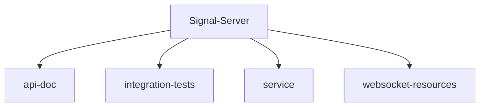

# 基础信息

|      |      |
|------|------|
| 名称 | Signal-Server |
| 编码语言 | .java |
| 代码路径 | Signal-Server |
| 包名 | Signal-Server |
| 概述说明 | Swagger参数解析与安全策略设置；Signal集成测试核心功能；后端服务模块多场景支持；WebSocket通信管理工具集。 |

# 说明

## 概述

该代码模块是一个高度集成且功能丰富的后端服务模块，涵盖了Swagger文档处理、集成测试、WebSocket通信管理以及核心服务功能。模块通过多个子模块和工具类的协同工作，为复杂的业务场景提供了全面的支持，确保系统的高效性、安全性、稳定性和可扩展性。模块的设计注重数据的安全性和完整性，同时简化了复杂操作的流程，提升了系统的可维护性和扩展性。

## 主要业务场景

1. **Swagger文档处理**：
   - **Swagger参数解析**：`OpenApiExtension`类处理Swagger文档中的参数解析，确保`Auth`注解和`AuthenticatedDevice`类型的参数在文档中正确表示，支持相关功能的实现和集成。
   - **安全策略设置**：`OpenApiReader`类通过重写`getParameters`方法，根据参数类型设置操作的安全要求，确保API操作的安全性和合规性，提升API的安全管理能力。
   - **API文档生成**：通过上述类的处理，生成准确且安全的Swagger API文档，支持开发者和系统集成时的正确使用和安全控制。

2. **集成测试**：
   - **用户管理**：`Operations`类封装了用户注册、删除和验证等操作的API，支持HTTP请求的构建与处理，为用户提供了便捷的操作接口。`TestUser`类负责管理用户注册、身份密钥、设备信息及账户属性，确保用户数据的完整性和安全性。
   - **设备管理**：`TestDevice`类负责管理设备ID和签名预密钥，提供创建、添加和获取最新签名预密钥的功能，确保设备的安全性和功能性。
   - **数据编码**：`Codecs`类是一个用于Base64序列化和反序列化的工具，支持将字节数组、EC公钥和身份密钥进行转换，适用于需要处理这些类型数据的场景。
   - **会话验证与密码恢复**：`IntegrationTools`类主要用于管理密码恢复、验证会话和电话号码标识符，提供了一套完整的解决方案，提升系统的安全性和用户体验。
   - **集成测试配置管理**：`Config`文件负责加载和管理集成测试所需的配置参数，确保测试环境的一致性。`DynamoDbTables`文件用于定义和初始化集成测试中使用的DynamoDB表结构，确保测试数据存储的正确性和可用性。

3. **核心服务功能**：
   - **数据处理与加密**：提供HmacSHA256加密、UUID与字节数组转换、Base64编码解码等功能，确保数据在传输和存储过程中的安全性和兼容性。通过`ExactlySizeValidator`、`RegistrationIdValidator`等验证工具，确保数据的合法性和完整性。
   - **推送通知与设备管理**：通过`FcmSender`、`APNSender`等类，支持通过Firebase和APNs发送推送通知，确保重要通知及时送达。`IdleDeviceNotificationScheduler`等类监控设备状态，优化推送通知的发送策略，提升用户体验。
   - **订阅支付管理**：集成Google Play Billing、Apple App Store、Stripe、Braintree等支付平台，处理订阅的创建、更新、取消、验证等操作，确保支付流程的准确性和安全性。`SubscriptionCurrencyUtil`等类支持货币转换，确保金额在不同系统之间的一致性。
   - **呼叫路由优化**：`CallRoutingTable`类通过分析IP地址和地理位置信息，选择最优数据中心，优化呼叫路由效率。`CallRoutingTableManager`类实时监控和更新路由表，确保路由信息的准确性和最新性。
   - **WebSocket通信与实时消息传递**：`WebSocketConnection`等类管理WebSocket连接的建立、维护、认证和消息传递，确保实时通信的稳定性和安全性。`ProvisioningConnectListener`等类处理设备间的通信和通知推送，提升系统的实时性和响应能力。
   - **Redis集群管理与限流**：`FaultTolerantRedisClusterClient`等类提供高容错的Redis集群管理，支持发布订阅、连接管理、拓扑变化处理等功能。`DynamicRateLimiter`等类实现限流管理，防止系统过载或遭受恶意攻击。
   - **身份验证与访问控制**：`AccountAuthenticator`等类处理设备认证流程，确保只有经过合法认证的请求和设备能够访问系统资源。`BasicAuthorizationHeader`等类解析和处理认证头信息，确保认证信息的准确性和安全性。
   - **备份管理与任务调度**：`BackupManager`等类管理备份操作的全流程，包括认证、配额管理、上传、删除和恢复功能，确保备份操作的安全性和高效性。`JobScheduler`等类负责调度和处理存储在DynamoDB中的任务，确保任务在指定时间内完成。
   - **异常处理与日志管理**：`NoStackTraceException`等类处理不需要堆栈跟踪信息的异常场景，减少内存开销。`MetricsRequestEventListener`等类监控HTTP请求的路径、方法、状态码等信息，帮助优化请求处理性能。
   - **AWS S3集成与文件上传管理**：`PostPolicyGenerator`等类生成符合AWS S3要求的POST策略，确保文件上传过程的安全性和合规性。`S3ObjectMonitor`类监控S3对象的状态变化，确保数据存储的实时性和可控性。
   - **多语言支持与资源管理**：该模块支持最多15个语言环境，通过头部信息控制资源包的查找和加载，确保在不同语言环境下能够准确获取相应的资源内容。有效管理和限制语言环境的数量，提升资源管理的效率和可控性，特别适用于需要支持多语言的应用程序。

4. **WebSocket通信管理**：
   - **WebSocket消息处理**：模块提供了基于Protobuf格式的WebSocket消息封装、解析与创建功能。通过`ProtobufWebSocketRequestMessage`、`ProtobufWebSocketResponseMessage`和`ProtobufWebSocketMessageFactory`等类，开发者可以高效地处理WebSocket请求和响应消息，确保消息的完整性和可追溯性。
   - **WebSocket会话管理**：通过`WebSocketClient`、`WebSocketSessionContext`和`WebSocketResourceProvider`等类，模块提供了对WebSocket会话的全生命周期管理，包括会话的建立、状态维护、事件处理以及会话的关闭。这些功能确保了WebSocket会话的稳定性和可控性。
   - **身份验证与安全控制**：模块通过`WebSocketSecurityContext`、`ReusableAuth`和`WebSocketAuthenticator`等类，提供了完整的身份验证机制，确保WebSocket通信的安全性。同时，模块还支持Principal的注入和认证状态的维护，确保用户身份和会话状态得到有效控制。
   - **WebSocket环境配置**：通过`WebSocketEnvironment`和`WebSocketConfiguration`等类，模块提供了灵活的WebSocket连接配置选项，包括认证机制、日志记录、消息处理工厂等。用户可以根据需求自定义超时设置、连接监听等，确保连接的安全性和稳定性。
   - **日志记录与事件管理**：模块通过`WebsocketEventLayoutFactory`、`WebsocketEventLayout`和`WebsocketRequestLog`等类，提供了完整的WebSocket事件日志记录功能。支持多种日志模式、异步日志记录、日志过滤和扩展记录内容，确保日志输出的统一性、可读性和高效性。
   - **资源提供与工厂管理**：通过`WebSocketResourceProviderFactory`和`WebSocketResourceProvider`等类，模块提供了对WebSocket资源的统一管理，确保WebSocket连接的安全性、认证流程的管理以及会话状态的维护。

这些业务场景共同构成了一个完整的后端服务模块，适用于需要高效、安全、可靠地处理复杂业务需求的系统。

### 包内部结构视图

该流程图展示了Signal-Server项目的目录结构。根目录为Signal-Server，其下包含四个子目录：api-doc、integration-tests、service和websocket-resources。这些子目录分别代表了项目的API文档、集成测试、服务层和WebSocket资源。

# 文件列表 File List

| 名称   | 类型  | 说明 |
|-------|------|-------------|
| [api-doc](api-doc/src/main/java/org/_module.md) | module | OpenApiExtension处理Swagger参数，OpenApiReader重写getParameters增强API安全。 |
| [service](service/src/main/java/org/_module.md) | module | 后端模块集成多功能，支持数据处理、推送通知、支付管理、路由优化、WebSocket通信、Redis集群、身份验证、备份管理、任务调度、异常处理、文件上传和多语言支持。 |
| [integration-tests](integration-tests/src/main/java/org/_module.md) | module | Signal-Server集成测试模块包含用户管理、设备管理、数据编码、配置管理及密码恢复等功能。 |
| [websocket-resources](websocket-resources/src/main/java/org/_module.md) | module | WebSocket模块处理通信、认证、会话管理和日志记录，确保消息解析、身份验证和连接稳定性。 |

