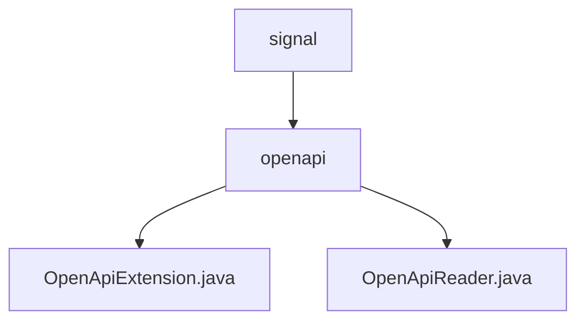

# 基础信息

|      |      |
|------|------|
| 名称 | signal |
| 编码语言 | .java |
| 代码路径 | Signal-Server/api-doc/src/main/java/org/signal |
| 包名 | Signal-Server.api-doc.src.main.java.org.signal |
| 概述说明 | OpenApiExtension处理Swagger参数，OpenApiReader重写getParameters增强API安全。 |

# 说明

## 概述
该代码模块主要负责处理Swagger文档中的参数解析和安全策略设置，确保API文档的准确性和安全性。模块中的`OpenApiExtension`类专注于解析Swagger参数，特别是处理`Auth`注解和`AuthenticatedDevice`类型的参数，确保这些参数在Swagger文档中正确表示。`OpenApiReader`类通过重写`getParameters`方法，根据参数类型设置操作的安全要求，增强了API的安全管理能力，使参数处理更加灵活和可靠。

## 主要业务场景
1. **Swagger参数解析**：`OpenApiExtension`类处理Swagger文档中的参数解析，确保`Auth`注解和`AuthenticatedDevice`类型的参数在文档中正确表示，支持相关功能的实现和集成。
2. **安全策略设置**：`OpenApiReader`类通过重写`getParameters`方法，根据参数类型设置操作的安全要求，确保API操作的安全性和合规性，提升API的安全管理能力。
3. **API文档生成**：通过上述类的处理，生成准确且安全的Swagger API文档，支持开发者和系统集成时的正确使用和安全控制。

### 包内部结构视图

该流程图展示了Signal-Server项目中API文档模块的路径层级关系。根节点为`signal`，其下包含`openapi`文件夹，`openapi`文件夹中又包含两个Java文件：`OpenApiExtension.java`和`OpenApiReader.java`。该图清晰地反映了代码的组织结构，便于理解项目的模块划分和文件依赖关系。

# 文件列表 File List

| 名称   | 类型  | 说明 |
|-------|------|-------------|
| [openapi](openapi/_module.md) | package | OpenApiExtension处理Swagger参数，OpenApiReader重写getParameters增强API安全。 |

