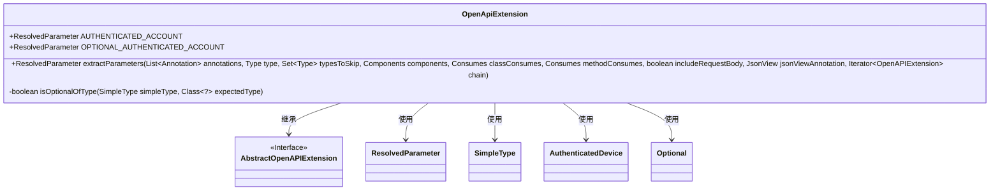

# 基础信息

|      |      |
|------|------|
| 名称 | OpenApiExtension |
| 编码语言 | .java |
| 代码路径 | Signal-Server/api-doc/src/main/java/org/signal/openapi/OpenApiExtension.java |
| 包名 | org.signal.openapi |
| 依赖项 | ['com.fasterxml.jackson.annotation.JsonView', 'com.fasterxml.jackson.databind.JavaType', 'com.fasterxml.jackson.databind.type.SimpleType', 'io.dropwizard.auth.Auth', 'io.swagger.v3.jaxrs2.ResolvedParameter', 'io.swagger.v3.jaxrs2.ext.AbstractOpenAPIExtension', 'io.swagger.v3.jaxrs2.ext.OpenAPIExtension', 'io.swagger.v3.oas.models.Components', 'jakarta.ws.rs.Consumes', 'java.lang.annotation.Annotation', 'java.lang.reflect.Type', 'java.util.Iterator', 'java.util.List', 'java.util.Optional', 'java.util.ServiceLoader', 'java.util.Set', 'org.whispersystems.textsecuregcm.auth.AuthenticatedDevice'] |
| 概述说明 | OpenApiExtension类解析Swagger参数，重点处理Auth注解和AuthenticatedDevice类型。 |

# 说明

OpenApiExtension类负责处理Swagger参数的解析，尤其专注于处理Auth注解和AuthenticatedDevice类型的参数。该类通过特定的逻辑确保这些参数在Swagger文档中的正确表示和处理，从而支持相关功能的实现和集成。

# 类列表 Class Summary

| 名称   | 类型  | 说明 |
|-------|------|-------------|
| OpenApiExtension | class | OpenApiExtension类处理Swagger参数解析，特别处理Auth注解和AuthenticatedDevice类型参数。 |

## 类 OpenApiExtension

|      |      |
|------|------|
| 访问范围 | public |
| 类型 | class |
| 名称 | OpenApiExtension |
| 说明 | OpenApiExtension类处理Swagger参数解析，特别处理Auth注解和AuthenticatedDevice类型参数。 |

### UML类图

### 描述
`OpenApiExtension`类继承自`AbstractOpenAPIExtension`接口，主要用于处理Swagger API的扩展功能。该类包含两个静态的`ResolvedParameter`对象：`AUTHENTICATED_ACCOUNT`和`OPTIONAL_AUTHENTICATED_ACCOUNT`。`extractParameters`方法用于解析API端点方法的参数，并根据注解类型返回相应的`ResolvedParameter`对象。`isOptionalOfType`方法用于检查`SimpleType`是否为`Optional`类型，并且其泛型参数是否为指定类型。该类依赖于`ResolvedParameter`、`SimpleType`、`AuthenticatedDevice`和`Optional`等类。

### 内部方法调用关系图

这段代码定义了一个 `OpenApiExtension` 类，继承自 `AbstractOpenAPIExtension`。该类主要用于处理 Swagger 中的参数提取逻辑，特别是处理带有 `@Auth` 注解的参数。`extractParameters` 方法根据注解和类型判断返回不同的 `ResolvedParameter` 实例，如果参数类型为 `AuthenticatedDevice` 或其 `Optional` 类型，则返回相应的预定义实例，否则调用父类的 `extractParameters` 方法。`isOptionalOfType` 方法用于判断一个 `SimpleType` 是否是 `Optional` 类型，并且其泛型参数是否为指定类型。

### 字段列表 Field List

| 名称  | 类型  | 说明 |
|-------|-------|------|
| OPTIONAL_AUTHENTICATED_ACCOUNT = new ResolvedParameter() | ResolvedParameter | 定义了一个静态不可变的认证账户参数对象。 |
| AUTHENTICATED_ACCOUNT = new ResolvedParameter() | ResolvedParameter | 定义了一个名为AUTHENTICATED_ACCOUNT的静态常量参数。 |

### 方法列表 Method List

| 名称  | 类型  | 说明 |
|-------|-------|------|
| isOptionalOfType | boolean | 检查简单类型是否为指定类型的Optional。 |
| extractParameters | ResolvedParameter | 方法提取参数，处理认证端点并调用父类方法。 |

