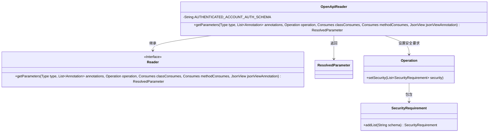
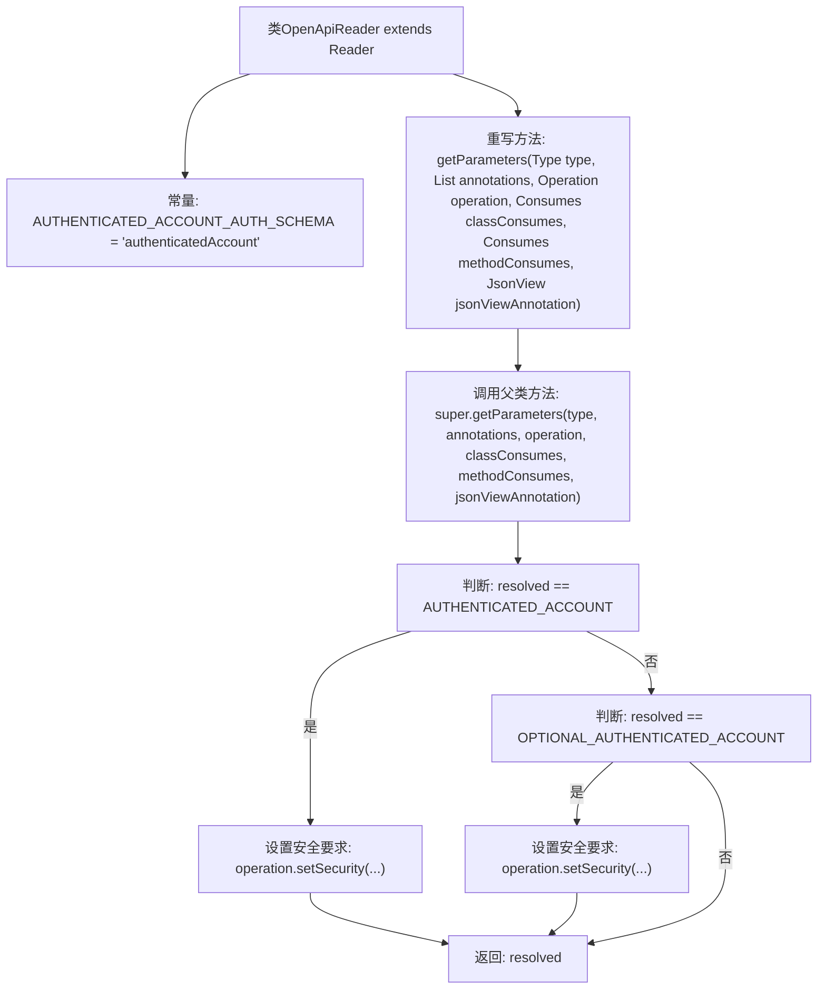

# 基础信息

|      |      |
|------|------|
| 名称 | OpenApiReader |
| 编码语言 | .java |
| 代码路径 | Signal-Server/api-doc/src/main/java/org/signal/openapi/OpenApiReader.java |
| 包名 | org.signal.openapi |
| 依赖项 | ['com.google.common.base.MoreObjects.firstNonNull', 'org.signal.openapi.OpenApiExtension.AUTHENTICATED_ACCOUNT', 'org.signal.openapi.OpenApiExtension.OPTIONAL_AUTHENTICATED_ACCOUNT', 'com.fasterxml.jackson.annotation.JsonView', 'com.google.common.collect.ImmutableList', 'io.swagger.v3.jaxrs2.Reader', 'io.swagger.v3.jaxrs2.ResolvedParameter', 'io.swagger.v3.oas.models.Operation', 'io.swagger.v3.oas.models.security.SecurityRequirement', 'jakarta.ws.rs.Consumes', 'java.lang.annotation.Annotation', 'java.lang.reflect.Type', 'java.util.Collections', 'java.util.List'] |
| 概述说明 | OpenApiReader类重写getParameters方法，按参数类型设置安全要求。 |

# 说明

OpenApiReader类中的getParameters方法被重写，该方法根据参数的类型来设置操作的安全要求。通过这一修改，系统能够更精确地控制不同参数类型对应的安全策略，确保操作的安全性和合规性。这一改进增强了API的安全管理能力，使得参数处理更加灵活和可靠。

# 类列表 Class Summary

| 名称   | 类型  | 说明 |
|-------|------|-------------|
| OpenApiReader | class | OpenApiReader类重写getParameters方法，根据参数类型设置操作的安全要求。 |

## 类 OpenApiReader

|      |      |
|------|------|
| 访问范围 | public |
| 类型 | class |
| 名称 | OpenApiReader |
| 说明 | OpenApiReader类重写getParameters方法，根据参数类型设置操作的安全要求。 |

### UML类图

这段代码描述了一个`OpenApiReader`类，它继承自`Reader`接口，并重写了`getParameters`方法。该方法根据解析后的参数类型，动态设置操作的安全要求。如果参数是`AUTHENTICATED_ACCOUNT`或`OPTIONAL_AUTHENTICATED_ACCOUNT`，则向操作中添加相应的安全需求。`Operation`类包含一个`SecurityRequirement`对象，用于表示操作的安全要求。整体设计旨在通过解析参数类型来动态调整操作的安全配置。

### 内部方法调用关系图

这段代码是`OpenApiReader`类中重写的`getParameters`方法，用于将解析后的参数转换为操作实体，特别是安全要求。该方法首先调用父类的`getParameters`方法获取解析后的参数，然后根据参数的不同值（`AUTHENTICATED_ACCOUNT`或`OPTIONAL_AUTHENTICATED_ACCOUNT`）设置操作的安全要求，并最终返回解析后的参数。流程图展示了方法的执行流程和条件判断。

### 字段列表 Field List

| 名称  | 类型  | 说明 |
|-------|-------|------|
| AUTHENTICATED_ACCOUNT_AUTH_SCHEMA = "authenticatedAccount" | String | 定义常量AUTHENTICATED_ACCOUNT_AUTH_SCHEMA为"authenticatedAccount"。 |

### 方法列表 Method List

| 名称  | 类型  | 说明 |
|-------|-------|------|
| getParameters | ResolvedParameter | 重写方法获取参数，根据参数类型设置操作安全要求。 |

