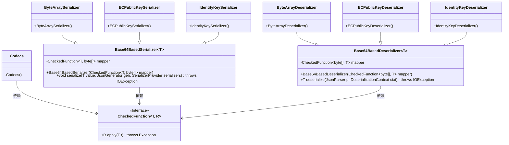

# 基础信息

|      |      |
|------|------|
| 名称 | Codecs |
| 编码语言 | .java |
| 代码路径 | Signal-Server/integration-tests/src/main/java/org/signal/integration/Codecs.java |
| 包名 | org.signal.integration |
| 依赖项 | ['com.fasterxml.jackson.core.JsonGenerator', 'com.fasterxml.jackson.core.JsonParser', 'com.fasterxml.jackson.databind.DeserializationContext', 'com.fasterxml.jackson.databind.JsonDeserializer', 'com.fasterxml.jackson.databind.JsonSerializer', 'com.fasterxml.jackson.databind.SerializerProvider', 'java.io.IOException', 'java.util.Base64', 'org.signal.libsignal.protocol.IdentityKey', 'org.signal.libsignal.protocol.ecc.Curve', 'org.signal.libsignal.protocol.ecc.ECPublicKey'] |
| 概述说明 | Codecs类支持Base64序列化与反序列化，处理字节数组、EC公钥和身份密钥。 |

# 说明

Codecs类是一个用于Base64序列化和反序列化的工具，支持将字节数组、EC公钥和身份密钥进行转换。该类提供了将数据编码为Base64格式以及从Base64格式解码回原始数据的功能，适用于需要处理这些类型数据的场景。

# 类列表 Class Summary

| 名称   | 类型  | 说明 |
|-------|------|-------------|
| Codecs | class | Codecs类提供Base64序列化和反序列化工具，支持字节数组、EC公钥和身份密钥的转换。 |

## 类 Codecs

|      |      |
|------|------|
| 访问范围 | public final |
| 类型 | class |
| 名称 | Codecs |
| 说明 | Codecs类提供Base64序列化和反序列化工具，支持字节数组、EC公钥和身份密钥的转换。 |

### UML类图

这段代码定义了一个名为 `Codecs` 的工具类，其中包含多个用于序列化和反序列化的类。`Base64BasedSerializer` 和 `Base64BasedDeserializer` 是两个泛型类，分别用于将对象序列化为 Base64 字符串和从 Base64 字符串反序列化为对象。`CheckedFunction` 是一个函数式接口，用于定义转换逻辑。`ByteArraySerializer`、`ECPublicKeySerializer` 和 `IdentityKeySerializer` 是 `Base64BasedSerializer` 的具体实现类，分别用于处理字节数组、EC公钥和身份密钥的序列化。`ByteArrayDeserializer`、`ECPublicKeyDeserializer` 和 `IdentityKeyDeserializer` 是 `Base64BasedDeserializer` 的具体实现类，分别用于处理字节数组、EC公钥和身份密钥的反序列化。

### 内部方法调用关系图

```mermaid
graph TD
    A["类Codecs"]
    B["内部接口: CheckedFunction<T, R>"]
    C["方法: R apply(T t) throws Exception"]
    D["内部类: Base64BasedSerializer<T>"]
    E["属性: CheckedFunction<T, byte[]> mapper"]
    F["构造方法: Base64BasedSerializer(CheckedFunction<T, byte[]> mapper)"]
    G["重写方法: void serialize(T value, JsonGenerator gen, SerializerProvider serializers)"]
    H["内部类: Base64BasedDeserializer<T>"]
    I["属性: CheckedFunction<byte[], T> mapper"]
    J["构造方法: Base64BasedDeserializer(CheckedFunction<byte[], T> mapper)"]
    K["重写方法: T deserialize(JsonParser p, DeserializationContext ctxt)"]
    L["内部类: ByteArraySerializer"]
    M["构造方法: ByteArraySerializer()"]
    N["内部类: ByteArrayDeserializer"]
    O["构造方法: ByteArrayDeserializer()"]
    P["内部类: ECPublicKeySerializer"]
    Q["构造方法: ECPublicKeySerializer()"]
    R["内部类: ECPublicKeyDeserializer"]
    S["构造方法: ECPublicKeyDeserializer()"]
    T["内部类: IdentityKeySerializer"]
    U["构造方法: IdentityKeySerializer()"]
    V["内部类: IdentityKeyDeserializer"]
    W["构造方法: IdentityKeyDeserializer()"]

    A --> B
    B --> C
    A --> D
    D --> E
    D --> F
    D --> G
    A --> H
    H --> I
    H --> J
    H --> K
    A --> L
    L --> M
    A --> N
    N --> O
    A --> P
    P --> Q
    A --> R
    R --> S
    A --> T
    T --> U
    A --> V
    V --> W
```

这段代码定义了一个名为`Codecs`的类，其中包含多个内部类和接口，主要用于序列化和反序列化操作。`CheckedFunction`接口定义了一个可以抛出异常的泛型函数。`Base64BasedSerializer`和`Base64BasedDeserializer`是两个基类，分别用于序列化和反序列化，并且它们都依赖于`CheckedFunction`接口。其他内部类如`ByteArraySerializer`、`ECPublicKeySerializer`等，都是基于这两个基类的具体实现，用于处理不同类型的序列化和反序列化任务。

### 字段列表 Field List

| 名称  | 类型  | 说明 |
|-------|-------|------|

### 方法列表 Method List

| 名称  | 类型  | 说明 |
|-------|-------|------|

