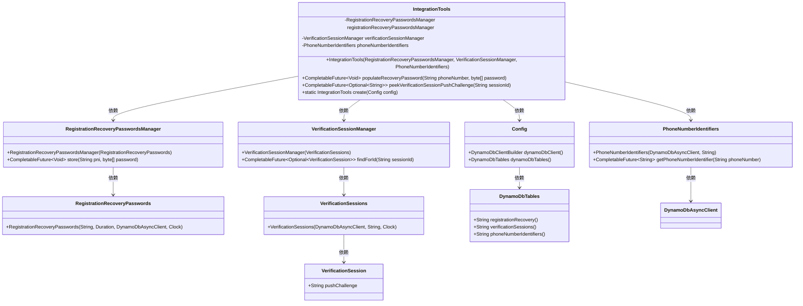

# 基础信息

|      |      |
|------|------|
| 名称 | IntegrationTools |
| 编码语言 | .java |
| 代码路径 | Signal-Server/integration-tests/src/main/java/org/signal/integration/IntegrationTools.java |
| 包名 | org.signal.integration |
| 依赖项 | ['java.time.Clock', 'java.time.Duration', 'java.util.Optional', 'java.util.UUID', 'java.util.concurrent.CompletableFuture', 'org.signal.integration.config.Config', 'org.whispersystems.textsecuregcm.metrics.NoopAwsSdkMetricPublisher', 'org.whispersystems.textsecuregcm.registration.VerificationSession', 'org.whispersystems.textsecuregcm.storage.PhoneNumberIdentifiers', 'org.whispersystems.textsecuregcm.storage.RegistrationRecoveryPasswords', 'org.whispersystems.textsecuregcm.storage.RegistrationRecoveryPasswordsManager', 'org.whispersystems.textsecuregcm.storage.VerificationSessionManager', 'org.whispersystems.textsecuregcm.storage.VerificationSessions', 'software.amazon.awssdk.auth.credentials.AwsCredentialsProvider', 'software.amazon.awssdk.auth.credentials.DefaultCredentialsProvider', 'software.amazon.awssdk.services.dynamodb.DynamoDbAsyncClient'] |
| 概述说明 | 集成工具管理密码恢复、会话验证及电话号码标识。 |

# 说明

该集成工具类主要用于管理密码恢复、验证会话和电话号码标识符。它提供了一套完整的解决方案，帮助用户高效处理密码恢复流程，确保会话验证的安全性和准确性，并有效管理电话号码标识符。通过这些功能，工具类能够提升系统的安全性和用户体验，简化相关操作的复杂性。

# 类列表 Class Summary

| 名称   | 类型  | 说明 |
|-------|------|-------------|
| IntegrationTools | class | 集成工具类，管理密码恢复、验证会话和电话号码标识符。 |

## 类 IntegrationTools

|      |      |
|------|------|
| 访问范围 | public |
| 类型 | class |
| 名称 | IntegrationTools |
| 说明 | 集成工具类，管理密码恢复、验证会话和电话号码标识符。 |

### UML类图

这段代码定义了一个 `IntegrationTools` 类，用于管理与密码恢复、验证会话和电话号码标识相关的操作。`IntegrationTools` 类依赖于 `RegistrationRecoveryPasswordsManager`、`VerificationSessionManager` 和 `PhoneNumberIdentifiers` 三个管理器类，这些管理器类又分别依赖于 `RegistrationRecoveryPasswords`、`VerificationSessions` 和 `DynamoDbAsyncClient` 等底层服务。通过 `create` 方法，`IntegrationTools` 可以根据配置初始化这些依赖项。

### 内部方法调用关系图

```mermaid
graph TD
    A["类IntegrationTools"]
    B["属性: RegistrationRecoveryPasswordsManager registrationRecoveryPasswordsManager"]
    C["属性: VerificationSessionManager verificationSessionManager"]
    D["属性: PhoneNumberIdentifiers phoneNumberIdentifiers"]
    E["静态方法: create(Config config)"]
    F["构造方法: IntegrationTools(RegistrationRecoveryPasswordsManager, VerificationSessionManager, PhoneNumberIdentifiers)"]
    G["方法: CompletableFuture<Void> populateRecoveryPassword(String phoneNumber, byte[] password)"]
    H["方法: CompletableFuture<Optional<String>> peekVerificationSessionPushChallenge(String sessionId)"]
    I["步骤: 创建AwsCredentialsProvider"]
    J["步骤: 创建DynamoDbAsyncClient"]
    K["步骤: 创建RegistrationRecoveryPasswords"]
    L["步骤: 创建VerificationSessions"]
    M["步骤: 返回IntegrationTools实例"]
    N["步骤: 调用phoneNumberIdentifiers.getPhoneNumberIdentifier(phoneNumber)"]
    O["步骤: 调用registrationRecoveryPasswordsManager.store(pni, password)"]
    P["步骤: 调用verificationSessionManager.findForId(sessionId)"]
    Q["步骤: 调用maybeSession.map(VerificationSession::pushChallenge)"]

    A --> B
    A --> C
    A --> D
    A --> E
    A --> F
    A --> G
    A --> H
    E --> I
    E --> J
    E --> K
    E --> L
    E --> M
    G --> N
    G --> O
    H --> P
    H --> Q
```

这段代码描述了一个名为 `IntegrationTools` 的类，该类用于管理注册恢复密码、验证会话和电话号码标识符。`create` 方法用于初始化并返回 `IntegrationTools` 的实例，通过配置 AWS 凭证和 DynamoDB 客户端来创建相关对象。`populateRecoveryPassword` 方法用于为指定电话号码存储恢复密码，而 `peekVerificationSessionPushChallenge` 方法则用于查找并返回指定会话的推送挑战。

### 字段列表 Field List

| 名称  | 类型  | 说明 |
|-------|-------|------|
| registrationRecoveryPasswordsManager | RegistrationRecoveryPasswordsManager | 私有注册密码恢复管理器实例。 |
| verificationSessionManager | VerificationSessionManager | 私有验证会话管理器实例。 |
| phoneNumberIdentifiers | PhoneNumberIdentifiers | 私有不可变的电话号码标识符对象。 |

### 方法列表 Method List

| 名称  | 类型  | 说明 |
|-------|-------|------|
| populateRecoveryPassword | CompletableFuture<Void> | 异步存储手机号对应的恢复密码。 |
| peekVerificationSessionPushChallenge | CompletableFuture<Optional<String>> | 异步查找会话ID并返回推送挑战。 |
| create | IntegrationTools | 创建集成工具，配置AWS凭证，初始化DynamoDB客户端，管理注册恢复密码和验证会话。 |

