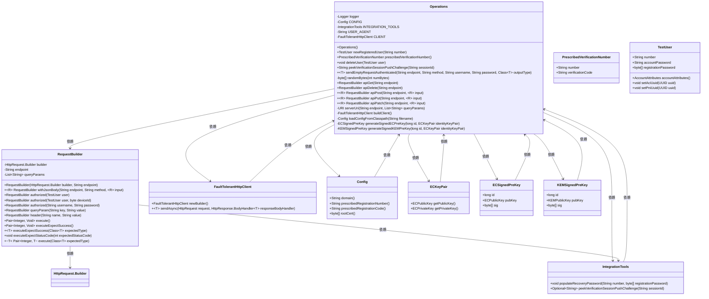

# 基础信息

|      |      |
|------|------|
| 名称 | Operations |
| 编码语言 | .java |
| 代码路径 | Signal-Server/integration-tests/src/main/java/org/signal/integration/Operations.java |
| 包名 | org.signal.integration |
| 依赖项 | ['java.util.Objects.requireNonNull', 'com.fasterxml.jackson.core.JsonProcessingException', 'com.google.common.io.Resources', 'com.google.common.net.HttpHeaders', 'io.dropwizard.configuration.ConfigurationValidationException', 'io.dropwizard.jersey.validation.Validators', 'jakarta.validation.ConstraintViolation', 'java.io.IOException', 'java.lang.invoke.MethodHandles', 'java.net.URI', 'java.net.URL', 'java.net.http.HttpRequest', 'java.net.http.HttpResponse', 'java.nio.charset.StandardCharsets', 'java.security.SecureRandom', 'java.security.cert.CertificateException', 'java.util.ArrayList', 'java.util.Base64', 'java.util.Collections', 'java.util.List', 'java.util.Optional', 'java.util.Set', 'java.util.concurrent.Executors', 'org.apache.commons.lang3.StringUtils', 'org.apache.commons.lang3.Validate', 'org.apache.commons.lang3.tuple.Pair', 'org.signal.integration.config.Config', 'org.signal.libsignal.protocol.IdentityKey', 'org.signal.libsignal.protocol.ecc.Curve', 'org.signal.libsignal.protocol.ecc.ECKeyPair', 'org.signal.libsignal.protocol.ecc.ECPublicKey', 'org.signal.libsignal.protocol.kem.KEMKeyPair', 'org.signal.libsignal.protocol.kem.KEMKeyType', 'org.signal.libsignal.protocol.kem.KEMPublicKey', 'org.slf4j.Logger', 'org.slf4j.LoggerFactory', 'org.whispersystems.textsecuregcm.configuration.CircuitBreakerConfiguration', 'org.whispersystems.textsecuregcm.entities.AccountAttributes', 'org.whispersystems.textsecuregcm.entities.AccountIdentityResponse', 'org.whispersystems.textsecuregcm.entities.ECSignedPreKey', 'org.whispersystems.textsecuregcm.entities.KEMSignedPreKey', 'org.whispersystems.textsecuregcm.entities.RegistrationRequest', 'org.whispersystems.textsecuregcm.http.FaultTolerantHttpClient', 'org.whispersystems.textsecuregcm.storage.Device', 'org.whispersystems.textsecuregcm.util.HeaderUtils', 'org.whispersystems.textsecuregcm.util.HttpUtils', 'org.whispersystems.textsecuregcm.util.SystemMapper'] |
| 概述说明 | Operations类封装用户注册、删除、验证等API，支持HTTP请求处理。 |

# 说明

Operations类封装了用户注册、删除和验证等操作的API，支持HTTP请求的构建与处理，为用户提供了便捷的操作接口。

# 类列表 Class Summary

| 名称   | 类型  | 说明 |
|-------|------|-------------|
| Operations | class | Operations类提供用户注册、删除、验证等操作的API封装，支持HTTP请求构建与处理。 |

## 类 Operations

|      |      |
|------|------|
| 访问范围 | public final |
| 类型 | class |
| 名称 | Operations |
| 说明 | Operations类提供用户注册、删除、验证等操作的API封装，支持HTTP请求构建与处理。 |

### UML类图

这段代码定义了一个名为 `Operations` 的工具类，主要用于处理用户注册、删除、验证等操作。`Operations` 类依赖于多个其他类，如 `RequestBuilder`、`IntegrationTools`、`FaultTolerantHttpClient` 和 `Config`，通过这些类完成HTTP请求、配置加载、用户管理等任务。`RequestBuilder` 类用于构建和发送HTTP请求，`IntegrationTools` 类用于处理与外部系统的集成，`FaultTolerantHttpClient` 类用于处理HTTP请求的容错机制，`Config` 类用于加载和管理配置信息。整体设计通过组合和依赖注入的方式实现了高内聚低耦合的目标。

### 内部方法调用关系图

```mermaid
graph TD
    A["类Operations"]
    B["属性: Logger logger"]
    C["属性: Config CONFIG"]
    D["属性: IntegrationTools INTEGRATION_TOOLS"]
    E["属性: String USER_AGENT"]
    F["属性: FaultTolerantHttpClient CLIENT"]
    G["构造方法: Operations()"]
    H["方法: TestUser newRegisteredUser(String number)"]
    I["方法: PrescribedVerificationNumber prescribedVerificationNumber()"]
    J["方法: void deleteUser(TestUser user)"]
    K["方法: String peekVerificationSessionPushChallenge(String sessionId)"]
    L["方法: T sendEmptyRequestAuthenticated(String endpoint, String method, String username, String password, Class<T> outputType)"]
    M["方法: byte[] randomBytes(int numBytes)"]
    N["方法: RequestBuilder apiGet(String endpoint)"]
    O["方法: RequestBuilder apiDelete(String endpoint)"]
    P["方法: RequestBuilder apiPost(String endpoint, R input)"]
    Q["方法: RequestBuilder apiPut(String endpoint, R input)"]
    R["方法: RequestBuilder apiPatch(String endpoint, R input)"]
    S["方法: URI serverUri(String endpoint, List<String> queryParams)"]
    T["内部类: RequestBuilder"]
    U["方法: FaultTolerantHttpClient buildClient()"]
    V["方法: Config loadConfigFromClasspath(String filename)"]
    W["方法: ECSignedPreKey generateSignedECPreKey(long id, ECKeyPair identityKeyPair)"]
    X["方法: KEMSignedPreKey generateSignedKEMPreKey(long id, ECKeyPair identityKeyPair)"]

    A --> B
    A --> C
    A --> D
    A --> E
    A --> F
    A --> G
    A --> H
    A --> I
    A --> J
    A --> K
    A --> L
    A --> M
    A --> N
    A --> O
    A --> P
    A --> Q
    A --> R
    A --> S
    A -.-> T
    A --> U
    A --> V
    A --> W
    A --> X
```

这段代码定义了一个名为`Operations`的工具类，主要用于处理用户注册、删除、验证等操作。类中包含多个静态方法和属性，如`newRegisteredUser`用于创建新用户，`deleteUser`用于删除用户，`sendEmptyRequestAuthenticated`用于发送认证请求等。类中还包含一个内部类`RequestBuilder`，用于构建HTTP请求。整体代码结构清晰，功能明确，主要用于集成测试和用户管理。

### 字段列表 Field List

| 名称  | 类型  | 说明 |
|-------|-------|------|
| USER_AGENT = "integration-test" | String | 定义私有静态常量USER_AGENT，值为"integration-test"。 |
| INTEGRATION_TOOLS = IntegrationTools.create(CONFIG) | IntegrationTools | 创建并初始化静态常量INTEGRATION_TOOLS实例。 |
| CLIENT = buildClient() | FaultTolerantHttpClient | 私有静态常量CLIENT通过buildClient方法初始化。 |
| logger = LoggerFactory.getLogger(MethodHandles.lookup().lookupClass()) | Logger | 定义私有静态日志记录器实例。 |
| CONFIG = loadConfigFromClasspath("config.yml") | Config | 加载类路径下的配置文件config.yml并赋值给静态常量CONFIG。 |

### 方法列表 Method List

| 名称  | 类型  | 说明 |
|-------|-------|------|
| apiDelete | RequestBuilder | 静态方法apiDelete创建并返回一个删除请求的RequestBuilder对象。 |
| generateSignedECPreKey | ECSignedPreKey | 生成带签名的EC预密钥，包含ID、公钥和签名。 |
| serverUri | URI | 静态方法生成带查询参数的服务器URI。 |
| sendEmptyRequestAuthenticated | T | 发送带认证的空请求并返回指定类型响应。 |
| apiPost | RequestBuilder | 静态方法apiPost用于通过POST请求发送JSON数据到指定端点。 |
| apiPatch | RequestBuilder | 静态方法apiPatch用于创建PATCH请求，接收端点和输入参数。 |
| apiGet | RequestBuilder | 静态方法apiGet创建并返回基于GET请求的RequestBuilder对象。 |
| generateSignedKEMPreKey | KEMSignedPreKey | 生成KEM签名预密钥，包含ID、公钥及签名。 |
| deleteUser | void | 删除指定用户的API请求，需授权并期望成功执行。 |
| buildClient | FaultTolerantHttpClient | 构建容错HTTP客户端，配置线程池、重试执行器、断路器及可信证书。 |
| loadConfigFromClasspath | Config | 从类路径加载配置文件，验证配置有效性，异常时抛出运行时异常。 |
| apiPut | RequestBuilder | 定义静态方法apiPut，用于创建PUT请求并包含JSON请求体。 |
| newRegisteredUser | TestUser | 生成新注册用户，设置密码、密钥对并提交注册请求。 |
| prescribedVerificationNumber | PrescribedVerificationNumber | 静态方法返回包含预设注册号和代码的验证号对象。 |
| peekVerificationSessionPushChallenge | String | 方法`peekVerificationSessionPushChallenge`通过`sessionId`获取验证会话的推送挑战，若未找到则抛出异常。 |
| randomBytes | byte[] | 生成指定长度的随机字节数组。 |

