# 基础信息

|      |      |
|------|------|
| 名称 | TestDevice |
| 编码语言 | .java |
| 代码路径 | Signal-Server/integration-tests/src/main/java/org/signal/integration/TestDevice.java |
| 包名 | org.signal.integration |
| 依赖项 | ['java.util.Map', 'java.util.concurrent.ConcurrentHashMap', 'org.apache.commons.lang3.tuple.Pair', 'org.signal.libsignal.protocol.IdentityKeyPair', 'org.signal.libsignal.protocol.InvalidKeyException', 'org.signal.libsignal.protocol.ecc.Curve', 'org.signal.libsignal.protocol.ecc.ECKeyPair', 'org.signal.libsignal.protocol.state.SignedPreKeyRecord'] |
| 概述说明 | TestDevice类管理设备ID和签名预密钥，支持创建、添加和获取操作。 |

# 说明

TestDevice类负责管理设备ID和签名预密钥，提供创建、添加和获取最新签名预密钥的功能。该类确保设备ID和签名预密钥的有效管理，支持相关操作的执行和最新密钥的获取，从而保障设备的安全性和功能性。

# 类列表 Class Summary

| 名称   | 类型  | 说明 |
|-------|------|-------------|
| TestDevice | class | TestDevice类管理设备ID和签名预密钥，支持创建、添加和获取最新签名预密钥。 |

## 类 TestDevice

|      |      |
|------|------|
| 访问范围 | public |
| 类型 | class |
| 名称 | TestDevice |
| 说明 | TestDevice类管理设备ID和签名预密钥，支持创建、添加和获取最新签名预密钥。 |

### UML类图

这段代码定义了一个`TestDevice`类，用于管理设备的安全密钥对和签名预密钥记录。`TestDevice`类包含一个设备ID和一个并发哈希映射`signedPreKeys`，用于存储不同身份密钥对及其对应的签名预密钥记录。`TestDevice`类提供了创建设备、获取最新签名预密钥、添加新签名预密钥等功能。代码中使用了`IdentityKeyPair`、`SignedPreKeyRecord`、`Pair`、`ECKeyPair`和`Curve`等类来支持密钥生成、签名计算和记录管理。

### 内部方法调用关系图

```mermaid
graph TD
    A["类TestDevice"]
    B["属性: byte deviceId"]
    C["属性: Map<Integer, Pair<IdentityKeyPair, SignedPreKeyRecord>> signedPreKeys"]
    D["静态方法: create(byte deviceId, IdentityKeyPair aciIdentityKeyPair, IdentityKeyPair pniIdentityKeyPair)"]
    E["构造方法: TestDevice(byte deviceId)"]
    F["方法: byte deviceId()"]
    G["方法: SignedPreKeyRecord latestSignedPreKey(IdentityKeyPair identity)"]
    H["方法: SignedPreKeyRecord addSignedPreKey(IdentityKeyPair identity)"]
    I["调用: addSignedPreKey(aciIdentityKeyPair)"]
    J["调用: addSignedPreKey(pniIdentityKeyPair)"]
    K["返回: TestDevice device"]
    L["流操作: signedPreKeys.entrySet().stream()"]
    M["过滤: filter(p -> p.getValue().getLeft().equals(identity))"]
    N["映射: mapToInt(Map.Entry::getKey)"]
    O["获取最大值: max()"]
    P["获取: signedPreKeys.get(id).getRight()"]
    Q["生成: ECKeyPair keyPair = Curve.generateKeyPair()"]
    R["计算签名: Curve.calculateSignature(identity.getPrivateKey(), keyPair.getPublicKey().serialize())"]
    S["创建: SignedPreKeyRecord signedPreKeyRecord = new SignedPreKeyRecord(nextId, System.currentTimeMillis(), keyPair, signature)"]
    T["存储: signedPreKeys.put(nextId, Pair.of(identity, signedPreKeyRecord))"]
    U["返回: signedPreKeyRecord"]

    A --> B
    A --> C
    A --> D
    A --> E
    A --> F
    A --> G
    A --> H
    D --> I
    D --> J
    D --> K
    G --> L
    L --> M
    M --> N
    N --> O
    O --> P
    H --> Q
    Q --> R
    R --> S
    S --> T
    T --> U
```

这段代码定义了一个 `TestDevice` 类，用于管理设备及其相关的签名预密钥。类中包含一个静态方法 `create`，用于创建 `TestDevice` 实例并添加两个签名预密钥。`latestSignedPreKey` 方法用于获取最新的签名预密钥，而 `addSignedPreKey` 方法则用于生成并存储新的签名预密钥。代码通过流操作和过滤来处理 `signedPreKeys` 映射中的条目，确保获取正确的密钥。

### 字段列表 Field List

| 名称  | 类型  | 说明 |
|-------|-------|------|
| deviceId | byte | 私有字节类型变量deviceId。 |
| signedPreKeys = new ConcurrentHashMap<>() | Map<Integer, Pair<IdentityKeyPair, SignedPreKeyRecord>> | 定义并发哈希映射存储整数与身份密钥对及签名预密钥记录的配对。 |

### 方法列表 Method List

| 名称  | 类型  | 说明 |
|-------|-------|------|
| deviceId | byte | 方法返回设备ID的字节值。 |
| latestSignedPreKey | SignedPreKeyRecord | 方法返回与指定身份密钥对匹配的最新签名预密钥记录。 |
| create | TestDevice | 创建TestDevice实例，添加ACI和PNI签名预密钥，返回设备对象。 |
| addSignedPreKey | SignedPreKeyRecord | 生成并添加带签名的预密钥记录，返回新记录。 |

