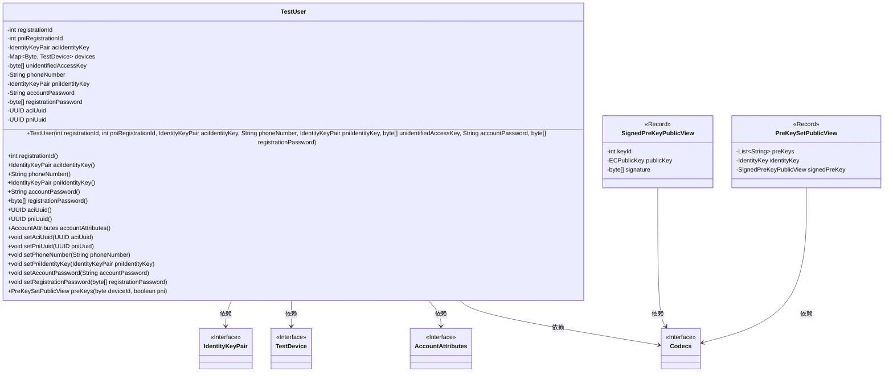

# 基础信息

|      |      |
|------|------|
| 名称 | TestUser |
| 编码语言 | .java |
| 代码路径 | Signal-Server/integration-tests/src/main/java/org/signal/integration/TestUser.java |
| 包名 | org.signal.integration |
| 依赖项 | ['java.util.Objects.requireNonNull', 'com.fasterxml.jackson.databind.annotation.JsonDeserialize', 'com.fasterxml.jackson.databind.annotation.JsonSerialize', 'java.security.SecureRandom', 'java.nio.charset.StandardCharsets', 'java.util.Collections', 'java.util.List', 'java.util.Map', 'java.util.Set', 'java.util.UUID', 'java.util.concurrent.ConcurrentHashMap', 'org.signal.libsignal.protocol.IdentityKey', 'org.signal.libsignal.protocol.IdentityKeyPair', 'org.signal.libsignal.protocol.InvalidKeyException', 'org.signal.libsignal.protocol.ecc.ECPublicKey', 'org.signal.libsignal.protocol.state.SignedPreKeyRecord', 'org.signal.libsignal.protocol.util.KeyHelper', 'org.whispersystems.textsecuregcm.auth.UnidentifiedAccessUtil', 'org.whispersystems.textsecuregcm.entities.AccountAttributes', 'org.whispersystems.textsecuregcm.storage.Device'] |
| 概述说明 | TestUser类负责用户注册、身份密钥、设备信息及账户属性的管理。 |

# 说明

TestUser类负责管理用户注册、身份密钥、设备信息及账户属性，确保用户数据的完整性和安全性。该类通过集中处理用户相关数据，简化了用户管理流程，提高了系统的可维护性和扩展性。

# 类列表 Class Summary

| 名称   | 类型  | 说明 |
|-------|------|-------------|
| TestUser | class | TestUser类管理用户注册、身份密钥、设备信息及账户属性。 |

## 类 TestUser

|      |      |
|------|------|
| 访问范围 | public |
| 类型 | class |
| 名称 | TestUser |
| 说明 | TestUser类管理用户注册、身份密钥、设备信息及账户属性。 |

### UML类图

这段代码定义了一个`TestUser`类，用于管理用户的相关信息，包括注册ID、身份密钥、设备信息、电话号码、账户密码等。`TestUser`类提供了多个方法来获取和设置这些信息，并生成了`SignedPreKeyPublicView`和`PreKeySetPublicView`两个记录类，用于表示预密钥的公开视图。类图展示了`TestUser`类与其他接口和记录类之间的依赖关系，以及`TestUser`类的内部结构。

### 内部方法调用关系图

```mermaid
graph TD
    A["类TestUser"]
    B["属性: int registrationId"]
    C["属性: int pniRegistrationId"]
    D["属性: IdentityKeyPair aciIdentityKey"]
    E["属性: Map<Byte, TestDevice> devices"]
    F["属性: byte[] unidentifiedAccessKey"]
    G["属性: String phoneNumber"]
    H["属性: IdentityKeyPair pniIdentityKey"]
    I["属性: String accountPassword"]
    J["属性: byte[] registrationPassword"]
    K["属性: UUID aciUuid"]
    L["属性: UUID pniUuid"]
    M["静态方法: create(String phoneNumber, String accountPassword, byte[] registrationPassword)"]
    N["构造方法: TestUser(int registrationId, int pniRegistrationId, IdentityKeyPair aciIdentityKey, String phoneNumber, IdentityKeyPair pniIdentityKey, byte[] unidentifiedAccessKey, String accountPassword, byte[] registrationPassword)"]
    O["方法: int registrationId()"]
    P["方法: IdentityKeyPair aciIdentityKey()"]
    Q["方法: String phoneNumber()"]
    R["方法: IdentityKeyPair pniIdentityKey()"]
    S["方法: String accountPassword()"]
    T["方法: byte[] registrationPassword()"]
    U["方法: UUID aciUuid()"]
    V["方法: UUID pniUuid()"]
    W["方法: AccountAttributes accountAttributes()"]
    X["方法: void setAciUuid(UUID aciUuid)"]
    Y["方法: void setPniUuid(UUID pniUuid)"]
    Z["方法: void setPhoneNumber(String phoneNumber)"]
    AA["方法: void setPniIdentityKey(IdentityKeyPair pniIdentityKey)"]
    AB["方法: void setAccountPassword(String accountPassword)"]
    AC["方法: void setRegistrationPassword(byte[] registrationPassword)"]
    AD["方法: PreKeySetPublicView preKeys(byte deviceId, boolean pni)"]
    AE["内部类: SignedPreKeyPublicView"]
    AF["内部类: PreKeySetPublicView"]

    A --> B
    A --> C
    A --> D
    A --> E
    A --> F
    A --> G
    A --> H
    A --> I
    A --> J
    A --> K
    A --> L
    A --> M
    A --> N
    A --> O
    A --> P
    A --> Q
    A --> R
    A --> S
    A --> T
    A --> U
    A --> V
    A --> W
    A --> X
    A --> Y
    A --> Z
    A --> AA
    A --> AB
    A --> AC
    A --> AD
    A --> AE
    A --> AF

    M --> N
    N --> E
    AD --> AE
    AD --> AF
```

这段代码定义了一个名为 `TestUser` 的类，用于表示用户的相关信息。类中包含多个属性，如 `registrationId`、`pniRegistrationId`、`aciIdentityKey` 等，以及多个方法用于获取和设置这些属性。`create` 方法用于创建 `TestUser` 实例，并初始化相关属性。`accountAttributes` 方法返回用户的账户属性，`preKeys` 方法返回用户的预密钥集。此外，类中还定义了两个内部类 `SignedPreKeyPublicView` 和 `PreKeySetPublicView`，用于表示签名预密钥和预密钥集的公共视图。

### 字段列表 Field List

| 名称  | 类型  | 说明 |
|-------|-------|------|
| registrationId | int | 私有整型变量registrationId，用于存储注册ID。 |
| registrationPassword | byte[] | 私有字节数组存储注册密码。 |
| accountPassword | String | 私有字符串变量存储账户密码。 |
| unidentifiedAccessKey | byte[] | 私有字节数组存储未识别的访问密钥。 |
| pniRegistrationId | int | 私有整型变量pniRegistrationId的声明。 |
| phoneNumber | String | 声明一个私有字符串变量phoneNumber。 |
| aciUuid | UUID | 定义了一个私有UUID变量aciUuid。 |
| aciIdentityKey | IdentityKeyPair | 私有终态变量aciIdentityKey为IdentityKeyPair类型。 |
| pniIdentityKey | IdentityKeyPair | 私有PNI身份密钥对声明。 |
| devices = new ConcurrentHashMap<>() | Map<Byte, TestDevice> | 定义了一个私有的并发哈希映射，键为字节，值为TestDevice对象。 |
| pniUuid | UUID | 私有UUID变量pniUuid。 |

### 方法列表 Method List

| 名称  | 类型  | 说明 |
|-------|-------|------|
| setAciUuid | void | 设置ACI UUID的方法。 |
| setPniUuid | void | 设置PNI UUID值的方法。 |
| registrationId | int | 方法返回注册ID整数值。 |
| accountPassword | String | 返回账户密码字符串。 |
| setAccountPassword | void | 设置账户密码的方法。 |
| setRegistrationPassword | void | 设置注册密码的字节数组方法。 |
| phoneNumber | String | 返回手机号码的字符串方法。 |
| pniUuid | UUID | 返回PNI UUID的方法。 |
| aciIdentityKey | IdentityKeyPair | 方法返回ACI身份密钥对。 |
| pniIdentityKey | IdentityKeyPair | 返回PNI身份密钥对。 |
| setPhoneNumber | void | 设置电话号码的方法，接收字符串参数并赋值给成员变量。 |
| registrationPassword | byte[] | 返回注册密码的字节数组。 |
| create | TestUser | 生成TestUser对象，包含密钥对、注册ID、随机访问密钥及用户信息。 |
| setPniIdentityKey | void | 该方法用于设置PNI身份密钥。 |
| aciUuid | UUID | 方法`aciUuid()`返回私有变量`aciUuid`的值。 |
| preKeys | PreKeySetPublicView | 根据设备ID和PNI参数生成预密钥集，包含身份公钥和签名预密钥视图。 |
| accountAttributes | AccountAttributes | 返回包含注册ID、PNI注册ID、未识别访问密钥和恢复密码的账户属性对象。 |

