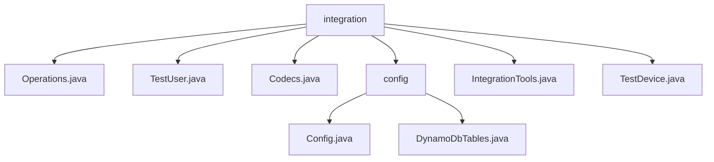

# 基础信息

|      |      |
|------|------|
| 名称 | integration |
| 编码语言 | .java |
| 代码路径 | Signal-Server/integration-tests/src/main/java/org/signal/integration |
| 包名 | Signal-Server.integration-tests.src.main.java.org.signal.integration |
| 概述说明 | Signal-Server集成测试模块包含用户管理、设备管理、数据编码、配置管理及密码恢复等功能。 |

# 说明

## 概述
该代码模块是Signal-Server集成测试的核心部分，主要涉及用户管理、设备管理、数据编码、会话验证、密码恢复以及DynamoDB表配置等功能。模块中的各个类通过封装特定功能，提供了便捷的操作接口和工具，支持集成测试的顺利执行。模块的设计注重数据的安全性和完整性，同时简化了复杂操作的流程，提升了系统的可维护性和扩展性。

## 主要业务场景
1. **用户管理**：
   - `Operations`类封装了用户注册、删除和验证等操作的API，支持HTTP请求的构建与处理，为用户提供了便捷的操作接口。
   - `TestUser`类负责管理用户注册、身份密钥、设备信息及账户属性，确保用户数据的完整性和安全性。

2. **设备管理**：
   - `TestDevice`类负责管理设备ID和签名预密钥，提供创建、添加和获取最新签名预密钥的功能，确保设备的安全性和功能性。

3. **数据编码**：
   - `Codecs`类是一个用于Base64序列化和反序列化的工具，支持将字节数组、EC公钥和身份密钥进行转换，适用于需要处理这些类型数据的场景。

4. **会话验证与密码恢复**：
   - `IntegrationTools`类主要用于管理密码恢复、验证会话和电话号码标识符，提供了一套完整的解决方案，提升系统的安全性和用户体验。

5. **集成测试配置管理**：
   - `Config`文件负责加载和管理集成测试所需的配置参数，确保测试环境的一致性。
   - `DynamoDbTables`文件用于定义和初始化集成测试中使用的DynamoDB表结构，确保测试数据存储的正确性和可用性。

通过以上功能，该模块为Signal-Server的集成测试提供了全面的支持，确保测试过程的可靠性和效率。

### 包内部结构视图

该流程图展示了`Signal-Server`项目中`integration-tests`模块的目录结构。`integration`目录下包含多个文件和子目录，其中`config`子目录进一步包含`Config.java`和`DynamoDbTables.java`文件。其他文件如`Operations.java`、`TestUser.java`、`Codecs.java`、`IntegrationTools.java`和`TestDevice.java`直接位于`integration`目录下。

# 文件列表 File List

| 名称   | 类型  | 说明 |
|-------|------|-------------|
| [Codecs.java](Codecs.md) | file | Codecs类支持Base64序列化与反序列化，处理字节数组、EC公钥和身份密钥。 |
| [TestDevice.java](TestDevice.md) | file | TestDevice类管理设备ID和签名预密钥，支持创建、添加和获取操作。 |
| [IntegrationTools.java](IntegrationTools.md) | file | 集成工具管理密码恢复、会话验证及电话号码标识。 |
| [TestUser.java](TestUser.md) | file | TestUser类负责用户注册、身份密钥、设备信息及账户属性的管理。 |
| [Operations.java](Operations.md) | file | Operations类封装用户注册、删除、验证等API，支持HTTP请求处理。 |
| [config](config/_module.md) | package | 无法总结，内容为空。 |

