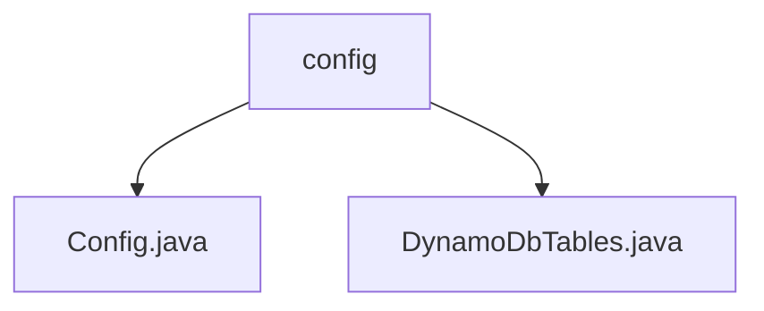

# 基础信息

|      |      |
|------|------|
| 名称 | config |
| 编码语言 | .java |
| 代码路径 | Signal-Server/integration-tests/src/main/java/org/signal/integration/config |
| 包名 | Signal-Server.integration-tests.src.main.java.org.signal.integration.config |
| 概述说明 | 无法总结，内容为空。 |

# 说明

## 概述
该代码模块主要涉及Signal-Server的集成测试配置部分，包含与DynamoDB表相关的配置。模块中的代码文件主要用于定义和配置集成测试所需的资源和环境，特别是与DynamoDB相关的表结构。

## 主要业务场景
1. **集成测试配置管理**：通过`Config.java`文件，模块可能负责加载和管理集成测试所需的配置参数，确保测试环境的一致性。
2. **DynamoDB表管理**：`DynamoDbTables.java`文件可能用于定义和初始化集成测试中使用的DynamoDB表结构，确保测试数据存储的正确性和可用性。

由于提供的具体内容有限，以上总结基于文件名和路径的推测。如需更详细的总结，请提供具体的代码内容或更多相关信息。

### 包内部结构视图

该流程图展示了Signal-Server项目中`integration-tests`模块下的`config`目录及其包含的两个Java文件：`Config.java`和`DynamoDbTables.java`。`config`作为父节点，直接关联到这两个文件，清晰地反映了它们之间的层级关系。

# 文件列表 File List

| 名称   | 类型  | 说明 |
|-------|------|-------------|
| [DynamoDbTables.java](DynamoDbTables.md) | file | 输入信息为空，无法生成概要描述。 |
| [Config.java](Config.md) | file | 信息为空，无法生成概要描述。 |

