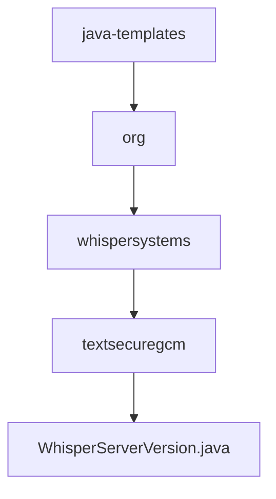

# 基础信息

|      |      |
|------|------|
| 名称 | java-templates |
| 编码语言 | .java |
| 代码路径 | Signal-Server/service/src/main/java-templates |
| 包名 | Signal-Server.service.src.main.java-templates |
| 概述说明 | WhisperServerVersion类用于获取服务器版本号。 |

# 说明

WhisperServerVersion类是一个用于获取服务器版本号的工具类。该类的主要功能是提供一种方法来获取当前服务器的版本号信息。通过调用该类的方法，用户可以方便地获取服务器的版本号，以便进行版本控制、兼容性检查或其他相关操作。

### 包内部结构视图

该流程图展示了Signal-Server项目中Java模板文件的层级结构。从`java-templates`目录开始，依次进入`org`、`whispersystems`和`textsecuregcm`子目录，最终到达`WhisperServerVersion.java`文件。每个节点代表路径中的最后一级目录或文件，清晰地展示了文件在项目中的位置和层级关系。

# 文件列表 File List

| 名称   | 类型  | 说明 |
|-------|------|-------------|
| [org](org/_module.md) | package | WhisperServerVersion类用于获取服务器版本号。 |

