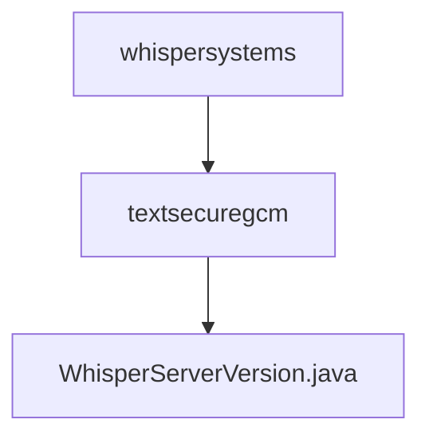

# 基础信息

|      |      |
|------|------|
| 名称 | whispersystems |
| 编码语言 | .java |
| 代码路径 | Signal-Server/service/src/main/java-templates/org/whispersystems |
| 包名 | Signal-Server.service.src.main.java-templates.org.whispersystems |
| 概述说明 | WhisperServerVersion类用于获取服务器版本号。 |

# 说明

WhisperServerVersion类是一个用于获取服务器版本号的工具类。该类的主要功能是提供一种方法来获取当前服务器的版本号信息。通过调用该类的方法，用户可以方便地获取服务器的版本号，以便进行版本控制、兼容性检查或其他相关操作。

### 包内部结构视图

该流程图展示了Signal-Server项目中Java代码的层级结构。顶层节点为`whispersystems`，它包含一个子节点`textsecuregcm`，而`textsecuregcm`又包含一个文件`WhisperServerVersion.java`。这种结构清晰地反映了代码的组织方式，从顶层包逐步细化到具体的Java文件。

# 文件列表 File List

| 名称   | 类型  | 说明 |
|-------|------|-------------|
| [textsecuregcm](textsecuregcm/_module.md) | package | WhisperServerVersion类用于获取服务器版本号。 |

