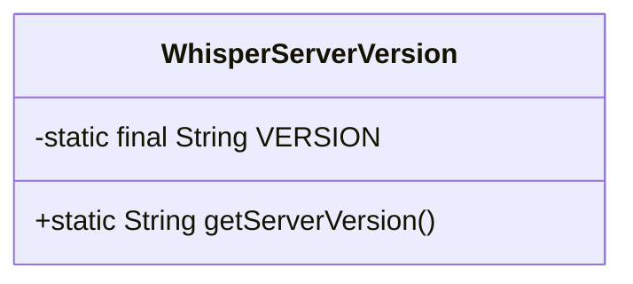
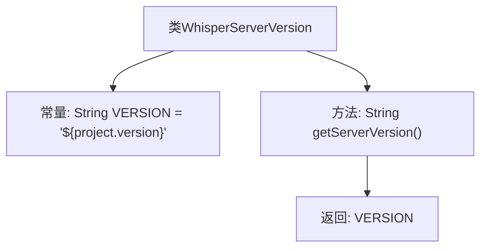

# 基础信息

|      |      |
|------|------|
| 名称 | WhisperServerVersion |
| 编码语言 | .java |
| 代码路径 | Signal-Server/service/src/main/java-templates/org/whispersystems/textsecuregcm/WhisperServerVersion.java |
| 包名 | org.whispersystems.textsecuregcm |
| 依赖项 | [] |
| 概述说明 | WhisperServerVersion类用于获取服务器版本号。 |

# 说明

WhisperServerVersion类是一个用于获取服务器版本号的工具类。该类的主要功能是提供一种方法来获取当前服务器的版本号信息。通过调用该类的方法，用户可以方便地获取服务器的版本号，以便进行版本控制、兼容性检查或其他相关操作。

# 类列表 Class Summary

| 名称   | 类型  | 说明 |
|-------|------|-------------|
| WhisperServerVersion | class | WhisperServerVersion类提供获取服务器版本号的方法。 |

## 类 WhisperServerVersion

|      |      |
|------|------|
| 访问范围 | public |
| 类型 | class |
| 名称 | WhisperServerVersion |
| 说明 | WhisperServerVersion类提供获取服务器版本号的方法。 |

### UML类图

这段代码定义了一个名为 `WhisperServerVersion` 的类，其中包含一个私有的静态常量 `VERSION`，该常量存储了服务器的版本号。类中还定义了一个公有的静态方法 `getServerVersion()`，用于返回 `VERSION` 的值。该类的主要作用是提供一个简单的方式来获取服务器的版本信息，适用于需要版本控制或版本检查的场景。

### 内部方法调用关系图

这段代码定义了一个名为 `WhisperServerVersion` 的类，其中包含一个常量 `VERSION` 和一个方法 `getServerVersion()`。常量 `VERSION` 被初始化为 `${project.version}`，表示项目版本号。`getServerVersion()` 方法返回这个常量值。流程图展示了类的结构以及方法如何返回常量值。

### 字段列表 Field List

| 名称  | 类型  | 说明 |
|-------|-------|------|
| VERSION = "${project.version}" | String | 定义私有静态常量VERSION，值为项目版本号。 |

### 方法列表 Method List

| 名称  | 类型  | 说明 |
|-------|-------|------|
| getServerVersion | String | 该方法返回服务器版本号。 |

