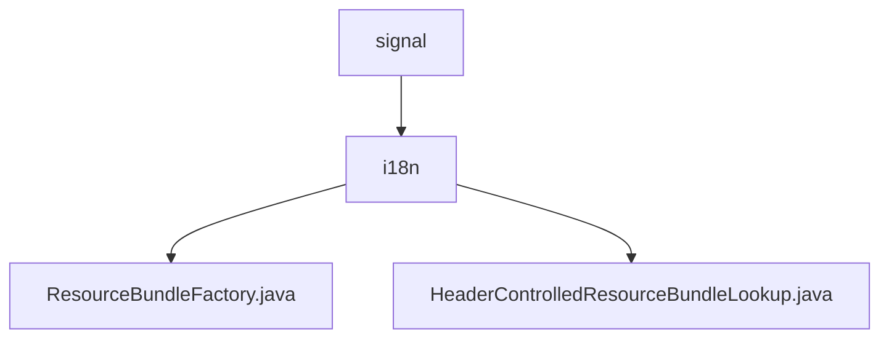

# 基础信息

|      |      |
|------|------|
| 名称 | signal |
| 编码语言 | .java |
| 代码路径 | Signal-Server/service/src/main/java/org/signal |
| 包名 | Signal-Server.service.src.main.java.org.signal |
| 概述说明 | HeaderControlledResourceBundleLookup类管理多语言资源包，支持15种语言，通过头部信息控制资源加载。 |

# 说明

## 概述
该代码模块主要涉及多语言资源包的管理，核心功能是通过头部信息控制资源包的查找和加载，确保在不同语言环境下能够准确获取相应的资源内容。模块支持最多15个语言环境，适用于需要支持多语言的应用程序，能够有效管理和限制语言环境的数量，提升资源管理的效率和可控性。

## 主要业务场景
- **多语言支持**：该模块适用于需要支持多语言的应用程序，通过头部信息控制资源包的查找和加载，确保在不同语言环境下能够准确获取相应的资源内容。
- **资源管理**：模块能够有效管理和限制语言环境的数量，提升资源管理的效率和可控性，特别适用于需要支持多语言的应用程序。

### 包内部结构视图

该流程图展示了Signal-Server项目中`org.signal`包下的层级结构。`signal`作为根节点，包含`i18n`子目录，而`i18n`目录下则包含`ResourceBundleFactory.java`和`HeaderControlledResourceBundleLookup.java`两个文件。这种结构清晰地反映了项目中国际化相关资源的组织方式。

# 文件列表 File List

| 名称   | 类型  | 说明 |
|-------|------|-------------|
| [i18n](i18n/_module.md) | package | HeaderControlledResourceBundleLookup类管理多语言资源包，支持15种语言，通过头部信息控制资源加载。 |

