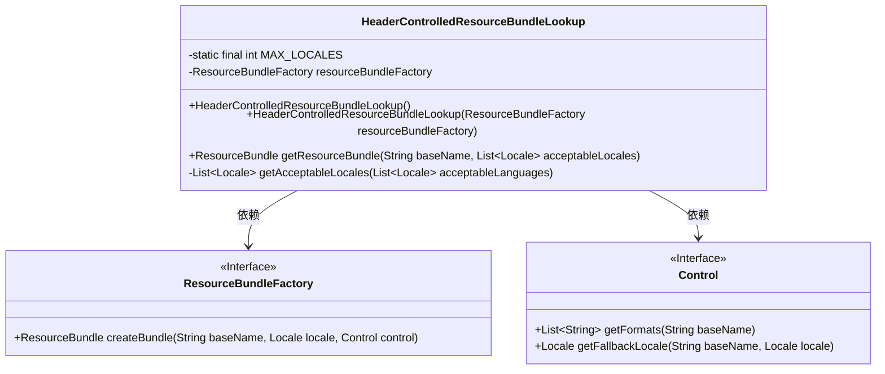
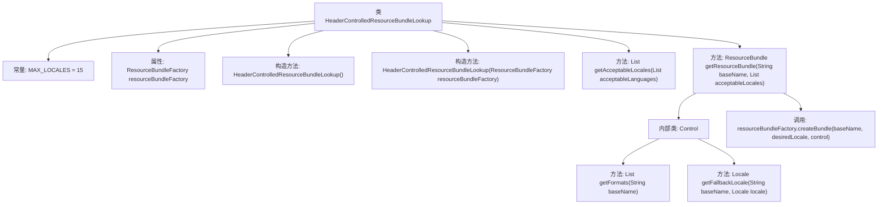

# 基础信息

|      |      |
|------|------|
| 名称 | HeaderControlledResourceBundleLookup |
| 编码语言 | .java |
| 代码路径 | Signal-Server/service/src/main/java/org/signal/i18n/HeaderControlledResourceBundleLookup.java |
| 包名 | org.signal.i18n |
| 依赖项 | ['com.google.common.annotations.VisibleForTesting', 'java.util.List', 'java.util.Locale', 'java.util.Objects', 'java.util.ResourceBundle', 'java.util.ResourceBundle.Control', 'java.util.stream.Collectors', 'javax.annotation.Nonnull'] |
| 概述说明 | 类HeaderControlledResourceBundleLookup管理多语言资源包，最多支持15种语言环境。 |

# 说明

类HeaderControlledResourceBundleLookup用于管理多语言资源包，支持最多15个语言环境。该类的核心功能是通过头部信息控制资源包的查找和加载，确保在不同语言环境下能够准确获取相应的资源内容。这种机制特别适用于需要支持多语言的应用程序，能够有效管理和限制语言环境的数量，提升资源管理的效率和可控性。

# 类列表 Class Summary

| 名称   | 类型  | 说明 |
|-------|------|-------------|
| HeaderControlledResourceBundleLookup | class | 类HeaderControlledResourceBundleLookup用于管理资源包，支持多语言，限制最多15个语言环境。 |

## 类 HeaderControlledResourceBundleLookup

|      |      |
|------|------|
| 访问范围 | public |
| 类型 | class |
| 名称 | HeaderControlledResourceBundleLookup |
| 说明 | 类HeaderControlledResourceBundleLookup用于管理资源包，支持多语言，限制最多15个语言环境。 |

### UML类图

类图描述：`HeaderControlledResourceBundleLookup`类用于根据请求头中的语言偏好获取资源包。它依赖于`ResourceBundleFactory`接口来创建资源包，并使用`Control`接口来控制资源包的格式和回退逻辑。`HeaderControlledResourceBundleLookup`类包含一个私有方法`getAcceptableLocales`，用于过滤和限制可接受的语言环境列表。

### 内部方法调用关系图

这段代码定义了一个名为`HeaderControlledResourceBundleLookup`的类，主要用于根据传入的语言列表获取资源包。类中包含两个构造方法，分别用于默认初始化和使用指定的`ResourceBundleFactory`。`getAcceptableLocales`方法用于从传入的语言列表中筛选出最多15个唯一语言。`getResourceBundle`方法则根据筛选后的语言列表和指定的资源包名称，通过自定义的`Control`类来控制资源包的加载和回退逻辑，最终返回相应的资源包。

### 字段列表 Field List

| 名称  | 类型  | 说明 |
|-------|-------|------|
| MAX_LOCALES = 15 | int | 代码定义了一个私有静态常量MAX_LOCALES，其值为15。 |
| resourceBundleFactory | ResourceBundleFactory | 私有且不可变的ResourceBundleFactory实例。 |

### 方法列表 Method List

| 名称  | 类型  | 说明 |
|-------|-------|------|
| getResourceBundle | ResourceBundle | 获取资源包方法，支持多语言和回退机制。 |
| getAcceptableLocales | List<Locale> | 方法返回前MAX_LOCALES个不重复的可用语言列表。 |

