# 基础信息

|      |      |
|------|------|
| 名称 | WhisperServerConfiguration |
| 编码语言 | .java |
| 代码路径 | Signal-Server/service/src/main/java/org/whispersystems/textsecuregcm/WhisperServerConfiguration.java |
| 包名 | org.whispersystems.textsecuregcm |
| 依赖项 | ['com.fasterxml.jackson.annotation.JsonProperty', 'io.dropwizard.core.Configuration', 'jakarta.validation.Valid', 'jakarta.validation.constraints.NotNull', 'java.time.Duration', 'java.util.HashMap', 'java.util.LinkedList', 'java.util.List', 'java.util.Map', 'org.whispersystems.textsecuregcm.attachments.TusConfiguration', 'org.whispersystems.textsecuregcm.configuration.ApnConfiguration', 'org.whispersystems.textsecuregcm.configuration.AppleAppStoreConfiguration', 'org.whispersystems.textsecuregcm.configuration.AppleDeviceCheckConfiguration', 'org.whispersystems.textsecuregcm.configuration.AwsCredentialsProviderFactory', 'org.whispersystems.textsecuregcm.configuration.BadgesConfiguration', 'org.whispersystems.textsecuregcm.configuration.BraintreeConfiguration', 'org.whispersystems.textsecuregcm.configuration.Cdn3StorageManagerConfiguration', 'org.whispersystems.textsecuregcm.configuration.CdnConfiguration', 'org.whispersystems.textsecuregcm.configuration.ClientReleaseConfiguration', 'org.whispersystems.textsecuregcm.configuration.DatadogConfiguration', 'org.whispersystems.textsecuregcm.configuration.DefaultAwsCredentialsFactory', 'org.whispersystems.textsecuregcm.configuration.DeviceCheckConfiguration', 'org.whispersystems.textsecuregcm.configuration.DirectoryV2Configuration', 'org.whispersystems.textsecuregcm.configuration.DogstatsdConfiguration', 'org.whispersystems.textsecuregcm.configuration.DynamoDbClientFactory', 'org.whispersystems.textsecuregcm.configuration.DynamoDbTables', 'org.whispersystems.textsecuregcm.configuration.ExternalRequestFilterConfiguration', 'org.whispersystems.textsecuregcm.configuration.FaultTolerantRedisClientFactory', 'org.whispersystems.textsecuregcm.configuration.FaultTolerantRedisClusterFactory', 'org.whispersystems.textsecuregcm.configuration.FcmConfiguration', 'org.whispersystems.textsecuregcm.configuration.GcpAttachmentsConfiguration', 'org.whispersystems.textsecuregcm.configuration.GenericZkConfig', 'org.whispersystems.textsecuregcm.configuration.GooglePlayBillingConfiguration', 'org.whispersystems.textsecuregcm.configuration.IdlePrimaryDeviceReminderConfiguration', 'org.whispersystems.textsecuregcm.configuration.KeyTransparencyServiceConfiguration', 'org.whispersystems.textsecuregcm.configuration.LinkDeviceSecretConfiguration', 'org.whispersystems.textsecuregcm.configuration.MaxDeviceConfiguration', 'org.whispersystems.textsecuregcm.configuration.MessageByteLimitCardinalityEstimatorConfiguration', 'org.whispersystems.textsecuregcm.configuration.MessageCacheConfiguration', 'org.whispersystems.textsecuregcm.configuration.NoiseWebSocketTunnelConfiguration', 'org.whispersystems.textsecuregcm.configuration.OneTimeDonationConfiguration', 'org.whispersystems.textsecuregcm.configuration.PaymentsServiceConfiguration', 'org.whispersystems.textsecuregcm.configuration.RegistrationServiceClientFactory', 'org.whispersystems.textsecuregcm.configuration.RemoteConfigConfiguration', 'org.whispersystems.textsecuregcm.configuration.ReportMessageConfiguration', 'org.whispersystems.textsecuregcm.configuration.S3ObjectMonitorFactory', 'org.whispersystems.textsecuregcm.configuration.SecureStorageServiceConfiguration', 'org.whispersystems.textsecuregcm.configuration.SecureValueRecovery2Configuration', 'org.whispersystems.textsecuregcm.configuration.ShortCodeExpanderConfiguration', 'org.whispersystems.textsecuregcm.configuration.SpamFilterConfiguration', 'org.whispersystems.textsecuregcm.configuration.StripeConfiguration', 'org.whispersystems.textsecuregcm.configuration.SubscriptionConfiguration', 'org.whispersystems.textsecuregcm.configuration.TlsKeyStoreConfiguration', 'org.whispersystems.textsecuregcm.configuration.TurnConfiguration', 'org.whispersystems.textsecuregcm.configuration.UnidentifiedDeliveryConfiguration', 'org.whispersystems.textsecuregcm.configuration.VirtualThreadConfiguration', 'org.whispersystems.textsecuregcm.configuration.ZkConfig', 'org.whispersystems.textsecuregcm.limits.RateLimiterConfig', 'org.whispersystems.websocket.configuration.WebSocketConfiguration'] |
| 概述说明 | WhisperServer配置类含TLS、AWS、支付、缓存、CDN、消息推送等关键组件。 |

# 说明

WhisperServer配置类是一个包含多个关键组件的复杂系统，主要涵盖TLS加密、AWS云服务、支付处理、缓存机制、CDN内容分发网络以及消息推送服务等配置。这些组件共同协作，确保服务器在安全性、性能、支付处理、内容分发和消息通知等方面的高效运行和优化。

# 类列表 Class Summary

| 名称   | 类型  | 说明 |
|-------|------|-------------|
| WhisperServerConfiguration | class | WhisperServer配置类包含多个关键组件，如TLS、AWS、支付、缓存、CDN、消息推送等配置。 |

## 类 WhisperServerConfiguration

|      |      |
|------|------|
| 访问范围 | public |
| 类型 | class |
| 名称 | WhisperServerConfiguration |
| 说明 | WhisperServer配置类包含多个关键组件，如TLS、AWS、支付、缓存、CDN、消息推送等配置。 |

### UML类图

```mermaid
classDiagram
    class WhisperServerConfiguration {
        -TlsKeyStoreConfiguration tlsKeyStore
        -AwsCredentialsProviderFactory awsCredentialsProvider
        -StripeConfiguration stripe
        -BraintreeConfiguration braintree
        -GooglePlayBillingConfiguration googlePlayBilling
        -AppleAppStoreConfiguration appleAppStore
        -AppleDeviceCheckConfiguration appleDeviceCheck
        -DeviceCheckConfiguration deviceCheck
        -DynamoDbClientFactory dynamoDbClient
        -DynamoDbTables dynamoDbTables
        -GcpAttachmentsConfiguration gcpAttachments
        -CdnConfiguration cdn
        -Cdn3StorageManagerConfiguration cdn3StorageManager
        -DatadogConfiguration dogstatsd
        -FaultTolerantRedisClusterFactory cacheCluster
        -FaultTolerantRedisClientFactory pubsub
        -DirectoryV2Configuration directoryV2
        -SecureValueRecovery2Configuration svr2
        -FaultTolerantRedisClusterFactory pushSchedulerCluster
        -FaultTolerantRedisClusterFactory rateLimitersCluster
        -MessageCacheConfiguration messageCache
        -List~MaxDeviceConfiguration~ maxDevices
        -Map~String, RateLimiterConfig~ limits
        -WebSocketConfiguration webSocket
        -FcmConfiguration fcm
        -ApnConfiguration apn
        -UnidentifiedDeliveryConfiguration unidentifiedDelivery
        -ShortCodeExpanderConfiguration shortCode
        -SecureStorageServiceConfiguration storageService
        -PaymentsServiceConfiguration paymentsService
        -ZkConfig zkConfig
        -GenericZkConfig callingZkConfig
        -GenericZkConfig backupsZkConfig
        -RemoteConfigConfiguration remoteConfig
        -S3ObjectMonitorFactory dynamicConfig
        -BadgesConfiguration badges
        -SubscriptionConfiguration subscription
        -OneTimeDonationConfiguration oneTimeDonations
        -ReportMessageConfiguration reportMessage
        -SpamFilterConfiguration spamFilter
        -RegistrationServiceClientFactory registrationService
        -TurnConfiguration turn
        -TusConfiguration tus
        -ClientReleaseConfiguration clientRelease
        -MessageByteLimitCardinalityEstimatorConfiguration messageByteLimitCardinalityEstimator
        -LinkDeviceSecretConfiguration linkDevice
        -VirtualThreadConfiguration virtualThread
        -NoiseWebSocketTunnelConfiguration noiseTunnel
        -ExternalRequestFilterConfiguration externalRequestFilter
        -KeyTransparencyServiceConfiguration keyTransparencyService
        -boolean logMessageDeliveryLoops
        -IdlePrimaryDeviceReminderConfiguration idlePrimaryDeviceReminder
        +TlsKeyStoreConfiguration getTlsKeyStoreConfiguration()
        +AwsCredentialsProviderFactory getAwsCredentialsConfiguration()
        +StripeConfiguration getStripe()
        +BraintreeConfiguration getBraintree()
        +GooglePlayBillingConfiguration getGooglePlayBilling()
        +AppleAppStoreConfiguration getAppleAppStore()
        +AppleDeviceCheckConfiguration getAppleDeviceCheck()
        +DeviceCheckConfiguration getDeviceCheck()
        +DynamoDbClientFactory getDynamoDbClientConfiguration()
        +DynamoDbTables getDynamoDbTables()
        +ShortCodeExpanderConfiguration getShortCodeRetrieverConfiguration()
        +WebSocketConfiguration getWebSocketConfiguration()
        +GcpAttachmentsConfiguration getGcpAttachmentsConfiguration()
        +FaultTolerantRedisClusterFactory getCacheClusterConfiguration()
        +FaultTolerantRedisClientFactory getRedisPubSubConfiguration()
        +SecureValueRecovery2Configuration getSvr2Configuration()
        +DirectoryV2Configuration getDirectoryV2Configuration()
        +SecureStorageServiceConfiguration getSecureStorageServiceConfiguration()
        +MessageCacheConfiguration getMessageCacheConfiguration()
        +FaultTolerantRedisClusterFactory getPushSchedulerCluster()
        +FaultTolerantRedisClusterFactory getRateLimitersCluster()
        +Map~String, RateLimiterConfig~ getLimitsConfiguration()
        +FcmConfiguration getFcmConfiguration()
        +ApnConfiguration getApnConfiguration()
        +CdnConfiguration getCdnConfiguration()
        +Cdn3StorageManagerConfiguration getCdn3StorageManagerConfiguration()
        +DatadogConfiguration getDatadogConfiguration()
        +UnidentifiedDeliveryConfiguration getDeliveryCertificate()
        +Map~String, Integer~ getMaxDevices()
        +PaymentsServiceConfiguration getPaymentsServiceConfiguration()
        +ZkConfig getZkConfig()
        +GenericZkConfig getCallingZkConfig()
        +GenericZkConfig getBackupsZkConfig()
        +RemoteConfigConfiguration getRemoteConfigConfiguration()
        +S3ObjectMonitorFactory getDynamicConfig()
        +BadgesConfiguration getBadges()
        +SubscriptionConfiguration getSubscription()
        +OneTimeDonationConfiguration getOneTimeDonations()
        +ReportMessageConfiguration getReportMessageConfiguration()
        +SpamFilterConfiguration getSpamFilterConfiguration()
        +RegistrationServiceClientFactory getRegistrationServiceConfiguration()
        +TurnConfiguration getTurnConfiguration()
        +TusConfiguration getTus()
        +ClientReleaseConfiguration getClientReleaseConfiguration()
        +MessageByteLimitCardinalityEstimatorConfiguration getMessageByteLimitCardinalityEstimator()
        +LinkDeviceSecretConfiguration getLinkDeviceSecretConfiguration()
        +VirtualThreadConfiguration getVirtualThreadConfiguration()
        +NoiseWebSocketTunnelConfiguration getNoiseWebSocketTunnelConfiguration()
        +ExternalRequestFilterConfiguration getExternalRequestFilterConfiguration()
        +KeyTransparencyServiceConfiguration getKeyTransparencyServiceConfiguration()
        +boolean logMessageDeliveryLoops()
        +IdlePrimaryDeviceReminderConfiguration idlePrimaryDeviceReminderConfiguration()
    }
```

**描述：**  
`WhisperServerConfiguration` 类是一个配置类，包含了多个私有属性，每个属性都对应一个特定的配置对象，如 `TlsKeyStoreConfiguration`、`AwsCredentialsProviderFactory` 等。该类提供了多个公有方法用于获取这些配置对象的值。这些配置对象可能用于服务器运行时的不同模块，如 TLS 证书管理、AWS 凭证管理、支付服务等。通过这种设计，`WhisperServerConfiguration` 类能够集中管理所有服务器配置，确保配置的一致性和可维护性。

### 内部方法调用关系图

**描述**：`WhisperServerConfiguration` 类是一个配置类，包含了大量的配置属性，涵盖了TLS密钥存储、AWS凭证、支付服务、数据库客户端、CDN配置、消息缓存、WebSocket配置等多个方面。每个属性都通过 `@JsonProperty` 注解进行序列化，并且通过 `@NotNull` 和 `@Valid` 注解确保其非空和有效性。类中还提供了多个getter方法，用于获取这些配置属性的值。

### 字段列表 Field List

| 名称  | 类型  | 说明 |
|-------|-------|------|
| stripe | StripeConfiguration | 非空有效的Stripe配置属性。 |
| deviceCheck | DeviceCheckConfiguration | 非空有效的设备检查配置属性。 |
| tlsKeyStore | TlsKeyStoreConfiguration | 非空验证的TLS密钥库配置属性。 |
| pubsub | FaultTolerantRedisClientFactory | 非空有效的Redis客户端工厂用于发布订阅。 |
| googlePlayBilling | GooglePlayBillingConfiguration | 非空有效的Google Play计费配置私有属性。 |
| braintree | BraintreeConfiguration | 非空验证的Braintree配置属性。 |
| appleAppStore | AppleAppStoreConfiguration | 非空有效的AppleAppStore配置项。 |
| gcpAttachments | GcpAttachmentsConfiguration | 非空有效的GCP附件配置属性。 |
| webSocket = new WebSocketConfiguration() | WebSocketConfiguration | WebSocket配置实例化并确保非空。 |
| oneTimeDonations | OneTimeDonationConfiguration | 非空一次性捐赠配置对象。 |
| awsCredentialsProvider = new DefaultAwsCredentialsFactory() | AwsCredentialsProviderFactory | 使用默认工厂创建AWS凭证提供者实例。 |
| noiseTunnel | NoiseWebSocketTunnelConfiguration | 非空NoiseWebSocket隧道配置属性。 |
| cdn3StorageManager | Cdn3StorageManagerConfiguration | 非空、有效的CDN3存储管理器配置对象。 |
| tus | TusConfiguration | 非空Tus配置对象。 |
| reportMessage = new ReportMessageConfiguration() | ReportMessageConfiguration | 非空报告消息配置实例初始化。 |
| cdn | CdnConfiguration | 非空有效CDN配置属性 |
| directoryV2 | DirectoryV2Configuration | 非空验证的DirectoryV2配置属性。 |
| cacheCluster | FaultTolerantRedisClusterFactory | 非空有效的缓存集群工厂属性。 |
| keyTransparencyService | KeyTransparencyServiceConfiguration | 配置中必须包含非空的密钥透明服务。 |
| logMessageDeliveryLoops | boolean | 属性logMessageDeliveryLoops用于记录消息传递循环状态。 |
| linkDevice | LinkDeviceSecretConfiguration | 链接设备密钥配置的私有属性，使用验证和非空注解。 |
| messageCache | MessageCacheConfiguration | 非空验证的消息缓存配置属性。 |
| dynamicConfig | S3ObjectMonitorFactory | 动态配置使用S3对象监控工厂，确保非空且有效。 |
| pushSchedulerCluster | FaultTolerantRedisClusterFactory | 非空有效的推送调度器集群工厂实例。 |
| backupsZkConfig | GenericZkConfig | 非空泛型Zk配置备份项 |
| apn | ApnConfiguration | Apn配置对象不可为空且必须验证。 |
| shortCode | ShortCodeExpanderConfiguration | 包含NotNull和JsonProperty注解的ShortCodeExpanderConfiguration配置。 |
| maxDevices = new LinkedList<>() | List<MaxDeviceConfiguration> | 非空列表存储MaxDeviceConfiguration对象。 |
| callingZkConfig | GenericZkConfig | 包含非空且有效的调用Zk配置属性。 |
| svr2 | SecureValueRecovery2Configuration | 非空验证的SecureValueRecovery2配置项svr2。 |
| badges | BadgesConfiguration | BadgesConfiguration字段为必填且不可为空。 |
| zkConfig | ZkConfig | 非空ZkConfig属性，使用JsonProperty注解标记。 |
| clientRelease = new ClientReleaseConfiguration(Duration.ofHours(4)) | ClientReleaseConfiguration | 客户端发布配置默认4小时，确保非空且有效。 |
| registrationService | RegistrationServiceClientFactory | 注册服务客户端工厂字段，非空且有效。 |
| turn | TurnConfiguration | 非空且有效的TurnConfiguration属性，使用JsonProperty注解。 |
| unidentifiedDelivery | UnidentifiedDeliveryConfiguration | 非空且有效的未识别交付配置项。 |
| rateLimitersCluster | FaultTolerantRedisClusterFactory | 非空有效的限速器集群工厂实例。 |
| dynamoDbClient | DynamoDbClientFactory | 非空验证的动态DynamoDB客户端工厂属性。 |
| storageService | SecureStorageServiceConfiguration | 非空安全存储服务配置，使用JsonProperty注解。 |
| remoteConfig | RemoteConfigConfiguration | 远程配置对象必须有效且不为空。 |
| fcm | FcmConfiguration | FcmConfiguration字段不可为空且需序列化。 |
| virtualThread = new VirtualThreadConfiguration(Duration.ofMillis(1)) | VirtualThreadConfiguration | 虚拟线程配置初始化为1毫秒，确保非空且有效。 |
| externalRequestFilter | ExternalRequestFilterConfiguration | 外部请求过滤器配置，需非空且有效。 |
| dynamoDbTables | DynamoDbTables | 非空且有效的DynamoDbTables属性，使用JsonProperty注解。 |
| idlePrimaryDeviceReminder =      new IdlePrimaryDeviceReminderConfiguration(Duration.ofDays(30)) | IdlePrimaryDeviceReminderConfiguration | 配置主设备闲置提醒，默认提醒周期为30天。 |
| dogstatsd = new DogstatsdConfiguration() | DatadogConfiguration | 非空且有效的Datadog配置项dogstatsd实例化。 |
| messageByteLimitCardinalityEstimator = new MessageByteLimitCardinalityEstimatorConfiguration(Duration.ofDays(1)) | MessageByteLimitCardinalityEstimatorConfiguration | 配置消息字节限制基数估计器，默认有效期为一天。 |
| appleDeviceCheck | AppleDeviceCheckConfiguration | 非空且有效的苹果设备检查配置项。 |
| spamFilter | SpamFilterConfiguration | 定义私有变量spamFilter，并标注为有效且可序列化。 |
| limits = new HashMap<>() | Map<String, RateLimiterConfig> | 定义了一个非空且有效的限流配置映射，键为字符串，值为限流配置对象。 |
| subscription | SubscriptionConfiguration | 包含NotNull和JsonProperty注解的SubscriptionConfiguration类型私有属性subscription。 |
| paymentsService | PaymentsServiceConfiguration | 支付服务配置项为必填且不能为空。 |

### 方法列表 Method List

| 名称  | 类型  | 说明 |
|-------|-------|------|
| getStripe | StripeConfiguration | 获取Stripe配置实例的方法。 |
| getDirectoryV2Configuration | DirectoryV2Configuration | 获取DirectoryV2配置实例。 |
| getDeviceCheck | DeviceCheckConfiguration | 获取设备检查配置的方法。 |
| getAwsCredentialsConfiguration | AwsCredentialsProviderFactory | 获取AWS凭证配置的工厂方法。 |
| getTlsKeyStoreConfiguration | TlsKeyStoreConfiguration | 获取TLS密钥库配置的方法。 |
| getMessageCacheConfiguration | MessageCacheConfiguration | 获取消息缓存配置的方法。 |
| getAppleDeviceCheck | AppleDeviceCheckConfiguration | 获取Apple设备检查配置的方法。 |
| getDynamoDbTables | DynamoDbTables | 该方法返回DynamoDbTables对象。 |
| getReportMessageConfiguration | ReportMessageConfiguration | 该方法返回报告消息配置对象。 |
| getSubscription | SubscriptionConfiguration | 获取订阅配置的方法。 |
| getWebSocketConfiguration | WebSocketConfiguration | 获取WebSocket配置的方法，返回webSocket实例。 |
| getBackupsZkConfig | GenericZkConfig | 获取备份Zookeeper配置的方法。 |
| getAppleAppStore | AppleAppStoreConfiguration | 获取AppleAppStore配置的方法。 |
| getTus | TusConfiguration | 获取Tus配置对象的方法。 |
| getGooglePlayBilling | GooglePlayBillingConfiguration | 获取Google Play支付配置的方法。 |
| getApnConfiguration | ApnConfiguration | 获取APN配置信息的方法。 |
| getRegistrationServiceConfiguration | RegistrationServiceClientFactory | 获取注册服务配置的工厂方法。 |
| getCallingZkConfig | GenericZkConfig | 获取调用ZooKeeper配置的方法。 |
| getCdnConfiguration | CdnConfiguration | 获取CDN配置的方法，返回CDN对象。 |
| getVirtualThreadConfiguration | VirtualThreadConfiguration | 获取虚拟线程配置对象的方法。 |
| getTurnConfiguration | TurnConfiguration | 获取转向配置的公共方法。 |
| getRemoteConfigConfiguration | RemoteConfigConfiguration | 获取远程配置实例。 |
| getFcmConfiguration | FcmConfiguration | 获取FCM配置的方法，返回fcm对象。 |
| getShortCodeRetrieverConfiguration | ShortCodeExpanderConfiguration | 获取短代码扩展配置的短代码检索器配置。 |
| getCacheClusterConfiguration | FaultTolerantRedisClusterFactory | 获取缓存集群配置的公共方法。 |
| getRateLimitersCluster | FaultTolerantRedisClusterFactory | 获取限流器集群的容错Redis工厂方法。 |
| getDeliveryCertificate | UnidentifiedDeliveryConfiguration | 该方法返回未识别的交付配置对象。 |
| getDynamoDbClientConfiguration | DynamoDbClientFactory | 获取DynamoDb客户端配置的工厂方法。 |
| getRedisPubSubConfiguration | FaultTolerantRedisClientFactory | 获取Redis发布订阅配置的工厂方法。 |
| getSecureStorageServiceConfiguration | SecureStorageServiceConfiguration | 获取安全存储服务配置，返回存储服务对象。 |
| getLinkDeviceSecretConfiguration | LinkDeviceSecretConfiguration | 获取设备连接密钥配置。 |
| getPushSchedulerCluster | FaultTolerantRedisClusterFactory | 获取推送调度器集群的容错Redis集群工厂实例。 |
| getGcpAttachmentsConfiguration | GcpAttachmentsConfiguration | 获取GCP附件配置的方法，返回gcpAttachments对象。 |
| getMaxDevices | Map<String, Integer> | 获取最大设备配置的编号和数量映射。 |
| getPaymentsServiceConfiguration | PaymentsServiceConfiguration | 获取支付服务配置的公共方法。 |
| getZkConfig | ZkConfig | 获取zkConfig配置实例。 |
| getClientReleaseConfiguration | ClientReleaseConfiguration | 获取客户端发布配置的方法。 |
| getSpamFilterConfiguration | SpamFilterConfiguration | 获取垃圾邮件过滤配置的公共方法。 |
| getMessageByteLimitCardinalityEstimator | MessageByteLimitCardinalityEstimatorConfiguration | 获取消息字节限制基数估计器配置方法。 |
| getDatadogConfiguration | DatadogConfiguration | 获取Datadog配置的公共方法，返回dogstatsd对象。 |
| getLimitsConfiguration | Map<String, RateLimiterConfig> | 该方法返回限流配置的映射。 |
| getBraintree | BraintreeConfiguration | 获取Braintree配置的方法，返回braintree对象。 |
| getOneTimeDonations | OneTimeDonationConfiguration | 获取一次性捐赠配置的公共方法。 |
| getSvr2Configuration | SecureValueRecovery2Configuration | 获取SecureValueRecovery2配置实例。 |
| getDynamicConfig | S3ObjectMonitorFactory | 获取动态配置的S3对象监控工厂实例。 |
| getNoiseWebSocketTunnelConfiguration | NoiseWebSocketTunnelConfiguration | 获取NoiseWebSocketTunnel配置实例。 |
| getCdn3StorageManagerConfiguration | Cdn3StorageManagerConfiguration | 获取Cdn3StorageManager配置实例。 |
| getExternalRequestFilterConfiguration | ExternalRequestFilterConfiguration | 获取外部请求过滤器配置实例。 |
| getBadges | BadgesConfiguration | 获取徽章配置的方法，返回徽章对象。 |
| logMessageDeliveryLoops | boolean | 方法返回消息传递循环的日志状态。 |
| getKeyTransparencyServiceConfiguration | KeyTransparencyServiceConfiguration | 获取密钥透明服务配置的方法。 |
| idlePrimaryDeviceReminderConfiguration | IdlePrimaryDeviceReminderConfiguration | 该方法返回空闲主设备提醒配置对象。 |

