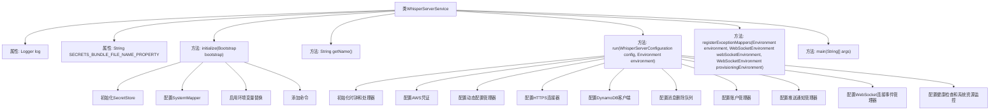

# 基础信息

|      |      |
|------|------|
| 名称 | WhisperServerService |
| 编码语言 | .java |
| 代码路径 | Signal-Server/service/src/main/java/org/whispersystems/textsecuregcm/WhisperServerService.java |
| 包名 | org.whispersystems.textsecuregcm |
| 依赖项 | ['com.codahale.metrics.MetricRegistry.name', 'java.util.Objects.requireNonNull', 'com.google.common.collect.Lists', 'com.webauthn4j.appattest.DeviceCheckManager', 'io.dropwizard.auth.AuthDynamicFeature', 'io.dropwizard.auth.AuthFilter', 'io.dropwizard.auth.AuthValueFactoryProvider', 'io.dropwizard.auth.basic.BasicCredentialAuthFilter', 'io.dropwizard.auth.basic.BasicCredentials', 'io.dropwizard.configuration.EnvironmentVariableSubstitutor', 'io.dropwizard.configuration.SubstitutingSourceProvider', 'io.dropwizard.core.Application', 'io.dropwizard.core.server.DefaultServerFactory', 'io.dropwizard.core.setup.Bootstrap', 'io.dropwizard.core.setup.Environment', 'io.dropwizard.jetty.HttpsConnectorFactory', 'io.grpc.ServerBuilder', 'io.lettuce.core.metrics.MicrometerCommandLatencyRecorder', 'io.lettuce.core.metrics.MicrometerOptions', 'io.lettuce.core.resource.ClientResources', 'io.micrometer.core.instrument.Metrics', 'io.micrometer.core.instrument.binder.grpc.MetricCollectingServerInterceptor', 'io.micrometer.core.instrument.binder.jvm.ExecutorServiceMetrics', 'io.netty.channel.local.LocalAddress', 'io.netty.channel.socket.nio.NioDatagramChannel', 'io.netty.channel.socket.nio.NioSocketChannel', 'io.netty.resolver.ResolvedAddressTypes', 'io.netty.resolver.dns.DnsNameResolver', 'io.netty.resolver.dns.DnsNameResolverBuilder', 'jakarta.servlet.DispatcherType', 'jakarta.servlet.Filter', 'jakarta.servlet.ServletRegistration', 'java.io.ByteArrayInputStream', 'java.io.FileInputStream', 'java.net.http.HttpClient', 'java.nio.charset.StandardCharsets', 'java.security.KeyStore', 'java.security.PrivateKey', 'java.security.cert.X509Certificate', 'java.time.Clock', 'java.time.Duration', 'java.util.ArrayList', 'java.util.Arrays', 'java.util.Collections', 'java.util.EnumSet', 'java.util.List', 'java.util.Optional', 'java.util.ServiceLoader', 'java.util.Set', 'java.util.concurrent.BlockingQueue', 'java.util.concurrent.ExecutorService', 'java.util.concurrent.LinkedBlockingQueue', 'java.util.concurrent.ScheduledExecutorService', 'java.util.concurrent.SynchronousQueue', 'java.util.concurrent.ThreadPoolExecutor', 'java.util.function.Function', 'java.util.stream.Stream', 'javax.annotation.Nullable', 'org.eclipse.jetty.websocket.server.config.JettyWebSocketServletContainerInitializer', 'org.glassfish.jersey.server.ServerProperties', 'org.signal.i18n.HeaderControlledResourceBundleLookup', 'org.signal.libsignal.zkgroup.GenericServerSecretParams', 'org.signal.libsignal.zkgroup.ServerSecretParams', 'org.signal.libsignal.zkgroup.auth.ServerZkAuthOperations', 'org.signal.libsignal.zkgroup.profiles.ServerZkProfileOperations', 'org.signal.libsignal.zkgroup.receipts.ReceiptCredentialPresentation', 'org.signal.libsignal.zkgroup.receipts.ServerZkReceiptOperations', 'org.slf4j.Logger', 'org.slf4j.LoggerFactory', 'org.whispersystems.textsecuregcm.attachments.GcsAttachmentGenerator', 'org.whispersystems.textsecuregcm.attachments.TusAttachmentGenerator', 'org.whispersystems.textsecuregcm.auth.AccountAuthenticator', 'org.whispersystems.textsecuregcm.auth.AuthenticatedDevice', 'org.whispersystems.textsecuregcm.auth.CertificateGenerator', 'org.whispersystems.textsecuregcm.auth.CloudflareTurnCredentialsManager', 'org.whispersystems.textsecuregcm.auth.DisconnectionRequestManager', 'org.whispersystems.textsecuregcm.auth.ExternalServiceCredentialsGenerator', 'org.whispersystems.textsecuregcm.auth.IdlePrimaryDeviceAuthenticatedWebSocketUpgradeFilter', 'org.whispersystems.textsecuregcm.auth.PhoneVerificationTokenManager', 'org.whispersystems.textsecuregcm.auth.RegistrationLockVerificationManager', 'org.whispersystems.textsecuregcm.auth.WebsocketRefreshApplicationEventListener', 'org.whispersystems.textsecuregcm.auth.grpc.ProhibitAuthenticationInterceptor', 'org.whispersystems.textsecuregcm.auth.grpc.RequireAuthenticationInterceptor', 'org.whispersystems.textsecuregcm.backup.BackupAuthManager', 'org.whispersystems.textsecuregcm.backup.BackupManager', 'org.whispersystems.textsecuregcm.backup.BackupsDb', 'org.whispersystems.textsecuregcm.backup.Cdn3BackupCredentialGenerator', 'org.whispersystems.textsecuregcm.backup.Cdn3RemoteStorageManager', 'org.whispersystems.textsecuregcm.badges.ConfiguredProfileBadgeConverter', 'org.whispersystems.textsecuregcm.captcha.CaptchaChecker', 'org.whispersystems.textsecuregcm.captcha.CaptchaClient', 'org.whispersystems.textsecuregcm.captcha.RegistrationCaptchaManager', 'org.whispersystems.textsecuregcm.captcha.ShortCodeExpander', 'org.whispersystems.textsecuregcm.configuration.dynamic.DynamicConfiguration', 'org.whispersystems.textsecuregcm.configuration.secrets.SecretStore', 'org.whispersystems.textsecuregcm.configuration.secrets.SecretsModule', 'org.whispersystems.textsecuregcm.controllers.AccountController', 'org.whispersystems.textsecuregcm.controllers.AccountControllerV2', 'org.whispersystems.textsecuregcm.controllers.ArchiveController', 'org.whispersystems.textsecuregcm.controllers.AttachmentControllerV4', 'org.whispersystems.textsecuregcm.controllers.CallLinkController', 'org.whispersystems.textsecuregcm.controllers.CallRoutingControllerV2', 'org.whispersystems.textsecuregcm.controllers.CertificateController', 'org.whispersystems.textsecuregcm.controllers.ChallengeController', 'org.whispersystems.textsecuregcm.controllers.DeviceCheckController', 'org.whispersystems.textsecuregcm.controllers.DeviceController', 'org.whispersystems.textsecuregcm.controllers.DirectoryV2Controller', 'org.whispersystems.textsecuregcm.controllers.DonationController', 'org.whispersystems.textsecuregcm.controllers.KeepAliveController', 'org.whispersystems.textsecuregcm.controllers.KeyTransparencyController', 'org.whispersystems.textsecuregcm.controllers.KeysController', 'org.whispersystems.textsecuregcm.controllers.MessageController', 'org.whispersystems.textsecuregcm.controllers.OneTimeDonationController', 'org.whispersystems.textsecuregcm.controllers.PaymentsController', 'org.whispersystems.textsecuregcm.controllers.ProfileController', 'org.whispersystems.textsecuregcm.controllers.ProvisioningController', 'org.whispersystems.textsecuregcm.controllers.RegistrationController', 'org.whispersystems.textsecuregcm.controllers.RemoteConfigController', 'org.whispersystems.textsecuregcm.controllers.SecureStorageController', 'org.whispersystems.textsecuregcm.controllers.SecureValueRecovery2Controller', 'org.whispersystems.textsecuregcm.controllers.StickerController', 'org.whispersystems.textsecuregcm.controllers.SubscriptionController', 'org.whispersystems.textsecuregcm.controllers.VerificationController', 'org.whispersystems.textsecuregcm.currency.CoinGeckoClient', 'org.whispersystems.textsecuregcm.currency.CurrencyConversionManager', 'org.whispersystems.textsecuregcm.currency.FixerClient', 'org.whispersystems.textsecuregcm.experiment.ExperimentEnrollmentManager', 'org.whispersystems.textsecuregcm.filters.ExternalRequestFilter', 'org.whispersystems.textsecuregcm.filters.RemoteAddressFilter', 'org.whispersystems.textsecuregcm.filters.RemoteDeprecationFilter', 'org.whispersystems.textsecuregcm.filters.RequestStatisticsFilter', 'org.whispersystems.textsecuregcm.filters.RestDeprecationFilter', 'org.whispersystems.textsecuregcm.filters.TimestampResponseFilter', 'org.whispersystems.textsecuregcm.grpc.AccountsAnonymousGrpcService', 'org.whispersystems.textsecuregcm.grpc.AccountsGrpcService', 'org.whispersystems.textsecuregcm.grpc.ErrorMappingInterceptor', 'org.whispersystems.textsecuregcm.grpc.ExternalServiceCredentialsAnonymousGrpcService', 'org.whispersystems.textsecuregcm.grpc.ExternalServiceCredentialsGrpcService', 'org.whispersystems.textsecuregcm.grpc.KeysAnonymousGrpcService', 'org.whispersystems.textsecuregcm.grpc.KeysGrpcService', 'org.whispersystems.textsecuregcm.grpc.PaymentsGrpcService', 'org.whispersystems.textsecuregcm.grpc.ProfileAnonymousGrpcService', 'org.whispersystems.textsecuregcm.grpc.ProfileGrpcService', 'org.whispersystems.textsecuregcm.grpc.RequestAttributesInterceptor', 'org.whispersystems.textsecuregcm.grpc.ValidatingInterceptor', 'org.whispersystems.textsecuregcm.grpc.net.GrpcClientConnectionManager', 'org.whispersystems.textsecuregcm.grpc.net.ManagedDefaultEventLoopGroup', 'org.whispersystems.textsecuregcm.grpc.net.ManagedLocalGrpcServer', 'org.whispersystems.textsecuregcm.grpc.net.ManagedNioEventLoopGroup', 'org.whispersystems.textsecuregcm.grpc.net.NoiseWebSocketTunnelServer', 'org.whispersystems.textsecuregcm.jetty.JettyHttpConfigurationCustomizer', 'org.whispersystems.textsecuregcm.keytransparency.KeyTransparencyServiceClient', 'org.whispersystems.textsecuregcm.limits.CardinalityEstimator', 'org.whispersystems.textsecuregcm.limits.MessageDeliveryLoopMonitor', 'org.whispersystems.textsecuregcm.limits.NoopMessageDeliveryLoopMonitor', 'org.whispersystems.textsecuregcm.limits.PushChallengeManager', 'org.whispersystems.textsecuregcm.limits.RateLimitByIpFilter', 'org.whispersystems.textsecuregcm.limits.RateLimitChallengeManager', 'org.whispersystems.textsecuregcm.limits.RateLimiters', 'org.whispersystems.textsecuregcm.limits.RedisMessageDeliveryLoopMonitor', 'org.whispersystems.textsecuregcm.mappers.CompletionExceptionMapper', 'org.whispersystems.textsecuregcm.mappers.DeviceLimitExceededExceptionMapper', 'org.whispersystems.textsecuregcm.mappers.GrpcStatusRuntimeExceptionMapper', 'org.whispersystems.textsecuregcm.mappers.IOExceptionMapper', 'org.whispersystems.textsecuregcm.mappers.ImpossiblePhoneNumberExceptionMapper', 'org.whispersystems.textsecuregcm.mappers.InvalidWebsocketAddressExceptionMapper', 'org.whispersystems.textsecuregcm.mappers.JsonMappingExceptionMapper', 'org.whispersystems.textsecuregcm.mappers.NonNormalizedPhoneNumberExceptionMapper', 'org.whispersystems.textsecuregcm.mappers.ObsoletePhoneNumberFormatExceptionMapper', 'org.whispersystems.textsecuregcm.mappers.RateLimitExceededExceptionMapper', 'org.whispersystems.textsecuregcm.mappers.RegistrationServiceSenderExceptionMapper', 'org.whispersystems.textsecuregcm.mappers.ServerRejectedExceptionMapper', 'org.whispersystems.textsecuregcm.mappers.SubscriptionExceptionMapper', 'org.whispersystems.textsecuregcm.metrics.MessageMetrics', 'org.whispersystems.textsecuregcm.metrics.MetricsApplicationEventListener', 'org.whispersystems.textsecuregcm.metrics.MetricsHttpChannelListener', 'org.whispersystems.textsecuregcm.metrics.MetricsUtil', 'org.whispersystems.textsecuregcm.metrics.MicrometerAwsSdkMetricPublisher', 'org.whispersystems.textsecuregcm.metrics.ReportedMessageMetricsListener', 'org.whispersystems.textsecuregcm.metrics.TrafficSource', 'org.whispersystems.textsecuregcm.providers.MultiRecipientMessageProvider', 'org.whispersystems.textsecuregcm.providers.RedisClusterHealthCheck', 'org.whispersystems.textsecuregcm.push.APNSender', 'org.whispersystems.textsecuregcm.push.FcmSender', 'org.whispersystems.textsecuregcm.push.MessageSender', 'org.whispersystems.textsecuregcm.push.ProvisioningManager', 'org.whispersystems.textsecuregcm.push.PushNotificationManager', 'org.whispersystems.textsecuregcm.push.PushNotificationScheduler', 'org.whispersystems.textsecuregcm.push.ReceiptSender', 'org.whispersystems.textsecuregcm.push.WebSocketConnectionEventManager', 'org.whispersystems.textsecuregcm.redis.ConnectionEventLogger', 'org.whispersystems.textsecuregcm.redis.FaultTolerantRedisClient', 'org.whispersystems.textsecuregcm.redis.FaultTolerantRedisClusterClient', 'org.whispersystems.textsecuregcm.registration.RegistrationServiceClient', 'org.whispersystems.textsecuregcm.s3.PolicySigner', 'org.whispersystems.textsecuregcm.s3.PostPolicyGenerator', 'org.whispersystems.textsecuregcm.securestorage.SecureStorageClient', 'org.whispersystems.textsecuregcm.securevaluerecovery.SecureValueRecovery2Client', 'org.whispersystems.textsecuregcm.spam.ChallengeConstraintChecker', 'org.whispersystems.textsecuregcm.spam.RegistrationFraudChecker', 'org.whispersystems.textsecuregcm.spam.RegistrationRecoveryChecker', 'org.whispersystems.textsecuregcm.spam.SpamChecker', 'org.whispersystems.textsecuregcm.spam.SpamFilter', 'org.whispersystems.textsecuregcm.storage.AccountLockManager', 'org.whispersystems.textsecuregcm.storage.AccountPrincipalSupplier', 'org.whispersystems.textsecuregcm.storage.Accounts', 'org.whispersystems.textsecuregcm.storage.AccountsManager', 'org.whispersystems.textsecuregcm.storage.ChangeNumberManager', 'org.whispersystems.textsecuregcm.storage.ClientPublicKeys', 'org.whispersystems.textsecuregcm.storage.ClientPublicKeysManager', 'org.whispersystems.textsecuregcm.storage.ClientReleaseManager', 'org.whispersystems.textsecuregcm.storage.ClientReleases', 'org.whispersystems.textsecuregcm.storage.DynamicConfigurationManager', 'org.whispersystems.textsecuregcm.storage.IssuedReceiptsManager', 'org.whispersystems.textsecuregcm.storage.KeysManager', 'org.whispersystems.textsecuregcm.storage.MessagesCache', 'org.whispersystems.textsecuregcm.storage.MessagesDynamoDb', 'org.whispersystems.textsecuregcm.storage.MessagesManager', 'org.whispersystems.textsecuregcm.storage.OneTimeDonationsManager', 'org.whispersystems.textsecuregcm.storage.PersistentTimer', 'org.whispersystems.textsecuregcm.storage.PhoneNumberIdentifiers', 'org.whispersystems.textsecuregcm.storage.Profiles', 'org.whispersystems.textsecuregcm.storage.ProfilesManager', 'org.whispersystems.textsecuregcm.storage.PushChallengeDynamoDb', 'org.whispersystems.textsecuregcm.storage.RedeemedReceiptsManager', 'org.whispersystems.textsecuregcm.storage.RegistrationRecoveryPasswords', 'org.whispersystems.textsecuregcm.storage.RegistrationRecoveryPasswordsManager', 'org.whispersystems.textsecuregcm.storage.RemoteConfigs', 'org.whispersystems.textsecuregcm.storage.RemoteConfigsManager', 'org.whispersystems.textsecuregcm.storage.ReportMessageDynamoDb', 'org.whispersystems.textsecuregcm.storage.ReportMessageManager', 'org.whispersystems.textsecuregcm.storage.SubscriptionManager', 'org.whispersystems.textsecuregcm.storage.Subscriptions', 'org.whispersystems.textsecuregcm.storage.VerificationSessionManager', 'org.whispersystems.textsecuregcm.storage.VerificationSessions', 'org.whispersystems.textsecuregcm.storage.devicecheck.AppleDeviceCheckManager', 'org.whispersystems.textsecuregcm.storage.devicecheck.AppleDeviceCheckTrustAnchor', 'org.whispersystems.textsecuregcm.storage.devicecheck.AppleDeviceChecks', 'org.whispersystems.textsecuregcm.subscriptions.AppleAppStoreManager', 'org.whispersystems.textsecuregcm.subscriptions.BankMandateTranslator', 'org.whispersystems.textsecuregcm.subscriptions.BraintreeManager', 'org.whispersystems.textsecuregcm.subscriptions.GooglePlayBillingManager', 'org.whispersystems.textsecuregcm.subscriptions.StripeManager', 'org.whispersystems.textsecuregcm.util.BufferingInterceptor', 'org.whispersystems.textsecuregcm.util.ManagedAwsCrt', 'org.whispersystems.textsecuregcm.util.SystemMapper', 'org.whispersystems.textsecuregcm.util.UsernameHashZkProofVerifier', 'org.whispersystems.textsecuregcm.util.VirtualExecutorServiceProvider', 'org.whispersystems.textsecuregcm.util.VirtualThreadPinEventMonitor', 'org.whispersystems.textsecuregcm.util.logging.LoggingUnhandledExceptionMapper', 'org.whispersystems.textsecuregcm.util.logging.UncaughtExceptionHandler', 'org.whispersystems.textsecuregcm.websocket.AuthenticatedConnectListener', 'org.whispersystems.textsecuregcm.websocket.ProvisioningConnectListener', 'org.whispersystems.textsecuregcm.websocket.WebSocketAccountAuthenticator', 'org.whispersystems.textsecuregcm.workers.BackupMetricsCommand', 'org.whispersystems.textsecuregcm.workers.CertificateCommand', 'org.whispersystems.textsecuregcm.workers.CheckDynamicConfigurationCommand', 'org.whispersystems.textsecuregcm.workers.DeleteUserCommand', 'org.whispersystems.textsecuregcm.workers.IdleDeviceNotificationSchedulerFactory', 'org.whispersystems.textsecuregcm.workers.MessagePersisterServiceCommand', 'org.whispersystems.textsecuregcm.workers.NotifyIdleDevicesCommand', 'org.whispersystems.textsecuregcm.workers.ProcessScheduledJobsServiceCommand', 'org.whispersystems.textsecuregcm.workers.RemoveExpiredAccountsCommand', 'org.whispersystems.textsecuregcm.workers.RemoveExpiredBackupsCommand', 'org.whispersystems.textsecuregcm.workers.RemoveExpiredLinkedDevicesCommand', 'org.whispersystems.textsecuregcm.workers.RemoveExpiredUsernameHoldsCommand', 'org.whispersystems.textsecuregcm.workers.ScheduledApnPushNotificationSenderServiceCommand', 'org.whispersystems.textsecuregcm.workers.ServerVersionCommand', 'org.whispersystems.textsecuregcm.workers.SetRequestLoggingEnabledTask', 'org.whispersystems.textsecuregcm.workers.SetUserDiscoverabilityCommand', 'org.whispersystems.textsecuregcm.workers.UnlinkDeviceCommand', 'org.whispersystems.textsecuregcm.workers.ZkParamsCommand', 'org.whispersystems.websocket.WebSocketResourceProviderFactory', 'org.whispersystems.websocket.setup.WebSocketEnvironment', 'reactor.core.scheduler.Scheduler', 'reactor.core.scheduler.Schedulers', 'software.amazon.awssdk.auth.credentials.AwsCredentialsProvider', 'software.amazon.awssdk.http.crt.AwsCrtHttpClient', 'software.amazon.awssdk.regions.Region', 'software.amazon.awssdk.services.dynamodb.DynamoDbAsyncClient', 'software.amazon.awssdk.services.dynamodb.DynamoDbClient', 'software.amazon.awssdk.services.s3.S3AsyncClient', 'software.amazon.awssdk.services.s3.S3Client'] |
| 概述说明 | WhisperServerService是基于Dropwizard的应用，负责配置、命令、监控及集成多种服务。 |

# 说明

WhisperServerService是一个基于Dropwizard框架构建的应用程序，主要负责初始化配置、管理命令、处理动态配置以及监控系统指标。该服务集成了多种外部服务，包括AWS、Redis和DynamoDB等，以确保系统的高效运行和扩展性。通过这一框架，WhisperServerService能够有效管理复杂的服务交互和资源配置，提升整体系统的稳定性和性能。

# 类列表 Class Summary

| 名称   | 类型  | 说明 |
|-------|------|-------------|
| WhisperServerService | class | WhisperServerService是一个基于Dropwizard框架的应用，负责初始化配置、管理命令、处理动态配置、监控指标，并集成多种服务如AWS、Redis、DynamoDB等。 |

## 类 WhisperServerService

|      |      |
|------|------|
| 访问范围 | public |
| 类型 | class |
| 名称 | WhisperServerService |
| 说明 | WhisperServerService是一个基于Dropwizard框架的应用，负责初始化配置、管理命令、处理动态配置、监控指标，并集成多种服务如AWS、Redis、DynamoDB等。 |

### UML类图

```mermaid
classDiagram
    class WhisperServerService {
        -Logger log
        +String SECRETS_BUNDLE_FILE_NAME_PROPERTY
        +void initialize(Bootstrap~WhisperServerConfiguration~ bootstrap)
        +String getName()
        +void run(WhisperServerConfiguration config, Environment environment) throws Exception
        +void main(String[] args) throws Exception
    }

    class WhisperServerConfiguration {
        // Configuration properties
    }

    class Environment {
        // Environment properties
    }

    class Bootstrap~T~ {
        // Bootstrap properties
    }

    class SecretStore {
        +SecretStore fromYamlFileSecretsBundle(String fileName)
    }

    class SecretsModule {
        +void setSecretStore(SecretStore secretStore)
    }

    class SystemMapper {
        +void configureMapper(ObjectMapper objectMapper)
    }

    class EnvironmentVariableSubstitutor {
        +EnvironmentVariableSubstitutor(boolean strict)
    }

    class SubstitutingSourceProvider {
        +SubstitutingSourceProvider(ConfigurationSourceProvider sourceProvider, EnvironmentVariableSubstitutor substitutor)
    }

    WhisperServerService --> SecretStore : 依赖
    WhisperServerService --> SecretsModule : 依赖
    WhisperServerService --> SystemMapper : 依赖
    WhisperServerService --> EnvironmentVariableSubstitutor : 依赖
    WhisperServerService --> SubstitutingSourceProvider : 依赖
    WhisperServerService --> WhisperServerConfiguration : 依赖
    WhisperServerService --> Environment : 依赖
    WhisperServerService --> Bootstrap~WhisperServerConfiguration~ : 依赖
```

### 描述
`WhisperServerService` 是一个继承自 `Application` 的类，负责初始化并运行 Whisper 服务器。它通过 `initialize` 方法设置密钥存储、系统映射器和环境变量替换器，并在 `run` 方法中配置 AWS 凭证、动态配置管理、Redis 集群、DynamoDB 客户端等。该服务还管理多个命令、任务和执行器，以确保服务器的正常运行。通过 `WhisperServerConfiguration` 和 `Environment` 类，服务能够灵活地加载配置和处理环境相关的操作。

### 内部方法调用关系图

**流程图描述：**

`WhisperServerService` 是一个复杂的服务类，主要负责初始化服务器配置、管理动态配置、处理AWS凭证、配置DynamoDB客户端、管理消息队列、账户管理、推送通知管理以及WebSocket连接事件管理。`initialize` 方法用于初始化SecretStore、配置SystemMapper、启用环境变量替换，并添加多个命令。`run` 方法则负责初始化时钟和处理器、配置AWS凭证、动态配置管理器、HTTPS连接器、DynamoDB客户端、消息删除队列、账户管理器、推送通知管理器、WebSocket连接事件管理器，并配置健康检查和系统资源监控。`registerExceptionMappers` 方法用于注册异常映射器，`main` 方法是程序的入口点。

### 字段列表 Field List

| 名称  | 类型  | 说明 |
|-------|-------|------|
| log = LoggerFactory.getLogger(WhisperServerService.class) | Logger | WhisperServerService类中定义了一个私有的静态日志记录器。 |
| SECRETS_BUNDLE_FILE_NAME_PROPERTY = "secrets.bundle.filename" | String | 定义了常量SECRETS_BUNDLE_FILE_NAME_PROPERTY，值为"secrets.bundle.filename"。 |

### 方法列表 Method List

| 名称  | 类型  | 说明 |
|-------|-------|------|
| main | void | Java主方法启动WhisperServerService服务。 |
| getName | String | 重写getName方法，返回字符串"whisper-server"。 |
| registerExceptionMappers | void | 注册多种异常映射器到环境和WebSocket环境。 |
| initialize | void | 初始化WhisperServer配置，加载SecretStore，配置环境变量替换，添加多个命令。 |
| run | void | 该代码实现了一个复杂的服务器配置和启动流程，包括动态配置管理、AWS凭证提供、DynamoDB客户端初始化、消息队列管理、健康检查、WebSocket配置等。 |

