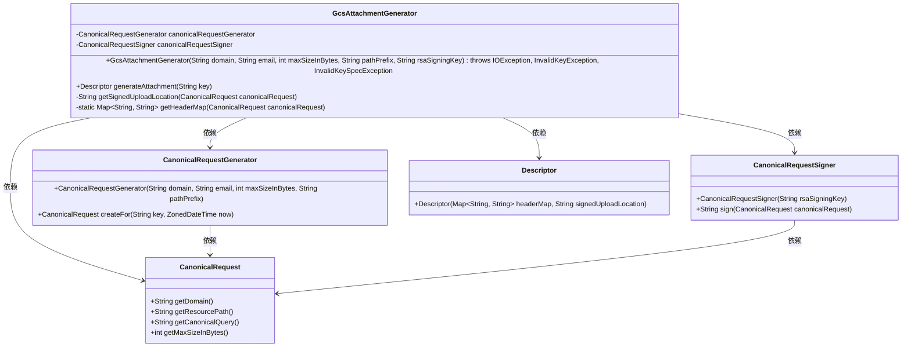
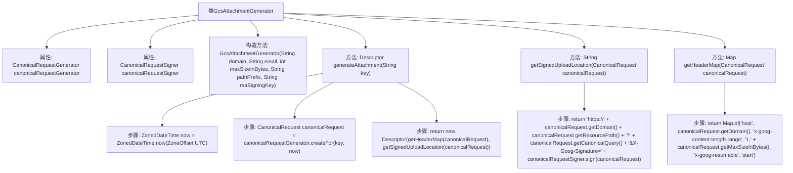

# 基础信息

|      |      |
|------|------|
| 名称 | GcsAttachmentGenerator |
| 编码语言 | .java |
| 代码路径 | Signal-Server/service/src/main/java/org/whispersystems/textsecuregcm/attachments/GcsAttachmentGenerator.java |
| 包名 | org.whispersystems.textsecuregcm.attachments |
| 依赖项 | ['org.whispersystems.textsecuregcm.gcp.CanonicalRequest', 'org.whispersystems.textsecuregcm.gcp.CanonicalRequestGenerator', 'org.whispersystems.textsecuregcm.gcp.CanonicalRequestSigner', 'javax.annotation.Nonnull', 'java.io.IOException', 'java.security.InvalidKeyException', 'java.security.spec.InvalidKeySpecException', 'java.time.ZoneOffset', 'java.time.ZonedDateTime', 'java.util.Map'] |
| 概述说明 | GcsAttachmentGenerator类处理GCS附件生成、签名及上传位置。 |

# 说明

GcsAttachmentGenerator类负责生成带有签名的Google Cloud Storage（GCS）附件描述。该类的功能包括处理生成请求、生成签名以及处理上传位置。通过这些步骤，确保附件能够安全且有效地上传到指定的GCS位置，并附带必要的签名信息以验证其合法性和完整性。

# 类列表 Class Summary

| 名称   | 类型  | 说明 |
|-------|------|-------------|
| GcsAttachmentGenerator | class | GcsAttachmentGenerator类生成带签名的GCS附件描述，包含请求生成、签名及上传位置处理。 |

## 类 GcsAttachmentGenerator

|      |      |
|------|------|
| 访问范围 | public |
| 类型 | class |
| 名称 | GcsAttachmentGenerator |
| 说明 | GcsAttachmentGenerator类生成带签名的GCS附件描述，包含请求生成、签名及上传位置处理。 |

### UML类图

### 描述
`GcsAttachmentGenerator` 类负责生成附件描述符，依赖于 `CanonicalRequestGenerator` 和 `CanonicalRequestSigner` 来创建和签名规范化请求。`CanonicalRequestGenerator` 生成 `CanonicalRequest` 对象，`CanonicalRequestSigner` 对请求进行签名。最终，`GcsAttachmentGenerator` 使用这些组件生成包含头信息和签名上传位置的 `Descriptor` 对象。

### 内部方法调用关系图

这段代码描述了一个名为`GcsAttachmentGenerator`的类，该类用于生成GCS（Google Cloud Storage）附件的描述符。类中包含两个主要属性：`CanonicalRequestGenerator`和`CanonicalRequestSigner`，分别用于生成和签名规范请求。构造方法初始化这两个属性，`generateAttachment`方法则负责生成附件的描述符，其中包括获取当前时间、创建规范请求，并返回包含签名上传位置和头信息的描述符。`getSignedUploadLocation`方法生成签名后的上传URL，`getHeaderMap`方法返回包含必要头信息的Map。

### 字段列表 Field List

| 名称  | 类型  | 说明 |
|-------|-------|------|
| canonicalRequestSigner | CanonicalRequestSigner | 非空私有常量CanonicalRequestSigner对象。 |
| canonicalRequestGenerator | CanonicalRequestGenerator | 非空私有最终变量，类型为CanonicalRequestGenerator。 |

### 方法列表 Method List

| 名称  | 类型  | 说明 |
|-------|-------|------|
| getHeaderMap | Map<String, String> | 方法返回包含主机、内容长度范围和可恢复上传的请求头映射。 |
| generateAttachment | Descriptor | 生成附件的描述符，包含请求头和签名上传位置。 |
| getSignedUploadLocation | String | 生成带签名的上传URL。 |

