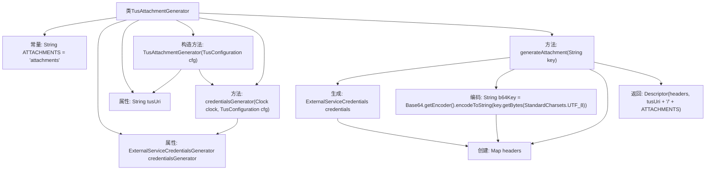

# 基础信息

|      |      |
|------|------|
| 名称 | TusAttachmentGenerator |
| 编码语言 | .java |
| 代码路径 | Signal-Server/service/src/main/java/org/whispersystems/textsecuregcm/attachments/TusAttachmentGenerator.java |
| 包名 | org.whispersystems.textsecuregcm.attachments |
| 依赖项 | ['org.apache.http.HttpHeaders', 'org.whispersystems.textsecuregcm.auth.ExternalServiceCredentials', 'org.whispersystems.textsecuregcm.auth.ExternalServiceCredentialsGenerator', 'org.whispersystems.textsecuregcm.util.HeaderUtils', 'java.nio.charset.StandardCharsets', 'java.time.Clock', 'java.util.Base64', 'java.util.Map'] |
| 概述说明 | TusAttachmentGenerator类生成附件描述符，含授权头和上传元数据。 |

# 说明

TusAttachmentGenerator类的主要功能是生成附件描述符，这些描述符包括授权头和上传元数据。授权头用于验证和授权上传操作，确保只有经过授权的用户可以执行上传。上传元数据则提供了关于附件的详细信息，如文件类型、大小等，以便在上传过程中进行有效的管理和处理。该类通过整合这些关键信息，简化了附件上传的流程，并确保了上传过程的安全性和准确性。

# 类列表 Class Summary

| 名称   | 类型  | 说明 |
|-------|------|-------------|
| TusAttachmentGenerator | class | TusAttachmentGenerator类用于生成附件描述符，包含授权头和上传元数据。 |

## 类 TusAttachmentGenerator

|      |      |
|------|------|
| 访问范围 | public |
| 类型 | class |
| 名称 | TusAttachmentGenerator |
| 说明 | TusAttachmentGenerator类用于生成附件描述符，包含授权头和上传元数据。 |

### UML类图

```mermaid
classDiagram
    class TusAttachmentGenerator {
        -String ATTACHMENTS
        -ExternalServiceCredentialsGenerator credentialsGenerator
        -String tusUri
        +TusAttachmentGenerator(TusConfiguration cfg)
        -ExternalServiceCredentialsGenerator credentialsGenerator(Clock clock, TusConfiguration cfg)
        +Descriptor generateAttachment(String key)
    }
    class ExternalServiceCredentialsGenerator {
        <<Interface>>
        +ExternalServiceCredentials generateFor(String key)
    }
    class TusConfiguration {
        +String uploadUri()
        +String userAuthenticationTokenSharedSecret()
    }
    class Descriptor {
        -Map<String, String> headers
        -String uri
        +Descriptor(Map<String, String> headers, String uri)
    }
    class Clock {
        <<Interface>>
    }
    class Base64 {
        +String encodeToString(byte[] bytes)
    }
    class StandardCharsets {
        +Charset UTF_8
    }
    class Map {
        <<Interface>>
        +Map<String, String> of(String key1, String value1, String key2, String value2)
    }
    class HttpHeaders {
        +String AUTHORIZATION
    }
    class HeaderUtils {
        +String basicAuthHeader(ExternalServiceCredentials credentials)
    }

    TusAttachmentGenerator --> ExternalServiceCredentialsGenerator : 依赖
    TusAttachmentGenerator --> TusConfiguration : 依赖
    TusAttachmentGenerator --> Descriptor : 依赖
    TusAttachmentGenerator --> Clock : 依赖
    TusAttachmentGenerator --> Base64 : 依赖
    TusAttachmentGenerator --> StandardCharsets : 依赖
    TusAttachmentGenerator --> Map : 依赖
    TusAttachmentGenerator --> HttpHeaders : 依赖
    TusAttachmentGenerator --> HeaderUtils : 依赖
```

这段代码展示了 `TusAttachmentGenerator` 类的实现，该类用于生成附件描述符。`TusAttachmentGenerator` 依赖于多个外部类和接口，如 `ExternalServiceCredentialsGenerator`、`TusConfiguration`、`Descriptor` 等，通过这些依赖项生成包含授权头和元数据的附件描述符。代码的核心功能是通过 `generateAttachment` 方法生成一个包含特定头部信息和 URI 的 `Descriptor` 对象。

### 内部方法调用关系图

这段代码的流程图展示了`TusAttachmentGenerator`类的结构及其内部方法的调用关系。首先，类中包含一个常量`ATTACHMENTS`和两个属性`credentialsGenerator`与`tusUri`。构造方法`TusAttachmentGenerator`初始化这两个属性，其中`credentialsGenerator`通过`credentialsGenerator`方法生成。`generateAttachment`方法负责生成附件描述符，包括生成凭证、编码密钥、创建请求头，并最终返回描述符对象。整个流程清晰地展示了类内部各部分的依赖关系和执行顺序。

### 字段列表 Field List

| 名称  | 类型  | 说明 |
|-------|-------|------|
| ATTACHMENTS = "attachments" | String | 定义私有静态常量ATTACHMENTS，值为"attachments"。 |
| tusUri | String | 最终字符串 tusUri 用于存储 URI。 |
| credentialsGenerator | ExternalServiceCredentialsGenerator | 外部服务凭证生成器实例化。 |

### 方法列表 Method List

| 名称  | 类型  | 说明 |
|-------|-------|------|
| generateAttachment | Descriptor | 方法生成附件描述，包含认证头和元数据，返回描述对象。 |
| credentialsGenerator | ExternalServiceCredentialsGenerator | 生成外部服务凭证生成器，配置时钟和用户认证令牌。 |

