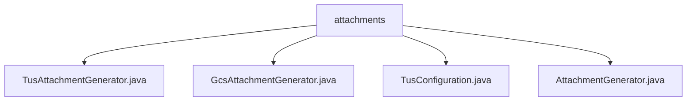

# 基础信息

|      |      |
|------|------|
| 名称 | attachments |
| 编码语言 | .java |
| 代码路径 | Signal-Server/service/src/main/java/org/whispersystems/textsecuregcm/attachments |
| 包名 | Signal-Server.service.src.main.java.org.whispersystems.textsecuregcm.attachments |
| 概述说明 | TusAttachmentGenerator生成附件描述符，GcsAttachmentGenerator处理GCS附件描述。 |

# 说明

## 概述

该代码模块主要涉及附件生成和处理的相关功能，特别是针对文件上传的授权、元数据管理以及安全上传的实现。模块中的核心类包括 `TusAttachmentGenerator` 和 `GcsAttachmentGenerator`，分别负责生成基于Tus协议的附件描述符和带有签名的Google Cloud Storage（GCS）附件描述。这些类通过处理授权头、上传元数据和签名信息，确保附件上传过程的安全性、合法性和有效性。

## 主要业务场景

1. **Tus协议附件生成**：`TusAttachmentGenerator` 类用于生成符合Tus协议的附件描述符。它负责生成授权头以验证用户身份，并提供上传元数据（如文件类型、大小等），以便在上传过程中进行有效的管理和处理。该类简化了基于Tus协议的附件上传流程，确保上传过程的安全性和准确性。

2. **GCS附件生成**：`GcsAttachmentGenerator` 类专门用于生成带有签名的GCS附件描述。它处理生成请求、生成签名并确定上传位置，确保附件能够安全且有效地上传到指定的GCS存储位置。签名信息用于验证附件的合法性和完整性，防止未经授权的访问或篡改。

3. **通用附件生成接口**：`AttachmentGenerator` 类可能作为附件生成的通用接口或基类，为不同的附件生成实现提供统一的框架或扩展点。尽管具体细节未提供，但可以推测该类可能定义了生成附件描述的核心方法或属性。

4. **配置管理**：`TusConfiguration` 类可能用于管理与Tus协议相关的配置信息，例如上传端点、授权机制等。尽管当前内容为空，但可以推测该类在模块中负责加载或管理Tus协议的配置参数，以支持附件上传的功能实现。

总结来说，该模块的核心业务场景是确保文件上传过程的安全性、合法性和高效性，支持基于Tus协议和GCS的附件上传，并通过授权、元数据和签名管理等手段实现这一目标。

### 包内部结构视图

该流程图展示了`attachments`文件夹下的文件层级关系。`attachments`作为根节点，包含了四个文件：`TusAttachmentGenerator.java`、`GcsAttachmentGenerator.java`、`TusConfiguration.java`和`AttachmentGenerator.java`。这些文件直接隶属于`attachments`文件夹，没有进一步的子文件夹嵌套。

# 文件列表 File List

| 名称   | 类型  | 说明 |
|-------|------|-------------|
| [AttachmentGenerator.java](AttachmentGenerator.md) | file | 无内容提供，无法生成概要描述。 |
| [TusConfiguration.java](TusConfiguration.md) | file | 输入为空，请提供具体内容以便生成概要描述。 |
| [GcsAttachmentGenerator.java](GcsAttachmentGenerator.md) | file | GcsAttachmentGenerator类处理GCS附件生成、签名及上传位置。 |
| [TusAttachmentGenerator.java](TusAttachmentGenerator.md) | file | TusAttachmentGenerator类生成附件描述符，含授权头和上传元数据。 |

