# 基础信息

|      |      |
|------|------|
| 名称 | AccountAuthenticator |
| 编码语言 | .java |
| 代码路径 | Signal-Server/service/src/main/java/org/whispersystems/textsecuregcm/auth/AccountAuthenticator.java |
| 包名 | org.whispersystems.textsecuregcm.auth |
| 依赖项 | ['com.codahale.metrics.MetricRegistry.name', 'com.google.common.annotations.VisibleForTesting', 'io.dropwizard.auth.Authenticator', 'io.dropwizard.auth.basic.BasicCredentials', 'io.micrometer.core.instrument.Counter', 'io.micrometer.core.instrument.Metrics', 'io.micrometer.core.instrument.Tags', 'java.time.Clock', 'java.time.Duration', 'java.time.temporal.ChronoUnit', 'java.util.Optional', 'java.util.UUID', 'org.apache.commons.lang3.StringUtils', 'org.whispersystems.textsecuregcm.storage.Account', 'org.whispersystems.textsecuregcm.storage.AccountsManager', 'org.whispersystems.textsecuregcm.storage.Device', 'org.whispersystems.textsecuregcm.util.Pair', 'org.whispersystems.textsecuregcm.util.Util'] |
| 概述说明 | AccountAuthenticator类负责设备认证、验证用户凭证及更新访问时间。 |

# 说明

AccountAuthenticator类负责处理设备认证流程，其主要功能包括验证用户提供的凭证以确保其有效性，并在认证成功后更新设备的最后访问时间。该类通过确保用户身份的合法性和记录设备的最新活动时间，增强了系统的安全性和用户管理能力。

# 类列表 Class Summary

| 名称   | 类型  | 说明 |
|-------|------|-------------|
| AccountAuthenticator | class | AccountAuthenticator类实现设备认证，验证用户凭证并更新设备最后访问时间。 |

## 类 AccountAuthenticator

|      |      |
|------|------|
| 访问范围 | public |
| 类型 | class |
| 名称 | AccountAuthenticator |
| 说明 | AccountAuthenticator类实现设备认证，验证用户凭证并更新设备最后访问时间。 |

### UML类图

```mermaid
classDiagram
    class AccountAuthenticator {
        -String LEGACY_NAME_PREFIX
        -String AUTHENTICATION_COUNTER_NAME
        -String AUTHENTICATION_SUCCEEDED_TAG_NAME
        -String AUTHENTICATION_FAILURE_REASON_TAG_NAME
        -String DAYS_SINCE_LAST_SEEN_DISTRIBUTION_NAME
        -String IS_PRIMARY_DEVICE_TAG
        -Counter OLD_TOKEN_VERSION_COUNTER
        -char DEVICE_ID_SEPARATOR
        -AccountsManager accountsManager
        -Clock clock
        +AccountAuthenticator(AccountsManager accountsManager)
        +AccountAuthenticator(AccountsManager accountsManager, Clock clock)
        +static Pair~String, Byte~ getIdentifierAndDeviceId(String basicUsername)
        +Optional~AuthenticatedDevice~ authenticate(BasicCredentials basicCredentials)
        +Account updateLastSeen(Account account, Device device)
    }

    class AccountsManager {
        +Optional~Account~ getByAccountIdentifier(UUID accountUuid)
        +Account updateDeviceAuthentication(Account account, Device device, SaltedTokenHash newCredentials)
        +Account updateDeviceLastSeen(Account account, Device device, long lastSeen)
    }

    class Device {
        +SaltedTokenHash getAuthTokenHash()
        +boolean isPrimary()
        +long getLastSeen()
    }

    class SaltedTokenHash {
        +boolean verify(String password)
        +int getVersion()
        +static SaltedTokenHash generateFor(String password)
    }

    class AuthenticatedDevice {
        +AuthenticatedDevice(Account account, Device device)
    }

    class BasicCredentials {
        +String getUsername()
        +String getPassword()
    }

    class Account {
        +UUID getUuid()
        +Optional~Device~ getDevice(byte deviceId)
    }

    class Pair~T, U~ {
        +T first()
        +U second()
    }

    class Metrics {
        +static Counter counter(String name, Tags tags)
        +static Summary summary(String name, String... tags)
    }

    class Tags {
        +static Tags of(String key, String value)
        +Tags and(String key, String value)
    }

    class Clock {
        +static Clock systemUTC()
    }

    class Util {
        +static long ensureNonNegativeLong(long value)
        +static long todayInMillisGivenOffsetFromNow(Clock clock, Duration offset)
        +static long todayInMillis(Clock clock)
    }

    class UUID {
        +long getLeastSignificantBits()
    }

    class ChronoUnit {
        +static ChronoUnit DAYS
        +Duration getDuration()
    }

    class Duration {
        +static Duration ofSeconds(long seconds)
        +static Duration ofMillis(long millis)
        +long toDays()
        +Duration negated()
    }

    class InvalidAuthorizationHeaderException {
    }

    class IllegalArgumentException {
    }

    AccountAuthenticator --> AccountsManager : 依赖
    AccountAuthenticator --> Clock : 依赖
    AccountAuthenticator --> Metrics : 依赖
    AccountAuthenticator --> Util : 依赖
    AccountAuthenticator --> Pair~String, Byte~ : 依赖
    AccountAuthenticator --> BasicCredentials : 依赖
    AccountAuthenticator --> AuthenticatedDevice : 依赖
    AccountAuthenticator --> SaltedTokenHash : 依赖
    AccountAuthenticator --> Device : 依赖
    AccountAuthenticator --> Account : 依赖
    AccountAuthenticator --> InvalidAuthorizationHeaderException : 依赖
    AccountAuthenticator --> IllegalArgumentException : 依赖
    AccountsManager --> Account : 依赖
    AccountsManager --> Device : 依赖
    AccountsManager --> SaltedTokenHash : 依赖
    Device --> SaltedTokenHash : 依赖
    Account --> Device : 依赖
    Account --> UUID : 依赖
    Util --> Clock : 依赖
    Util --> Duration : 依赖
    Duration --> ChronoUnit : 依赖
    Metrics --> Tags : 依赖
```

**描述：**  
`AccountAuthenticator` 类实现了 `Authenticator` 接口，用于验证用户凭据并返回认证设备。它依赖于 `AccountsManager` 管理账户信息，`Clock` 处理时间相关操作，`Metrics` 记录统计信息。`getIdentifierAndDeviceId` 方法解析用户名和设备ID，`authenticate` 方法验证凭据并更新设备最后访问时间。`updateLastSeen` 方法确保设备每天只更新一次最后访问时间，避免在午夜集中更新。

### 内部方法调用关系图

这段代码定义了一个`AccountAuthenticator`类，用于处理用户设备的认证逻辑。类中包含多个属性和方法，用于管理认证计数器、设备ID、认证结果等。主要方法`authenticate`负责验证用户凭证，并根据验证结果更新设备状态。`updateLastSeen`方法用于更新设备的最后访问时间，确保每个账户每天最多更新一次。代码通过`Metrics`类记录认证成功和失败的次数，并通过`accountsManager`管理账户和设备的状态。

### 字段列表 Field List

| 名称  | 类型  | 说明 |
|-------|-------|------|
| AUTHENTICATION_COUNTER_NAME = name(LEGACY_NAME_PREFIX, "authentication") | String | 定义认证计数器名称常量，使用前缀和"authentication"组合。 |
| clock | Clock | 私有且不可变的时钟对象。 |
| DEVICE_ID_SEPARATOR = '.' | char | 测试可见的静态常量DEVICE_ID_SEPARATOR值为'.'。 |
| DAYS_SINCE_LAST_SEEN_DISTRIBUTION_NAME = name(LEGACY_NAME_PREFIX, "daysSinceLastSeen") | String | 定义静态字符串变量，用于记录上次访问天数分布的名称。 |
| AUTHENTICATION_FAILURE_REASON_TAG_NAME = "reason" | String | 定义静态常量AUTHENTICATION_FAILURE_REASON_TAG_NAME，值为"reason"。 |
| OLD_TOKEN_VERSION_COUNTER =      Metrics.counter(name(AccountAuthenticator.class, "oldTokenVersionCounter")) | Counter | 定义计数器OLD_TOKEN_VERSION_COUNTER，用于统计旧版令牌数量。 |
| IS_PRIMARY_DEVICE_TAG = "isPrimary" | String | 定义私有静态常量字符串IS_PRIMARY_DEVICE_TAG，值为"isPrimary"。 |
| AUTHENTICATION_SUCCEEDED_TAG_NAME = "succeeded" | String | 定义常量AUTHENTICATION_SUCCEEDED_TAG_NAME为"succeeded"。 |
| LEGACY_NAME_PREFIX = "org.whispersystems.textsecuregcm.auth.BaseAccountAuthenticator" | String | 定义常量LEGACY_NAME_PREFIX，值为特定认证类路径。 |
| accountsManager | AccountsManager | 私有且不可变的AccountsManager实例。 |

### 方法列表 Method List

| 名称  | 类型  | 说明 |
|-------|-------|------|
| getIdentifierAndDeviceId | Pair<String, Byte> | 方法提取用户名和设备ID，无分隔符时返回主设备ID。 |
| authenticate | Optional<AuthenticatedDevice> | 验证设备身份，返回验证结果，记录失败原因并更新计数器。 |
| updateLastSeen | Account | 方法`updateLastSeen`更新账户设备最后可见时间，确保每天最多更新一次，且时间分散在一天内。 |

