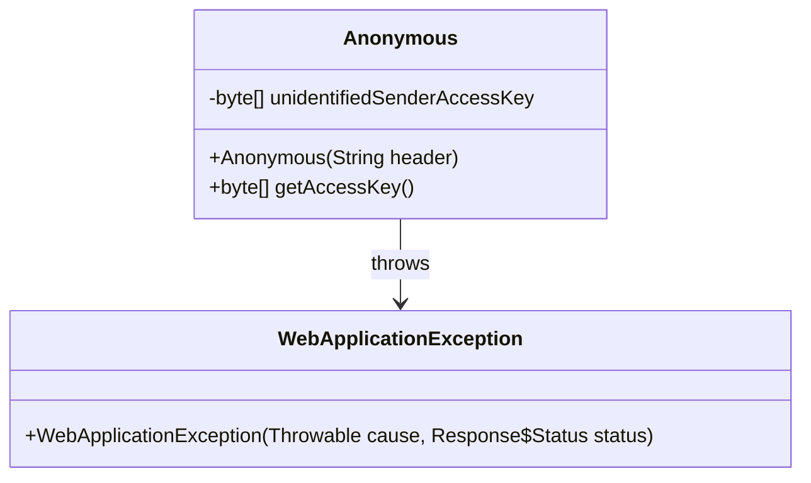
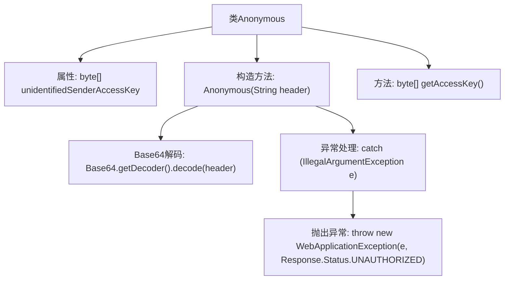

# 基础信息

|      |      |
|------|------|
| 名称 | Anonymous |
| 编码语言 | .java |
| 代码路径 | Signal-Server/service/src/main/java/org/whispersystems/textsecuregcm/auth/Anonymous.java |
| 包名 | org.whispersystems.textsecuregcm.auth |
| 依赖项 | ['jakarta.ws.rs.WebApplicationException', 'jakarta.ws.rs.core.Response', 'java.util.Base64'] |
| 概述说明 | Anonymous类解码Base64头信息并转换为字节数组。 |

# 说明

该内容描述了一个匿名类的功能，主要用于解码Base64格式的头信息，并将其转换为字节数组进行存储。Base64是一种常见的编码方式，通常用于在传输或存储时将二进制数据转换为文本格式。匿名类通过解码操作，将Base64编码的头信息还原为原始的二进制数据，并以字节数组的形式保存，便于后续处理或使用。这一过程在数据处理和通信协议中较为常见，确保信息的完整性和可读性。

# 类列表 Class Summary

| 名称   | 类型  | 说明 |
|-------|------|-------------|
| Anonymous | class | Anonymous类解码Base64头信息并存储为字节数组。 |

## 类 Anonymous

|      |      |
|------|------|
| 访问范围 | public |
| 类型 | class |
| 名称 | Anonymous |
| 说明 | Anonymous类解码Base64头信息并存储为字节数组。 |

### UML类图

**描述：**  
`Anonymous` 类用于处理未识别发送者的访问密钥。它通过构造函数接收一个Base64编码的字符串，并将其解码为字节数组存储在私有字段 `unidentifiedSenderAccessKey` 中。如果解码过程中发生 `IllegalArgumentException` 异常，则会抛出 `WebApplicationException` 异常，并返回 `UNAUTHORIZED` 状态码。类还提供了一个公有方法 `getAccessKey` 用于获取解码后的访问密钥。

### 内部方法调用关系图

这段代码定义了一个名为`Anonymous`的类，包含一个私有的`byte[]`类型的属性`unidentifiedSenderAccessKey`。构造函数接收一个`String`类型的`header`参数，并尝试将其通过Base64解码为字节数组。如果解码过程中发生`IllegalArgumentException`异常，则抛出`WebApplicationException`并设置响应状态为`UNAUTHORIZED`。类中还提供了一个`getAccessKey`方法，用于返回解码后的字节数组。

### 字段列表 Field List

| 名称  | 类型  | 说明 |
|-------|-------|------|
| unidentifiedSenderAccessKey | byte[] | 私有字节数组存储未识别发送者访问密钥。 |

### 方法列表 Method List

| 名称  | 类型  | 说明 |
|-------|-------|------|
| getAccessKey | byte[] | 该方法返回未识别发送者的访问密钥字节数组。 |

