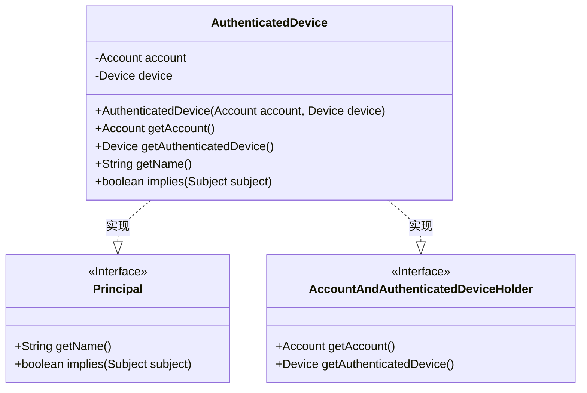
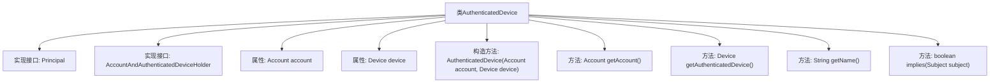

# 基础信息

|      |      |
|------|------|
| 名称 | AuthenticatedDevice |
| 编码语言 | .java |
| 代码路径 | Signal-Server/service/src/main/java/org/whispersystems/textsecuregcm/auth/AuthenticatedDevice.java |
| 包名 | org.whispersystems.textsecuregcm.auth |
| 依赖项 | ['java.security.Principal', 'javax.security.auth.Subject', 'org.whispersystems.textsecuregcm.storage.Account', 'org.whispersystems.textsecuregcm.storage.Device'] |
| 概述说明 | AuthenticatedDevice类实现Principal接口，包含账户和设备信息，提供获取方法。 |

# 说明

AuthenticatedDevice类实现了Principal接口，主要用于管理和存储账户与设备的相关信息。该类提供了获取这些信息的方法，确保能够有效地访问和操作账户及设备数据。通过实现Principal接口，该类能够集成到需要身份验证和授权的系统中，增强了系统的安全性和功能性。

# 类列表 Class Summary

| 名称   | 类型  | 说明 |
|-------|------|-------------|
| AuthenticatedDevice | class | AuthenticatedDevice类实现Principal接口，包含账户和设备信息，提供获取方法。 |

## 类 AuthenticatedDevice

|      |      |
|------|------|
| 访问范围 | public |
| 类型 | class |
| 名称 | AuthenticatedDevice |
| 说明 | AuthenticatedDevice类实现Principal接口，包含账户和设备信息，提供获取方法。 |

### UML类图

**描述**：`AuthenticatedDevice` 类实现了 `Principal` 和 `AccountAndAuthenticatedDeviceHolder` 两个接口。该类包含两个私有成员变量 `account` 和 `device`，并通过构造函数进行初始化。它提供了获取 `account` 和 `device` 的方法，并实现了 `Principal` 接口中的 `getName` 和 `implies` 方法。该类主要用于管理认证设备及其关联的账户信息。

### 内部方法调用关系图

这段代码定义了一个名为 `AuthenticatedDevice` 的类，该类实现了 `Principal` 和 `AccountAndAuthenticatedDeviceHolder` 两个接口。类中包含两个私有属性 `account` 和 `device`，分别表示账户和设备。类提供了构造方法 `AuthenticatedDevice` 用于初始化这两个属性，并实现了接口中的方法，包括 `getAccount`、`getAuthenticatedDevice`、`getName` 和 `implies`。这些方法分别用于获取账户、获取认证设备、获取名称以及判断是否隐含某个主题。

### 字段列表 Field List

| 名称  | 类型  | 说明 |
|-------|-------|------|
| account | Account | 私有不可变账户实例变量。 |
| device | Device | 私有设备实例变量。 |

### 方法列表 Method List

| 名称  | 类型  | 说明 |
|-------|-------|------|
| getAccount | Account | 重写getAccount方法，返回account对象。 |
| getName | String | 重写getName方法，返回null。 |
| getAuthenticatedDevice | Device | 重写方法返回认证设备实例。 |
| implies | boolean | 重写implies方法，始终返回false。 |

