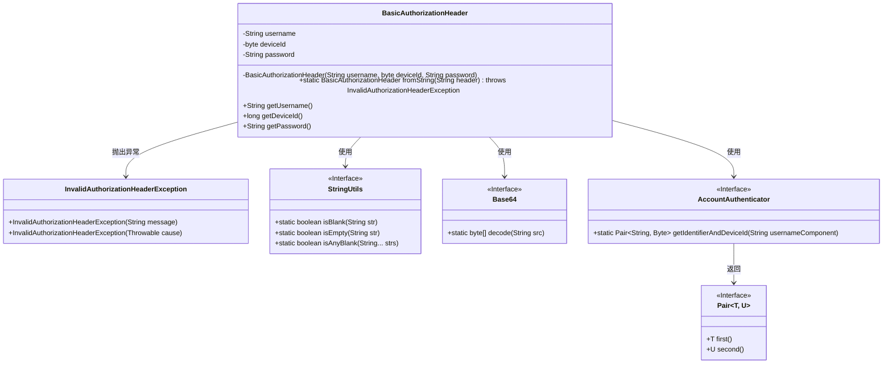
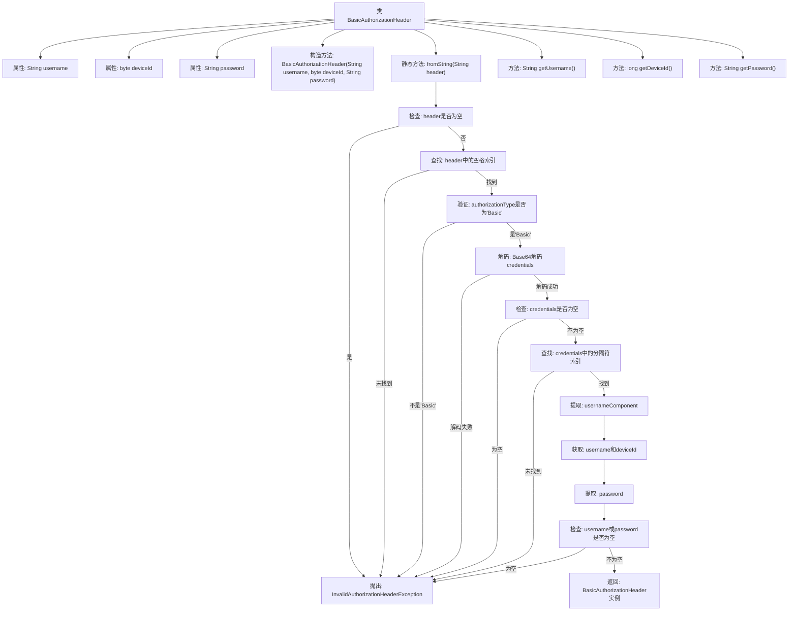

# 基础信息

|      |      |
|------|------|
| 名称 | BasicAuthorizationHeader |
| 编码语言 | .java |
| 代码路径 | Signal-Server/service/src/main/java/org/whispersystems/textsecuregcm/auth/BasicAuthorizationHeader.java |
| 包名 | org.whispersystems.textsecuregcm.auth |
| 依赖项 | ['java.util.Base64', 'org.apache.commons.lang3.StringUtils', 'org.whispersystems.textsecuregcm.util.Pair'] |
| 概述说明 | BasicAuthorizationHeader类解析Basic认证头，提取并验证用户名、设备ID和密码。 |

# 说明

BasicAuthorizationHeader类主要用于解析和处理Basic认证头信息。它能够从认证头中提取出用户名、设备ID和密码，并对这些信息进行有效性验证，以确保其符合预期的格式和标准。通过这一过程，该类帮助确保认证信息的准确性和安全性，为后续的认证流程提供可靠的基础。

# 类列表 Class Summary

| 名称   | 类型  | 说明 |
|-------|------|-------------|
| BasicAuthorizationHeader | class | BasicAuthorizationHeader类用于解析Basic认证头，提取用户名、设备ID和密码，并进行有效性验证。 |

## 类 BasicAuthorizationHeader

|      |      |
|------|------|
| 访问范围 | public |
| 类型 | class |
| 名称 | BasicAuthorizationHeader |
| 说明 | BasicAuthorizationHeader类用于解析Basic认证头，提取用户名、设备ID和密码，并进行有效性验证。 |

### UML类图

### 描述
`BasicAuthorizationHeader` 类用于解析和处理基本的授权头信息。它通过 `fromString` 方法将字符串形式的授权头解析为用户名、设备ID和密码，并验证其合法性。类中使用了 `StringUtils`、`Base64` 和 `AccountAuthenticator` 等工具类来辅助处理字符串、解码和身份验证。如果授权头格式不正确或内容为空，将抛出 `InvalidAuthorizationHeaderException` 异常。

### 内部方法调用关系图

**描述：**  
这段代码定义了一个`BasicAuthorizationHeader`类，用于处理基于Base64编码的Basic认证头信息。`fromString`方法负责解析传入的认证头字符串，验证其格式，解码并提取用户名、设备ID和密码。如果任何步骤失败，将抛出`InvalidAuthorizationHeaderException`异常。流程图展示了从解析到验证的完整流程，确保每一步都经过严格的检查和处理。

### 字段列表 Field List

| 名称  | 类型  | 说明 |
|-------|-------|------|
| username | String | 定义了一个私有且不可变的字符串类型变量username。 |
| password | String | 私有不可变字符串变量password。 |
| deviceId | byte | 定义了一个私有且不可变的字节类型变量deviceId。 |

### 方法列表 Method List

| 名称  | 类型  | 说明 |
|-------|-------|------|
| getDeviceId | long | 该方法返回设备ID。 |
| getUsername | String | 该方法返回用户名字符串。 |
| getPassword | String | 获取密码的方法，返回字符串类型。 |
| fromString | BasicAuthorizationHeader | 该方法解析Basic授权头，验证格式并提取用户名、设备ID和密码，若无效则抛出异常。 |

