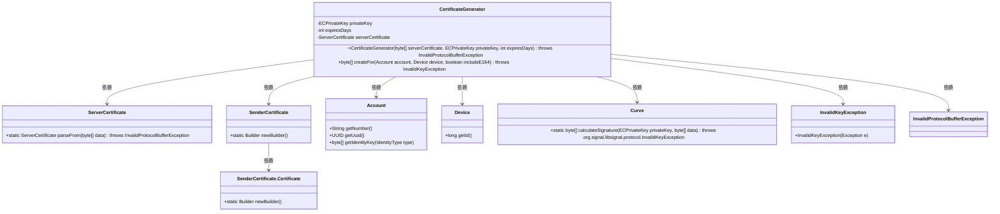
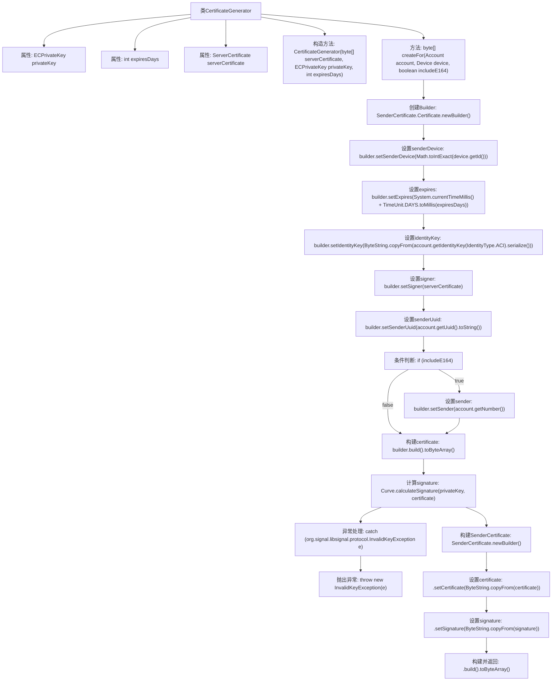

# 基础信息

|      |      |
|------|------|
| 名称 | CertificateGenerator |
| 编码语言 | .java |
| 代码路径 | Signal-Server/service/src/main/java/org/whispersystems/textsecuregcm/auth/CertificateGenerator.java |
| 包名 | org.whispersystems.textsecuregcm.auth |
| 依赖项 | ['com.google.protobuf.ByteString', 'com.google.protobuf.InvalidProtocolBufferException', 'java.security.InvalidKeyException', 'java.util.concurrent.TimeUnit', 'org.signal.libsignal.protocol.ecc.Curve', 'org.signal.libsignal.protocol.ecc.ECPrivateKey', 'org.whispersystems.textsecuregcm.entities.MessageProtos.SenderCertificate', 'org.whispersystems.textsecuregcm.entities.MessageProtos.ServerCertificate', 'org.whispersystems.textsecuregcm.identity.IdentityType', 'org.whispersystems.textsecuregcm.storage.Account', 'org.whispersystems.textsecuregcm.storage.Device'] |
| 概述说明 | 证书生成器类利用私钥、有效期和服务器证书生成发送者证书。 |

# 说明

证书生成器类负责创建发送者证书，主要功能包括使用私钥、有效期和服务器证书作为输入参数，生成相应的发送者证书。该类通过整合私钥和服务器证书信息，并结合指定的有效期，确保生成的证书具有合法性和时效性，适用于安全通信场景。

# 类列表 Class Summary

| 名称   | 类型  | 说明 |
|-------|------|-------------|
| CertificateGenerator | class | 证书生成器类，使用私钥、有效期和服务器证书生成发送者证书。 |

## 类 CertificateGenerator

|      |      |
|------|------|
| 访问范围 | public |
| 类型 | class |
| 名称 | CertificateGenerator |
| 说明 | 证书生成器类，使用私钥、有效期和服务器证书生成发送者证书。 |

### UML类图

### 描述
`CertificateGenerator` 类用于生成证书，依赖于 `ServerCertificate`、`SenderCertificate`、`Account`、`Device` 和 `Curve` 等类。它通过 `createFor` 方法为指定的账户和设备创建证书，并可选地包含 E164 号码。生成的证书包括证书内容和签名，签名通过 `Curve` 类的 `calculateSignature` 方法计算。类中处理了 `InvalidKeyException` 和 `InvalidProtocolBufferException` 异常。

### 内部方法调用关系图

这段代码定义了一个名为 `CertificateGenerator` 的类，用于生成证书。类中包含三个私有属性：`privateKey`、`expiresDays` 和 `serverCertificate`。构造方法 `CertificateGenerator` 用于初始化这些属性。`createFor` 方法用于为给定的 `Account` 和 `Device` 创建证书，并根据 `includeE164` 参数决定是否包含电话号码。该方法首先构建一个 `SenderCertificate.Certificate` 对象，然后使用 `Curve.calculateSignature` 方法计算签名，最后构建并返回 `SenderCertificate` 对象的字节数组。

### 字段列表 Field List

| 名称  | 类型  | 说明 |
|-------|-------|------|
| privateKey | ECPrivateKey | 私有密钥类型为ECPrivateKey的私有变量privateKey。 |
| serverCertificate | ServerCertificate | 私有且不可变的服务器证书对象。 |
| expiresDays | int | 私有整型变量，表示过期天数。 |

### 方法列表 Method List

| 名称  | 类型  | 说明 |
|-------|-------|------|
| createFor | byte[] | 为账户和设备创建包含签名的发送者证书，可选包含E164号码。 |

