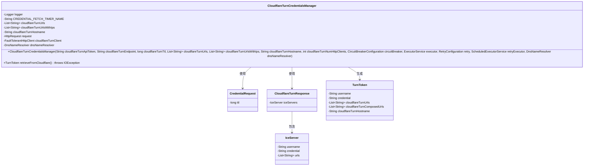

# 基础信息

|      |      |
|------|------|
| 名称 | CloudflareTurnCredentialsManager |
| 编码语言 | .java |
| 代码路径 | Signal-Server/service/src/main/java/org/whispersystems/textsecuregcm/auth/CloudflareTurnCredentialsManager.java |
| 包名 | org.whispersystems.textsecuregcm.auth |
| 依赖项 | ['com.fasterxml.jackson.core.JsonProcessingException', 'io.micrometer.core.instrument.Metrics', 'io.micrometer.core.instrument.Timer', 'io.netty.resolver.dns.DnsNameResolver', 'jakarta.ws.rs.core.Response', 'java.io.IOException', 'java.net.Inet6Address', 'java.net.URI', 'java.net.http.HttpRequest', 'java.net.http.HttpResponse', 'java.util.Collections', 'java.util.List', 'java.util.concurrent.CompletionException', 'java.util.concurrent.ExecutorService', 'java.util.concurrent.ScheduledExecutorService', 'org.slf4j.Logger', 'org.slf4j.LoggerFactory', 'org.whispersystems.textsecuregcm.configuration.CircuitBreakerConfiguration', 'org.whispersystems.textsecuregcm.configuration.RetryConfiguration', 'org.whispersystems.textsecuregcm.http.FaultTolerantHttpClient', 'org.whispersystems.textsecuregcm.metrics.MetricsUtil', 'org.whispersystems.textsecuregcm.util.ExceptionUtils', 'org.whispersystems.textsecuregcm.util.SystemMapper'] |
| 概述说明 | CloudflareTurnCredentialsManager类负责获取并解析Cloudflare的TURN凭证。 |

# 说明

CloudflareTurnCredentialsManager类负责管理TURN（Traversal Using Relays around NAT）凭证。该类通过发起HTTP请求从Cloudflare获取凭证数据，并对Cloudflare的响应进行解析，确保凭证信息的准确性和可用性。这一过程确保了TURN服务的有效配置和运行，支持网络通信中的中继功能。

# 类列表 Class Summary

| 名称   | 类型  | 说明 |
|-------|------|-------------|
| CloudflareTurnCredentialsManager | class | CloudflareTurnCredentialsManager类管理TURN凭证，通过HTTP请求获取并解析Cloudflare的响应。 |

## 类 CloudflareTurnCredentialsManager

|      |      |
|------|------|
| 访问范围 | public |
| 类型 | class |
| 名称 | CloudflareTurnCredentialsManager |
| 说明 | CloudflareTurnCredentialsManager类管理TURN凭证，通过HTTP请求获取并解析Cloudflare的响应。 |

### UML类图

**描述**：`CloudflareTurnCredentialsManager` 类负责管理与 Cloudflare TURN 服务的交互，包括获取 TURN 凭证。它通过 `FaultTolerantHttpClient` 发送 HTTP 请求，并使用 `DnsNameResolver` 解析域名。`CloudflareTurnResponse` 和 `IceServer` 类用于解析响应数据，最终生成 `TurnToken` 对象。整个流程涉及多个类的协作，确保在异常情况下也能正确处理请求。

### 内部方法调用关系图

```mermaid
graph TD
    A["类CloudflareTurnCredentialsManager"]
    B["属性: Logger logger"]
    C["属性: String CREDENTIAL_FETCH_TIMER_NAME"]
    D["属性: List<String> cloudflareTurnUrls"]
    E["属性: List<String> cloudflareTurnUrlsWithIps"]
    F["属性: String cloudflareTurnHostname"]
    G["属性: HttpRequest request"]
    H["属性: FaultTolerantHttpClient cloudflareTurnClient"]
    I["属性: DnsNameResolver dnsNameResolver"]
    J["内部类: CredentialRequest"]
    K["内部类: CloudflareTurnResponse"]
    L["内部类: IceServer"]
    M["构造方法: CloudflareTurnCredentialsManager"]
    N["方法: TurnToken retrieveFromCloudflare()"]

    A --> B
    A --> C
    A --> D
    A --> E
    A --> F
    A --> G
    A --> H
    A --> I
    A --> J
    A --> K
    K --> L
    A --> M
    A --> N

    M --> M1["初始化cloudflareTurnClient"]
    M --> M2["初始化cloudflareTurnUrls"]
    M --> M3["初始化cloudflareTurnUrlsWithIps"]
    M --> M4["初始化cloudflareTurnHostname"]
    M --> M5["初始化dnsNameResolver"]
    M --> M6["创建HttpRequest对象"]

    N --> N1["解析cloudflareTurnHostname"]
    N --> N2["发送HTTP请求"]
    N --> N3["处理HTTP响应"]
    N --> N4["创建TurnToken对象"]
```

**描述：**
`CloudflareTurnCredentialsManager` 类用于管理与Cloudflare Turn服务的交互，包括获取TURN（Traversal Using Relays around NAT）凭证。类中包含多个属性用于存储配置信息和HTTP客户端，构造方法负责初始化这些属性并创建HTTP请求对象。`retrieveFromCloudflare` 方法负责解析主机名、发送HTTP请求、处理响应并返回TURN凭证。整个流程涉及DNS解析、HTTP请求发送、响应处理以及错误处理。

### 字段列表 Field List

| 名称  | 类型  | 说明 |
|-------|-------|------|
| CREDENTIAL_FETCH_TIMER_NAME = MetricsUtil.name(CloudflareTurnCredentialsManager.class,      "credentialFetchLatency") | String | Cloudflare凭证管理器获取凭证的延迟计时器名称。 |
| cloudflareTurnUrls | List<String> | 私有且不可变的Cloudflare转向URL列表。 |
| logger = LoggerFactory.getLogger(CloudflareTurnCredentialsManager.class) | Logger | 定义CloudflareTurnCredentialsManager类的私有静态日志记录器。 |
| dnsNameResolver | DnsNameResolver | 私有且不可变的DNS名称解析器实例。 |
| cloudflareTurnUrlsWithIps | List<String> | 私有列表存储Cloudflare的Turn服务器URL及IP地址。 |
| cloudflareTurnClient | FaultTolerantHttpClient | 私有不可变的容错HTTP客户端用于Cloudflare中转。 |
| cloudflareTurnHostname | String | 私有字符串变量存储Cloudflare中转主机名。 |
| request | HttpRequest | 定义了一个私有且不可变的HttpRequest对象。 |

### 方法列表 Method List

| 名称  | 类型  | 说明 |
|-------|-------|------|
| retrieveFromCloudflare | TurnToken | 从Cloudflare获取TurnToken，处理DNS解析、HTTP请求及响应，返回Token信息。 |

