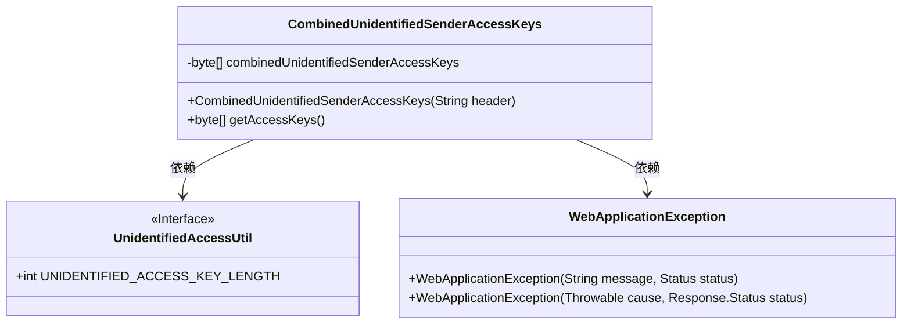
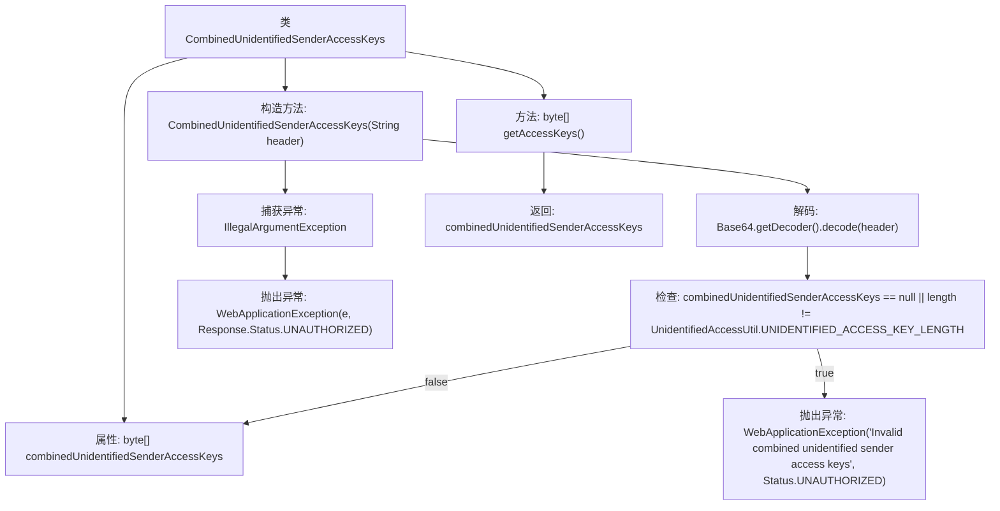

# 基础信息

|      |      |
|------|------|
| 名称 | CombinedUnidentifiedSenderAccessKeys |
| 编码语言 | .java |
| 代码路径 | Signal-Server/service/src/main/java/org/whispersystems/textsecuregcm/auth/CombinedUnidentifiedSenderAccessKeys.java |
| 包名 | org.whispersystems.textsecuregcm.auth |
| 依赖项 | ['jakarta.ws.rs.WebApplicationException', 'jakarta.ws.rs.core.Response', 'jakarta.ws.rs.core.Response.Status', 'java.util.Base64'] |
| 概述说明 | 类CombinedUnidentifiedSenderAccessKeys解析并验证Base64编码的访问密钥。 |

# 说明

类CombinedUnidentifiedSenderAccessKeys负责解析和验证Base64编码的访问密钥。该类的核心功能是处理来自未知发送者的访问密钥，确保其格式正确且有效。通过解析Base64编码的密钥，类能够提取必要的信息并进行验证，以确认密钥的合法性和可用性。这一过程确保了系统在处理访问请求时的安全性和可靠性。

# 类列表 Class Summary

| 名称   | 类型  | 说明 |
|-------|------|-------------|
| CombinedUnidentifiedSenderAccessKeys | class | 类CombinedUnidentifiedSenderAccessKeys解析并验证Base64编码的访问密钥。 |

## 类 CombinedUnidentifiedSenderAccessKeys

|      |      |
|------|------|
| 访问范围 | public |
| 类型 | class |
| 名称 | CombinedUnidentifiedSenderAccessKeys |
| 说明 | 类CombinedUnidentifiedSenderAccessKeys解析并验证Base64编码的访问密钥。 |

### UML类图

这段代码定义了一个名为 `CombinedUnidentifiedSenderAccessKeys` 的类，用于处理未识别的发送者访问密钥。该类包含一个私有字节数组 `combinedUnidentifiedSenderAccessKeys`，通过构造函数将 Base64 编码的字符串解码为字节数组，并验证其长度是否符合预期。如果解码失败或长度不符，将抛出 `WebApplicationException` 异常。该类还提供了一个公有方法 `getAccessKeys`，用于返回解码后的字节数组。

### 内部方法调用关系图

该流程图描述了`CombinedUnidentifiedSenderAccessKeys`类的结构及其主要方法的执行流程。首先，构造方法接收一个Base64编码的字符串并尝试解码，如果解码失败或解码后的字节数组不符合预期长度，则抛出`WebApplicationException`异常。如果解码成功且字节数组有效，则将其存储在类的属性中。`getAccessKeys`方法用于返回存储的字节数组。整个流程展示了从解码到验证再到异常处理的完整过程。

### 字段列表 Field List

| 名称  | 类型  | 说明 |
|-------|-------|------|
| combinedUnidentifiedSenderAccessKeys | byte[] | 私有字节数组存储未识别发送者访问密钥。 |

### 方法列表 Method List

| 名称  | 类型  | 说明 |
|-------|-------|------|
| getAccessKeys | byte[] | 该方法返回组合的未识别发送者访问密钥。 |

