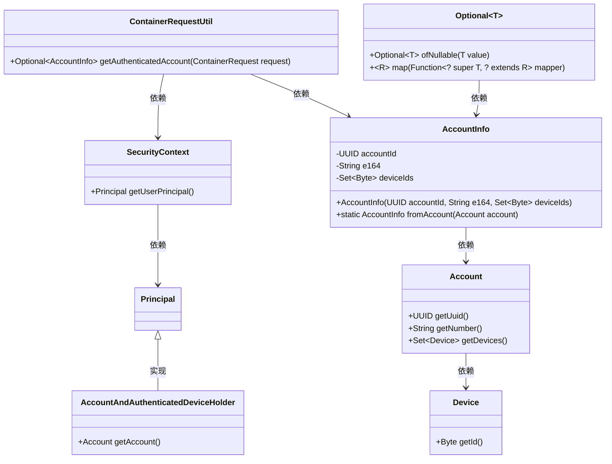
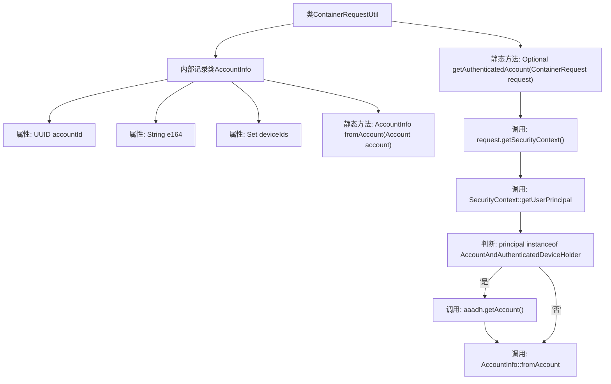

# 基础信息

|      |      |
|------|------|
| 名称 | ContainerRequestUtil |
| 编码语言 | .java |
| 代码路径 | Signal-Server/service/src/main/java/org/whispersystems/textsecuregcm/auth/ContainerRequestUtil.java |
| 包名 | org.whispersystems.textsecuregcm.auth |
| 依赖项 | ['jakarta.ws.rs.core.SecurityContext', 'java.util.Optional', 'java.util.Set', 'java.util.UUID', 'java.util.stream.Collectors', 'org.glassfish.jersey.server.ContainerRequest', 'org.whispersystems.textsecuregcm.storage.Account', 'org.whispersystems.textsecuregcm.storage.Device'] |
| 概述说明 | ContainerRequestUtil类用于记录和获取认证账户信息。 |

# 说明

ContainerRequestUtil类是一个用于处理容器请求的工具类，其中包含AccountInfo记录，用于存储账户信息。该类还提供了获取认证账户信息的方法，确保能够准确获取并处理与账户相关的认证数据。

# 类列表 Class Summary

| 名称   | 类型  | 说明 |
|-------|------|-------------|
| ContainerRequestUtil | class | ContainerRequestUtil类包含AccountInfo记录和获取认证账户信息的方法。 |

## 类 ContainerRequestUtil

|      |      |
|------|------|
| 访问范围 | None |
| 类型 | class |
| 名称 | ContainerRequestUtil |
| 说明 | ContainerRequestUtil类包含AccountInfo记录和获取认证账户信息的方法。 |

### UML类图

这段代码定义了一个 `ContainerRequestUtil` 类，其中包含一个静态方法 `getAuthenticatedAccount`，用于从 `ContainerRequest` 对象中获取经过身份验证的账户信息。`AccountInfo` 是一个记录类，用于存储账户的基本信息，并且提供了一个静态方法 `fromAccount` 来从 `Account` 对象中提取这些信息。代码通过 `SecurityContext` 和 `Principal` 对象来获取账户信息，并使用 `Optional` 类来处理可能为空的情况。

### 内部方法调用关系图

**描述：**  
`ContainerRequestUtil` 类包含一个内部记录类 `AccountInfo`，用于表示账户信息。`AccountInfo` 类有三个属性：`accountId`、`e164` 和 `deviceIds`，并提供了一个静态方法 `fromAccount` 用于从 `Account` 对象创建 `AccountInfo` 实例。`ContainerRequestUtil` 类还提供了一个静态方法 `getAuthenticatedAccount`，该方法从 `ContainerRequest` 对象中获取安全上下文，并提取用户主体。如果用户主体是 `AccountAndAuthenticatedDeviceHolder` 类型，则获取账户信息并转换为 `AccountInfo` 对象。

### 字段列表 Field List

| 名称  | 类型  | 说明 |
|-------|-------|------|

### 方法列表 Method List

| 名称  | 类型  | 说明 |
|-------|-------|------|
| getAuthenticatedAccount | Optional<AccountInfo> | 获取请求中的认证账户信息，返回Optional<AccountInfo>。 |

