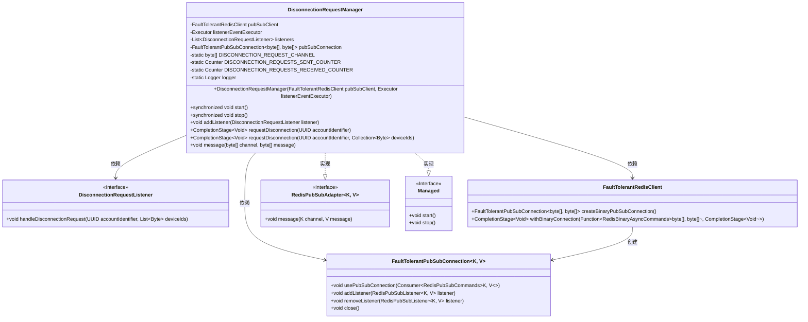

# 基础信息

|      |      |
|------|------|
| 名称 | DisconnectionRequestManager |
| 编码语言 | .java |
| 代码路径 | Signal-Server/service/src/main/java/org/whispersystems/textsecuregcm/auth/DisconnectionRequestManager.java |
| 包名 | org.whispersystems.textsecuregcm.auth |
| 依赖项 | ['com.google.protobuf.InvalidProtocolBufferException', 'io.dropwizard.lifecycle.Managed', 'io.lettuce.core.pubsub.RedisPubSubAdapter', 'java.nio.charset.StandardCharsets', 'java.util.Collection', 'java.util.Collections', 'java.util.List', 'java.util.UUID', 'java.util.concurrent.CompletionStage', 'java.util.concurrent.CopyOnWriteArrayList', 'java.util.concurrent.Executor', 'javax.annotation.Nullable', 'io.micrometer.core.instrument.Counter', 'io.micrometer.core.instrument.Metrics', 'org.slf4j.Logger', 'org.slf4j.LoggerFactory', 'org.whispersystems.textsecuregcm.metrics.MetricsUtil', 'org.whispersystems.textsecuregcm.redis.FaultTolerantPubSubConnection', 'org.whispersystems.textsecuregcm.redis.FaultTolerantRedisClient', 'org.whispersystems.textsecuregcm.storage.Device', 'org.whispersystems.textsecuregcm.util.UUIDUtil'] |
| 概述说明 | DisconnectionRequestManager通过Redis广播处理断开请求，支持监听和ID过滤。 |

# 说明

DisconnectionRequestManager负责管理断开连接请求，利用Redis的发布订阅机制进行请求的广播和处理。该管理器支持添加监听器，以便在接收到请求时执行相应的操作，同时还支持设备ID过滤功能，确保只有特定设备的请求被处理。这种设计提高了系统的灵活性和可扩展性，能够有效管理和响应断开连接请求。

# 类列表 Class Summary

| 名称   | 类型  | 说明 |
|-------|------|-------------|
| DisconnectionRequestManager | class | DisconnectionRequestManager管理断开连接请求，通过Redis发布订阅机制广播和处理请求，支持添加监听器和设备ID过滤。 |

## 类 DisconnectionRequestManager

|      |      |
|------|------|
| 访问范围 | public |
| 类型 | class |
| 名称 | DisconnectionRequestManager |
| 说明 | DisconnectionRequestManager管理断开连接请求，通过Redis发布订阅机制广播和处理请求，支持添加监听器和设备ID过滤。 |

### UML类图

**描述：**
`DisconnectionRequestManager` 类负责管理断开连接的请求，通过 Redis 发布/订阅机制广播和接收断开连接请求。它实现了 `RedisPubSubAdapter` 和 `Managed` 接口，依赖于 `FaultTolerantRedisClient` 和 `FaultTolerantPubSubConnection` 来处理 Redis 连接。该类维护了一个 `DisconnectionRequestListener` 列表，用于处理接收到的断开连接请求。

### 内部方法调用关系图

```mermaid
graph TD
    A["类DisconnectionRequestManager"]
    B["属性: FaultTolerantRedisClient pubSubClient"]
    C["属性: Executor listenerEventExecutor"]
    D["属性: List<DisconnectionRequestListener> listeners"]
    E["属性: FaultTolerantPubSubConnection<byte[], byte[]> pubSubConnection"]
    F["属性: byte[] DISCONNECTION_REQUEST_CHANNEL"]
    G["属性: Counter DISCONNECTION_REQUESTS_SENT_COUNTER"]
    H["属性: Counter DISCONNECTION_REQUESTS_RECEIVED_COUNTER"]
    I["属性: Logger logger"]
    J["构造方法: DisconnectionRequestManager(FaultTolerantRedisClient pubSubClient, Executor listenerEventExecutor)"]
    K["方法: synchronized void start()"]
    L["方法: synchronized void stop()"]
    M["方法: void addListener(DisconnectionRequestListener listener)"]
    N["方法: CompletionStage<Void> requestDisconnection(UUID accountIdentifier)"]
    O["方法: CompletionStage<Void> requestDisconnection(UUID accountIdentifier, Collection<Byte> deviceIds)"]
    P["方法: void message(byte[] channel, byte[] message)"]

    A --> B
    A --> C
    A --> D
    A --> E
    A --> F
    A --> G
    A --> H
    A --> I
    A --> J
    A --> K
    A --> L
    A --> M
    A --> N
    A --> O
    A --> P
```

该流程图展示了 `DisconnectionRequestManager` 类的结构及其主要方法。类包含多个属性，如 `pubSubClient`、`listenerEventExecutor` 等，以及构造方法和多个关键方法，如 `start`、`stop`、`addListener` 等。这些方法分别用于启动和停止连接管理、添加监听器、请求断开连接以及处理接收到的消息。流程图清晰地展示了类内部的函数调用关系，帮助理解类的整体功能和工作流程。

### 字段列表 Field List

| 名称  | 类型  | 说明 |
|-------|-------|------|
| pubSubClient | FaultTolerantRedisClient | 私有且最终的红is发布订阅客户端。 |
| pubSubConnection | FaultTolerantPubSubConnection<byte[], byte[]> | 可为空的字节数组类型容错发布订阅连接对象。 |
| listeners = new CopyOnWriteArrayList<>() | List<DisconnectionRequestListener> | 使用CopyOnWriteArrayList存储DisconnectionRequestListener实例。 |
| listenerEventExecutor | Executor | 私有最终执行器用于监听事件。 |
| DISCONNECTION_REQUEST_CHANNEL = "disconnection_requests".getBytes(StandardCharsets.UTF_8) | byte[] | 定义私有静态字节数组，存储断开请求通道的UTF-8编码。 |
| DISCONNECTION_REQUESTS_SENT_COUNTER =      Metrics.counter(MetricsUtil.name(DisconnectionRequestManager.class, "requestsSent")) | Counter | 定义了一个私有静态计数器，用于统计断连请求发送次数。 |
| logger = LoggerFactory.getLogger(DisconnectionRequestManager.class) | Logger | 定义了一个私有的静态日志记录器，用于管理断开连接请求。 |
| DISCONNECTION_REQUESTS_RECEIVED_COUNTER =      Metrics.counter(MetricsUtil.name(DisconnectionRequestManager.class, "requestsReceived")) | Counter | DisconnectionRequestManager类中定义了一个名为DISCONNECTION_REQUESTS_RECEIVED_COUNTER的计数器，用于统计接收到的断开连接请求。 |

### 方法列表 Method List

| 名称  | 类型  | 说明 |
|-------|-------|------|
| addListener | void | 添加断开连接请求监听器到监听器列表。 |
| start | void | 同步启动方法，创建二进制连接并监听订阅断开请求通道。 |
| message | void | 处理断开连接请求，解析账户和设备ID，通知监听器执行操作。 |
| requestDisconnection | CompletionStage<Void> | 方法请求断开连接，构建请求并异步发布到指定通道，完成后增加计数器。 |
| stop | void | 同步停止方法，关闭并移除pubSubConnection监听器。 |
| requestDisconnection | CompletionStage<Void> | 定义公共方法requestDisconnection，接受UUID参数，返回CompletionStage<Void>。 |

