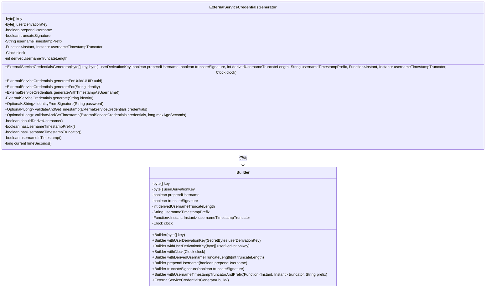

# 基础信息

|      |      |
|------|------|
| 名称 | ExternalServiceCredentialsGenerator |
| 编码语言 | .java |
| 代码路径 | Signal-Server/service/src/main/java/org/whispersystems/textsecuregcm/auth/ExternalServiceCredentialsGenerator.java |
| 包名 | org.whispersystems.textsecuregcm.auth |
| 依赖项 | ['java.util.Objects.requireNonNull', 'org.whispersystems.textsecuregcm.util.HmacUtils.hmac256ToHexString', 'org.whispersystems.textsecuregcm.util.HmacUtils.hmac256TruncatedToHexString', 'org.whispersystems.textsecuregcm.util.HmacUtils.hmacHexStringsEqual', 'com.google.common.annotations.VisibleForTesting', 'java.time.Clock', 'java.time.Instant', 'java.util.Optional', 'java.util.UUID', 'java.util.function.Function', 'org.apache.commons.lang3.StringUtils', 'org.apache.commons.lang3.Validate', 'org.whispersystems.textsecuregcm.configuration.secrets.SecretBytes'] |
| 概述说明 | 工具类生成外部服务凭证，支持用户名派生、时间戳前缀和签名截断。 |

# 说明

该工具类用于生成外部服务凭证，具备多种功能以增强凭证的安全性和唯一性。主要功能包括支持基于用户名派生凭证、在凭证前添加时间戳前缀以确保时效性、以及对签名进行截断处理以优化凭证长度。这些功能共同确保生成的凭证既安全又高效，适用于多种外部服务场景。

# 类列表 Class Summary

| 名称   | 类型  | 说明 |
|-------|------|-------------|
| ExternalServiceCredentialsGenerator | class | 生成外部服务凭证的工具类，支持用户名派生、时间戳前缀、签名截断等功能。 |

## 类 ExternalServiceCredentialsGenerator

|      |      |
|------|------|
| 访问范围 | public |
| 类型 | class |
| 名称 | ExternalServiceCredentialsGenerator |
| 说明 | 生成外部服务凭证的工具类，支持用户名派生、时间戳前缀、签名截断等功能。 |

### UML类图

**描述**：`ExternalServiceCredentialsGenerator` 类用于生成外部服务凭证，支持通过UUID或字符串生成凭证，并提供了验证凭证有效性的功能。`Builder` 类用于配置生成器的参数，如密钥、用户名前缀、时间戳截断器等。生成器类通过 `Builder` 类进行实例化，并提供了多种生成和验证凭证的方法。

### 内部方法调用关系图

```mermaid
graph TD
    A["类ExternalServiceCredentialsGenerator"]
    B["属性: byte[] key"]
    C["属性: byte[] userDerivationKey"]
    D["属性: boolean prependUsername"]
    E["属性: boolean truncateSignature"]
    F["属性: String usernameTimestampPrefix"]
    G["属性: Function<Instant, Instant> usernameTimestampTruncator"]
    H["属性: Clock clock"]
    I["属性: int derivedUsernameTruncateLength"]
    J["方法: builder(SecretBytes key)"]
    K["方法: builder(byte[] key)"]
    L["构造方法: ExternalServiceCredentialsGenerator(byte[] key, byte[] userDerivationKey, boolean prependUsername, boolean truncateSignature, int derivedUsernameTruncateLength, String usernameTimestampPrefix, Function<Instant, Instant> usernameTimestampTruncator, Clock clock)"]
    M["方法: generateForUuid(UUID uuid)"]
    N["方法: generateFor(String identity)"]
    O["方法: generateWithTimestampAsUsername()"]
    P["方法: generate(String identity)"]
    Q["方法: identityFromSignature(String password)"]
    R["方法: validateAndGetTimestamp(ExternalServiceCredentials credentials)"]
    S["方法: validateAndGetTimestamp(ExternalServiceCredentials credentials, long maxAgeSeconds)"]
    T["方法: shouldDeriveUsername()"]
    U["方法: hasUsernameTimestampPrefix()"]
    V["方法: hasUsernameTimestampTruncator()"]
    W["方法: usernameIsTimestamp()"]
    X["方法: currentTimeSeconds()"]
    Y["类Builder"]
    Z["属性: byte[] key"]
    AA["属性: byte[] userDerivationKey"]
    AB["属性: boolean prependUsername"]
    AC["属性: boolean truncateSignature"]
    AD["属性: int derivedUsernameTruncateLength"]
    AE["属性: String usernameTimestampPrefix"]
    AF["属性: Function<Instant, Instant> usernameTimestampTruncator"]
    AG["属性: Clock clock"]
    AH["构造方法: Builder(byte[] key)"]
    AI["方法: withUserDerivationKey(SecretBytes userDerivationKey)"]
    AJ["方法: withUserDerivationKey(byte[] userDerivationKey)"]
    AK["方法: withClock(Clock clock)"]
    AL["方法: withDerivedUsernameTruncateLength(int truncateLength)"]
    AM["方法: prependUsername(boolean prependUsername)"]
    AN["方法: truncateSignature(boolean truncateSignature)"]
    AO["方法: withUsernameTimestampTruncatorAndPrefix(Function<Instant, Instant> truncator, String prefix)"]
    AP["方法: build()"]

    A --> B
    A --> C
    A --> D
    A --> E
    A --> F
    A --> G
    A --> H
    A --> I
    A --> J
    A --> K
    A --> L
    A --> M
    A --> N
    A --> O
    A --> P
    A --> Q
    A --> R
    A --> S
    A --> T
    A --> U
    A --> V
    A --> W
    A --> X
    A -.-> Y
    Y --> Z
    Y --> AA
    Y --> AB
    Y --> AC
    Y --> AD
    Y --> AE
    Y --> AF
    Y --> AG
    Y --> AH
    Y --> AI
    Y --> AJ
    Y --> AK
    Y --> AL
    Y --> AM
    Y --> AN
    Y --> AO
    Y --> AP
```

这段代码定义了一个名为`ExternalServiceCredentialsGenerator`的类，用于生成外部服务凭证。该类包含多个属性和方法，用于配置和生成凭证。`Builder`类用于构建`ExternalServiceCredentialsGenerator`的实例，允许灵活配置生成器的属性。生成器支持使用UUID或字符串作为身份标识生成凭证，并提供了验证凭证的方法。流程图展示了类的结构、属性、方法以及它们之间的关系，帮助理解代码的复杂逻辑和功能。

### 字段列表 Field List

| 名称  | 类型  | 说明 |
|-------|-------|------|
| clock | Clock | 私有且不可变的时钟对象。 |
| DELIMITER = ":" | String | 定义静态常量DELIMITER，值为冒号。 |
| key | byte[] | 定义一个私有的不可变字节数组key。 |
| userDerivationKey | byte[] | 私有字节数组用于用户密钥派生。 |
| TRUNCATED_SIGNATURE_LENGTH = 10 | int | 定义常量TRUNCATED_SIGNATURE_LENGTH值为10。 |
| usernameTimestampTruncator | Function<Instant, Instant> | 私有最终函数，截断用户时间戳。 |
| prependUsername | boolean | 私有布尔变量prependUsername用于决定是否在用户名前添加内容。 |
| usernameTimestampPrefix | String | 私有常量字符串，用于存储带时间戳的用户名前缀。 |
| derivedUsernameTruncateLength | int | 私有整型变量，用于存储派生用户名的截取长度。 |
| truncateSignature | boolean | 私有布尔变量truncateSignature用于控制签名截断。 |

### 方法列表 Method List

| 名称  | 类型  | 说明 |
|-------|-------|------|
| builder | ExternalServiceCredentialsGenerator.Builder | 静态方法生成外部服务凭证构建器，接受密钥参数。 |
| currentTimeSeconds | long | 该方法返回当前时间的秒数。 |
| hasUsernameTimestampTruncator | boolean | 检查usernameTimestampTruncator是否为空。 |
| generateForUuid | ExternalServiceCredentials | 根据UUID生成外部服务凭证。 |
| hasUsernameTimestampPrefix | boolean | 检查用户名时间戳前缀是否存在。 |
| shouldDeriveUsername | boolean | 检查用户派生键长度以决定是否派生用户名。 |
| generateWithTimestampAsUsername | ExternalServiceCredentials | 生成带时间戳用户名的外部服务凭证，验证配置并返回结果。 |
| usernameIsTimestamp | boolean | 检查用户名是否为时间戳格式，需满足前缀和截断符条件。 |
| builder | ExternalServiceCredentialsGenerator.Builder | 公开测试方法，返回带密钥的生成器构建器。 |
| validateAndGetTimestamp | Optional<Long> | 验证并获取时间戳，确保不超过最大时间差。 |
| generate | ExternalServiceCredentials | 根据身份生成用户名，签名数据并创建服务凭证。 |
| identityFromSignature | Optional<String> | 根据密码格式提取身份信息，条件不满足或格式不符时返回空。 |
| validateAndGetTimestamp | Optional<Long> | 验证外部服务凭据并返回时间戳，若格式或签名无效则返回空。 |
| generateFor | ExternalServiceCredentials | 生成外部服务凭证，若用户名是时间戳则抛出异常。 |

