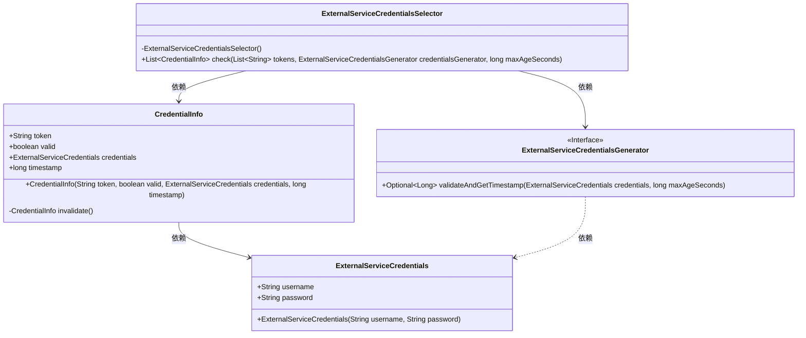
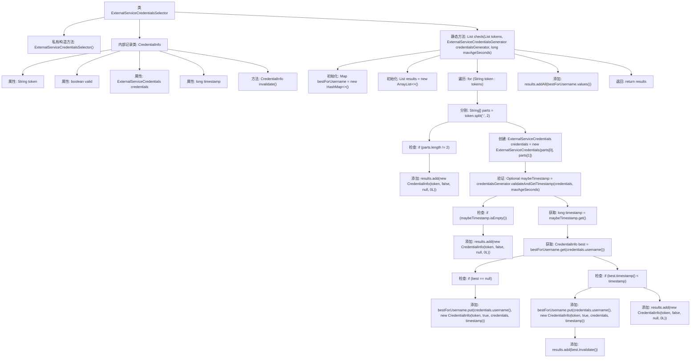

# 基础信息

|      |      |
|------|------|
| 名称 | ExternalServiceCredentialsSelector |
| 编码语言 | .java |
| 代码路径 | Signal-Server/service/src/main/java/org/whispersystems/textsecuregcm/auth/ExternalServiceCredentialsSelector.java |
| 包名 | org.whispersystems.textsecuregcm.auth |
| 依赖项 | ['java.util.ArrayList', 'java.util.HashMap', 'java.util.List', 'java.util.Map', 'java.util.Optional'] |
| 概述说明 | 验证用户凭证，更新有效凭证并标记无效凭证。 |

# 说明

该功能涉及验证用户凭证的过程，主要目标是确保凭证的有效性。系统会保留最新且有效的凭证，同时自动标记那些无效的凭证。通过这种方式，系统能够维护用户凭证的准确性和安全性，确保只有有效的凭证可用于后续操作。这一机制有助于提升系统的安全性和用户体验，避免因无效凭证导致的错误或安全问题。

# 类列表 Class Summary

| 名称   | 类型  | 说明 |
|-------|------|-------------|
| ExternalServiceCredentialsSelector | class | 验证用户凭证，保留最新有效凭证并标记无效凭证。 |

## 类 ExternalServiceCredentialsSelector

|      |      |
|------|------|
| 访问范围 | public |
| 类型 | class |
| 名称 | ExternalServiceCredentialsSelector |
| 说明 | 验证用户凭证，保留最新有效凭证并标记无效凭证。 |

### UML类图

### 描述
该代码定义了一个 `ExternalServiceCredentialsSelector` 类，用于验证一组用户名和密码的凭证。`CredentialInfo` 记录类用于存储凭证信息，包括令牌、有效性、凭证对象和时间戳。`ExternalServiceCredentials` 类表示凭证，包含用户名和密码。`ExternalServiceCredentialsGenerator` 接口用于验证凭证并获取时间戳。`check` 方法通过遍历凭证列表，验证每个凭证的有效性，并确保每个用户名的最新凭证被保留，最终返回所有凭证的验证结果。

### 内部方法调用关系图

这段代码定义了一个名为 `ExternalServiceCredentialsSelector` 的类，用于验证一组用户名和密码凭证的有效性。代码的核心是 `check` 方法，它遍历提供的凭证列表，验证每个凭证的有效性，并确保每个用户名的最新凭证被保留。无效的凭证会被标记为无效，而有效的凭证会被存储在结果列表中。最终，方法返回包含所有凭证验证结果的列表。

### 字段列表 Field List

| 名称  | 类型  | 说明 |
|-------|-------|------|

### 方法列表 Method List

| 名称  | 类型  | 说明 |
|-------|-------|------|
| check | List<CredentialInfo> | 方法检查令牌有效性，更新最新凭证，返回无效和最新有效凭证列表。 |

