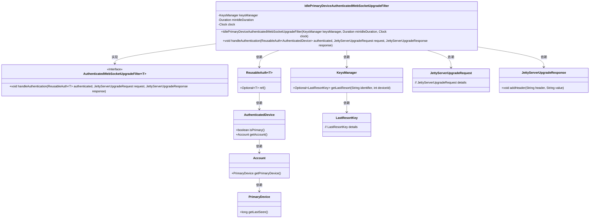
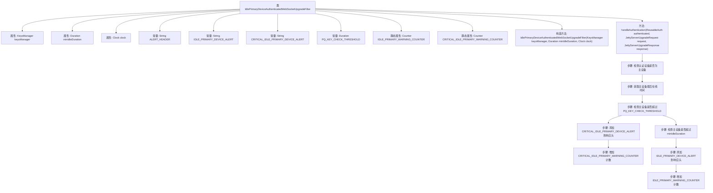

# 基础信息

|      |      |
|------|------|
| 名称 | IdlePrimaryDeviceAuthenticatedWebSocketUpgradeFilter |
| 编码语言 | .java |
| 代码路径 | Signal-Server/service/src/main/java/org/whispersystems/textsecuregcm/auth/IdlePrimaryDeviceAuthenticatedWebSocketUpgradeFilter.java |
| 包名 | org.whispersystems.textsecuregcm.auth |
| 依赖项 | ['com.google.common.annotations.VisibleForTesting', 'io.micrometer.core.instrument.Counter', 'io.micrometer.core.instrument.Metrics', 'org.eclipse.jetty.websocket.server.JettyServerUpgradeRequest', 'org.eclipse.jetty.websocket.server.JettyServerUpgradeResponse', 'org.whispersystems.textsecuregcm.identity.IdentityType', 'org.whispersystems.textsecuregcm.metrics.MetricsUtil', 'org.whispersystems.textsecuregcm.storage.Device', 'org.whispersystems.textsecuregcm.storage.KeysManager', 'org.whispersystems.websocket.ReusableAuth', 'org.whispersystems.websocket.auth.AuthenticatedWebSocketUpgradeFilter', 'java.time.Clock', 'java.time.Duration', 'java.time.Instant'] |
| 概述说明 | IdlePrimaryDeviceAuthenticatedWebSocketUpgradeFilter类用于检查主设备空闲状态并发警报。 |

# 说明

IdlePrimaryDeviceAuthenticatedWebSocketUpgradeFilter类的主要功能是监控主设备的空闲状态，并在检测到空闲时发送相应的警报。该类的核心任务是确保主设备在使用WebSocket进行身份验证和升级过程中保持活跃状态，避免因设备空闲而导致的安全或操作问题。通过实时监控和警报机制，该类有助于提高系统的安全性和稳定性。

# 类列表 Class Summary

| 名称   | 类型  | 说明 |
|-------|------|-------------|
| IdlePrimaryDeviceAuthenticatedWebSocketUpgradeFilter | class | IdlePrimaryDeviceAuthenticatedWebSocketUpgradeFilter类用于检查主设备空闲状态，并发送相应警报。 |

## 类 IdlePrimaryDeviceAuthenticatedWebSocketUpgradeFilter

|      |      |
|------|------|
| 访问范围 | public |
| 类型 | class |
| 名称 | IdlePrimaryDeviceAuthenticatedWebSocketUpgradeFilter |
| 说明 | IdlePrimaryDeviceAuthenticatedWebSocketUpgradeFilter类用于检查主设备空闲状态，并发送相应警报。 |

### UML类图

这段代码定义了一个名为 `IdlePrimaryDeviceAuthenticatedWebSocketUpgradeFilter` 的类，它实现了 `AuthenticatedWebSocketUpgradeFilter` 接口。该类的主要功能是处理 WebSocket 升级请求，并在设备长时间未活动时发送警告。它依赖于 `KeysManager` 来获取密钥信息，并通过 `ReusableAuth` 和 `AuthenticatedDevice` 来验证设备身份。如果主设备长时间未活动，它会通过 `JettyServerUpgradeResponse` 添加警告头信息，并更新计数器以记录警告次数。

### 内部方法调用关系图

该流程图展示了`IdlePrimaryDeviceAuthenticatedWebSocketUpgradeFilter`类的结构和`handleAuthentication`方法的执行流程。首先，类中包含多个属性和常量，构造方法用于初始化这些属性。`handleAuthentication`方法首先检查认证设备是否为主设备，如果不是，则获取主设备的最后在线时间，并根据是否超过特定阈值来决定是否添加警告头信息并增加计数器。

### 字段列表 Field List

| 名称  | 类型  | 说明 |
|-------|-------|------|
| keysManager | KeysManager | 私有不可变的KeysManager实例。 |
| minIdleDuration | Duration | 最小空闲时长设置为私有常量。 |
| clock | Clock | 私有且不可变的时钟对象。 |
| CRITICAL_IDLE_PRIMARY_DEVICE_ALERT = "critical-idle-primary-device" | String | 测试可见的静态常量，表示关键空闲主设备警报。 |
| IDLE_PRIMARY_DEVICE_ALERT = "idle-primary-device" | String | 用于测试的空闲主设备警报标识符。 |
| CRITICAL_IDLE_PRIMARY_WARNING_COUNTER = Metrics.counter(      MetricsUtil.name(IdlePrimaryDeviceAuthenticatedWebSocketUpgradeFilter.class, "idlePrimaryDeviceWarning"),      "critical", "true") | Counter | 定义静态计数器用于监控主设备空闲警告。 |
| PQ_KEY_CHECK_THRESHOLD = Duration.ofDays(120) | Duration | 测试用PQ密钥检查阈值为120天。 |
| ALERT_HEADER = "X-Signal-Alert" | String | 测试可见的静态常量ALERT_HEADER，值为"X-Signal-Alert"。 |
| IDLE_PRIMARY_WARNING_COUNTER = Metrics.counter(      MetricsUtil.name(IdlePrimaryDeviceAuthenticatedWebSocketUpgradeFilter.class, "idlePrimaryDeviceWarning"),      "critical", "false") | Counter | 定义静态计数器IDLE_PRIMARY_WARNING_COUNTER，用于监控空闲主设备警告。 |

### 方法列表 Method List

| 名称  | 类型  | 说明 |
|-------|-------|------|
| handleAuthentication | void | 处理认证设备，检查主设备活动状态，必要时添加警告头并计数。 |

