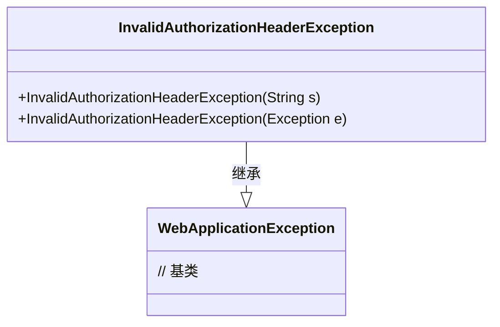
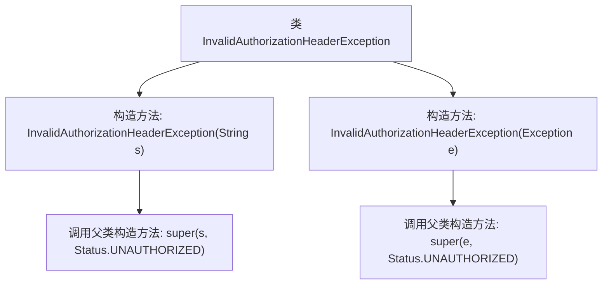

# 基础信息

|      |      |
|------|------|
| 名称 | InvalidAuthorizationHeaderException |
| 编码语言 | .java |
| 代码路径 | Signal-Server/service/src/main/java/org/whispersystems/textsecuregcm/auth/InvalidAuthorizationHeaderException.java |
| 包名 | org.whispersystems.textsecuregcm.auth |
| 依赖项 | ['jakarta.ws.rs.WebApplicationException', 'jakarta.ws.rs.core.Response.Status'] |
| 概述说明 | 无效授权头异常类继承WebApplicationException，处理未授权状态。 |

# 说明

无效授权头异常类是一个继承自WebApplicationException的异常类，专门用于处理未授权状态。当系统检测到无效的授权头信息时，会抛出该异常，以便在应用程序中进行相应的错误处理和反馈。通过继承WebApplicationException，该类能够利用已有的异常处理机制，确保在未授权情况下能够准确地传递错误信息，并采取适当的措施。该类的设计旨在提高系统的安全性和用户体验，确保未经授权的访问被及时拦截和处理。

# 类列表 Class Summary

| 名称   | 类型  | 说明 |
|-------|------|-------------|
| InvalidAuthorizationHeaderException | class | 无效授权头异常类，继承WebApplicationException，用于处理未授权状态。 |

## 类 InvalidAuthorizationHeaderException

|      |      |
|------|------|
| 访问范围 | public |
| 类型 | class |
| 名称 | InvalidAuthorizationHeaderException |
| 说明 | 无效授权头异常类，继承WebApplicationException，用于处理未授权状态。 |

### UML类图

这段代码定义了一个名为 `InvalidAuthorizationHeaderException` 的异常类，它继承自 `WebApplicationException`。该类提供了两个构造函数，一个接受字符串参数用于描述异常信息，另一个接受一个异常对象作为参数。这两个构造函数都会调用父类的构造函数，并将 HTTP 状态码设置为 `UNAUTHORIZED`（401）。这个类通常用于处理授权头无效的场景，帮助开发者快速识别和处理此类异常。

### 内部方法调用关系图

这段代码定义了一个名为 `InvalidAuthorizationHeaderException` 的异常类，它继承自 `WebApplicationException`。该类提供了两个构造方法，分别接受一个字符串和一个异常作为参数，并在内部调用父类的构造方法，将状态码设置为 `Status.UNAUTHORIZED`。这个异常类通常用于处理授权头无效的情况，确保在发生此类错误时能够返回适当的HTTP状态码。

### 字段列表 Field List

| 名称  | 类型  | 说明 |
|-------|-------|------|

### 方法列表 Method List

| 名称  | 类型  | 说明 |
|-------|-------|------|

