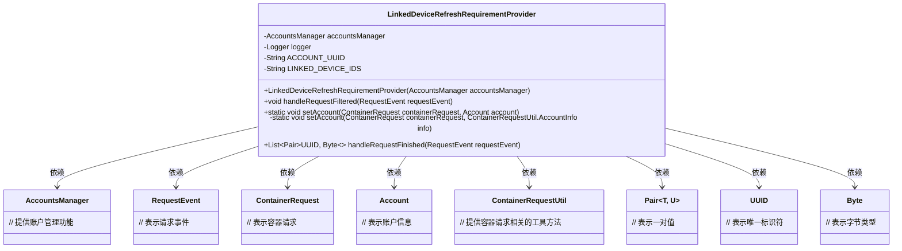
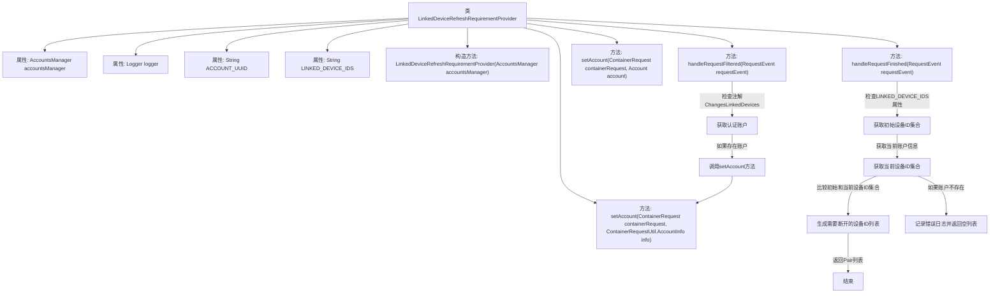

# 基础信息

|      |      |
|------|------|
| 名称 | LinkedDeviceRefreshRequirementProvider |
| 编码语言 | .java |
| 代码路径 | Signal-Server/service/src/main/java/org/whispersystems/textsecuregcm/auth/LinkedDeviceRefreshRequirementProvider.java |
| 包名 | org.whispersystems.textsecuregcm.auth |
| 依赖项 | ['java.util.Collections', 'java.util.HashSet', 'java.util.List', 'java.util.Set', 'java.util.UUID', 'java.util.stream.Collectors', 'org.glassfish.jersey.server.ContainerRequest', 'org.glassfish.jersey.server.monitoring.RequestEvent', 'org.slf4j.Logger', 'org.slf4j.LoggerFactory', 'org.whispersystems.textsecuregcm.storage.Account', 'org.whispersystems.textsecuregcm.storage.AccountsManager', 'org.whispersystems.textsecuregcm.util.Pair'] |
| 概述说明 | LinkedDeviceRefreshRequirementProvider类处理设备状态变化，触发重新认证。 |

# 说明

LinkedDeviceRefreshRequirementProvider类负责处理设备在请求前后的状态变化，并在检测到状态变化时触发设备的重新认证流程。该类的核心功能是确保设备在状态更新后能够及时进行认证，以维持系统的安全性和一致性。通过监控设备状态的变化，该类能够有效地管理设备的认证需求，确保设备在系统内的合法性和有效性。

# 类列表 Class Summary

| 名称   | 类型  | 说明 |
|-------|------|-------------|
| LinkedDeviceRefreshRequirementProvider | class | LinkedDeviceRefreshRequirementProvider类处理请求前后设备状态变化，触发设备重新认证。 |

## 类 LinkedDeviceRefreshRequirementProvider

|      |      |
|------|------|
| 访问范围 | public |
| 类型 | class |
| 名称 | LinkedDeviceRefreshRequirementProvider |
| 说明 | LinkedDeviceRefreshRequirementProvider类处理请求前后设备状态变化，触发设备重新认证。 |

### UML类图

### 描述
`LinkedDeviceRefreshRequirementProvider` 类是一个用于处理与设备刷新需求相关的请求的类。它依赖于 `AccountsManager` 来管理账户信息，并通过 `RequestEvent` 和 `ContainerRequest` 来处理请求事件和容器请求。该类的主要功能包括在请求过滤时处理账户信息，以及在请求完成时检查设备列表的变化，并返回需要重新认证的设备列表。

### 内部方法调用关系图

这段代码的流程图描述了`LinkedDeviceRefreshRequirementProvider`类的核心逻辑。该类主要负责处理与设备刷新相关的请求，包括在请求过滤时捕获账户的链接设备信息，以及在请求完成后检查设备ID是否发生变化。如果设备ID发生变化，则生成需要断开的设备ID列表。流程图清晰地展示了各个方法之间的调用关系以及逻辑判断的流程。

### 字段列表 Field List

| 名称  | 类型  | 说明 |
|-------|-------|------|
| logger = LoggerFactory.getLogger(LinkedDeviceRefreshRequirementProvider.class) | Logger | 私有静态日志记录器初始化。 |
| accountsManager | AccountsManager | 私有且不可变的AccountsManager实例。 |
| ACCOUNT_UUID = LinkedDeviceRefreshRequirementProvider.class.getName() + ".accountUuid" | String | 定义私有静态常量ACCOUNT_UUID，值为类名拼接.accountUuid。 |
| LINKED_DEVICE_IDS = LinkedDeviceRefreshRequirementProvider.class.getName() + ".deviceIds" | String | 定义静态常量LINKED_DEVICE_IDS，值为类名加".deviceIds"。 |

### 方法列表 Method List

| 名称  | 类型  | 说明 |
|-------|-------|------|
| handleRequestFinished | List<Pair<UUID, Byte>> | 请求完成后检查设备变化，若变化则设备需重新认证。 |
| setAccount | void | 静态方法setAccount用于设置容器请求中的账户信息。 |
| setAccount | void | 私有方法设置账户信息，将账户ID和设备ID存入容器请求属性中。 |
| handleRequestFiltered | void | 方法检查请求注解并捕获认证账户的链接设备快照。 |

