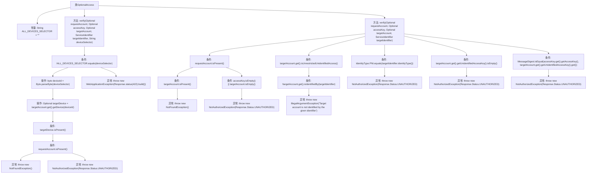

# 基础信息

|      |      |
|------|------|
| 名称 | OptionalAccess |
| 编码语言 | .java |
| 代码路径 | Signal-Server/service/src/main/java/org/whispersystems/textsecuregcm/auth/OptionalAccess.java |
| 包名 | org.whispersystems.textsecuregcm.auth |
| 依赖项 | ['jakarta.ws.rs.NotAuthorizedException', 'jakarta.ws.rs.NotFoundException', 'jakarta.ws.rs.WebApplicationException', 'jakarta.ws.rs.core.Response', 'java.security.MessageDigest', 'java.util.Optional', 'org.whispersystems.textsecuregcm.identity.IdentityType', 'org.whispersystems.textsecuregcm.identity.ServiceIdentifier', 'org.whispersystems.textsecuregcm.storage.Account', 'org.whispersystems.textsecuregcm.storage.Device'] |
| 概述说明 | OptionalAccess类负责验证账户和设备权限，处理未授权及未找到异常。 |

# 说明

OptionalAccess类用于验证账户和设备的访问权限，主要功能包括处理未授权访问和未找到资源的异常情况。该类确保在访问控制过程中，能够准确识别并应对权限不足或资源不存在的问题，从而保障系统的安全性和稳定性。

# 类列表 Class Summary

| 名称   | 类型  | 说明 |
|-------|------|-------------|
| OptionalAccess | class | OptionalAccess类验证账户和设备访问权限，处理未授权和未找到异常。 |


## 类 OptionalAccess

|      |      |
|------|------|
| 访问范围 | @SuppressWarnings("OptionalUsedAsFieldOrParameterType");public |
| 类型 | class |
| 名称 | OptionalAccess |
| 说明 | OptionalAccess类验证账户和设备访问权限，处理未授权和未找到异常。 |


### UML类图

```mermaid
classDiagram
    class OptionalAccess {
        +String ALL_DEVICES_SELECTOR
        +verify(Optional~Account~ requestAccount, Optional~Anonymous~ accessKey, Optional~Account~ targetAccount, ServiceIdentifier targetIdentifier, String deviceSelector)
        +verify(Optional~Account~ requestAccount, Optional~Anonymous~ accessKey, Optional~Account~ targetAccount, ServiceIdentifier targetIdentifier)
    }

    class Account {
        +getDevice(byte deviceId) Optional~Device~
        +isUnrestrictedUnidentifiedAccess() boolean
        +isIdentifiedBy(ServiceIdentifier targetIdentifier) boolean
        +getUnidentifiedAccessKey() Optional~byte[]~
    }

    class Anonymous {
        +getAccessKey() byte[]
    }

    class ServiceIdentifier {
        +identityType() IdentityType
    }

    class Device {
    }

    class NotFoundException {
    }

    class NotAuthorizedException {
        +NotAuthorizedException(Response.Status status)
    }

    class WebApplicationException {
        +WebApplicationException(Response response)
    }

    class IdentityType {
    }

    class Response {
        +Status UNAUTHORIZED
        +status(int status) Response
    }

    class Status {
    }

    OptionalAccess --> Account : 依赖
    OptionalAccess --> Anonymous : 依赖
    OptionalAccess --> ServiceIdentifier : 依赖
    OptionalAccess --> Device : 依赖
    OptionalAccess --> NotFoundException : 依赖
    OptionalAccess --> NotAuthorizedException : 依赖
    OptionalAccess --> WebApplicationException : 依赖
    OptionalAccess --> IdentityType : 依赖
    OptionalAccess --> Response : 依赖
    Account --> Device : 依赖
    ServiceIdentifier --> IdentityType : 依赖
    Anonymous --> byte[] : 依赖
    Response --> Status : 依赖
```

这段代码定义了一个名为 `OptionalAccess` 的类，主要用于验证请求的合法性和权限。类中包含两个 `verify` 方法，分别用于处理不同场景的验证逻辑。`OptionalAccess` 类依赖于多个其他类，如 `Account`、`Anonymous`、`ServiceIdentifier` 等，这些类提供了必要的功能支持。代码中还定义了一些异常类，如 `NotFoundException`、`NotAuthorizedException` 和 `WebApplicationException`，用于处理不同的错误情况。整体设计旨在确保请求的合法性和安全性，并根据不同的条件抛出相应的异常。


### 内部方法调用关系图



这段代码定义了一个名为`OptionalAccess`的类，其中包含两个重载的`verify`方法，用于验证账户访问权限。第一个`verify`方法处理设备选择器的验证，如果设备选择器不是通配符，则尝试解析设备ID并检查设备是否存在。第二个`verify`方法处理账户和访问密钥的验证，确保请求账户或访问密钥的有效性，并根据不同条件抛出相应的异常。代码通过多个条件判断和异常处理来确保访问权限的安全性。

### 字段列表 Field List

| 名称  | 类型  | 说明 |
|-------|-------|------|
| ALL_DEVICES_SELECTOR = "*" | String | 定义公共静态字符串变量ALL_DEVICES_SELECTOR，默认值为"*"。 |

### 方法列表 Method List

| 名称  | 类型  | 说明 |
|-------|-------|------|
| verify | void | 验证账户和设备权限，处理异常和未授权情况。 |
| verify | void | 验证请求账户、访问密钥和目标账户，确保合法访问并处理异常。 |


