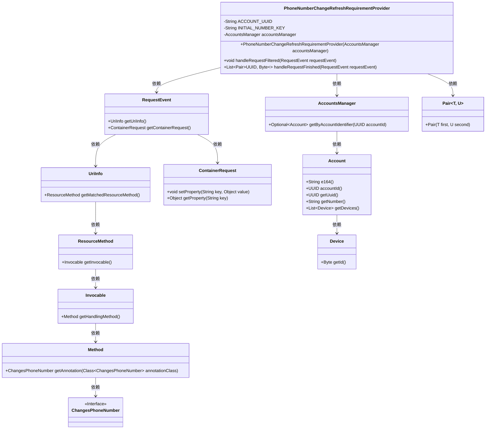
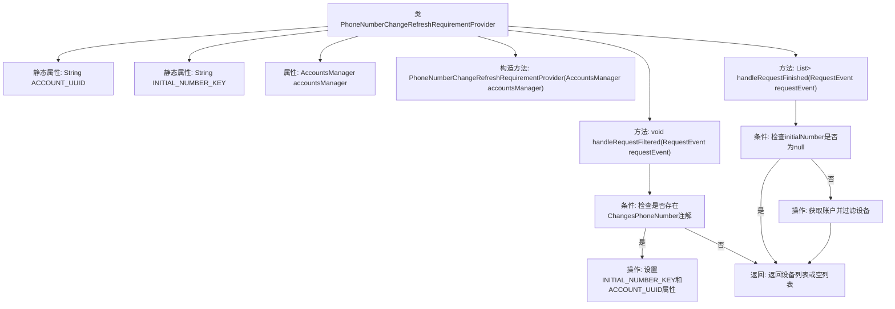

# 基础信息

|      |      |
|------|------|
| 名称 | PhoneNumberChangeRefreshRequirementProvider |
| 编码语言 | .java |
| 代码路径 | Signal-Server/service/src/main/java/org/whispersystems/textsecuregcm/auth/PhoneNumberChangeRefreshRequirementProvider.java |
| 包名 | org.whispersystems.textsecuregcm.auth |
| 依赖项 | ['java.util.Collections', 'java.util.List', 'java.util.UUID', 'java.util.stream.Collectors', 'org.glassfish.jersey.server.monitoring.RequestEvent', 'org.whispersystems.textsecuregcm.storage.AccountsManager', 'org.whispersystems.textsecuregcm.util.Pair'] |
| 概述说明 | 类实现Websocket刷新，处理电话号码变更。 |

# 说明

该类实现了Websocket刷新功能，主要用于处理电话号码变更请求。通过Websocket技术，确保在电话号码发生变更时，系统能够实时刷新并更新相关信息，从而保证数据的准确性和一致性。该类的设计旨在高效处理变更请求，确保系统在接收到新的电话号码信息后，能够迅速响应并完成刷新操作。

# 类列表 Class Summary

| 名称   | 类型  | 说明 |
|-------|------|-------------|
| PhoneNumberChangeRefreshRequirementProvider | class | 类实现Websocket刷新需求，处理电话号码变更请求。 |

## 类 PhoneNumberChangeRefreshRequirementProvider

|      |      |
|------|------|
| 访问范围 | public |
| 类型 | class |
| 名称 | PhoneNumberChangeRefreshRequirementProvider |
| 说明 | 类实现Websocket刷新需求，处理电话号码变更请求。 |

### UML类图

这段代码展示了`PhoneNumberChangeRefreshRequirementProvider`类如何通过`WebsocketRefreshRequirementProvider`接口处理电话号码变更的刷新需求。它依赖于`AccountsManager`来管理账户信息，并通过`RequestEvent`获取请求的详细信息。类图中清晰地展示了各个类之间的关系和依赖，特别是`PhoneNumberChangeRefreshRequirementProvider`如何与其他类交互以完成其功能。

### 内部方法调用关系图

该流程图描述了`PhoneNumberChangeRefreshRequirementProvider`类的结构和主要方法调用关系。类包含两个静态属性和一个`AccountsManager`属性，并通过构造方法初始化。`handleRequestFiltered`方法检查请求是否包含`ChangesPhoneNumber`注解，若存在则设置相关属性。`handleRequestFinished`方法根据初始号码和账户UUID获取设备列表，若初始号码为空则返回空列表，否则过滤并返回设备列表。

### 字段列表 Field List

| 名称  | 类型  | 说明 |
|-------|-------|------|
| accountsManager | AccountsManager | 私有且不可变的账户管理器实例。 |
| INITIAL_NUMBER_KEY =      PhoneNumberChangeRefreshRequirementProvider.class.getName() + ".initialNumber" | String | 私有静态常量INITIAL_NUMBER_KEY存储类名与初始号码的拼接字符串。 |
| ACCOUNT_UUID =      PhoneNumberChangeRefreshRequirementProvider.class.getName() + ".accountUuid" | String | 私有静态常量ACCOUNT_UUID存储类名与字符串“.accountUuid”的拼接结果。 |

### 方法列表 Method List

| 名称  | 类型  | 说明 |
|-------|-------|------|
| handleRequestFiltered | void | 处理请求时检查注解并设置账户属性。 |
| handleRequestFinished | List<Pair<UUID, Byte>> | 处理请求完成，返回账户UUID与设备ID列表。 |

