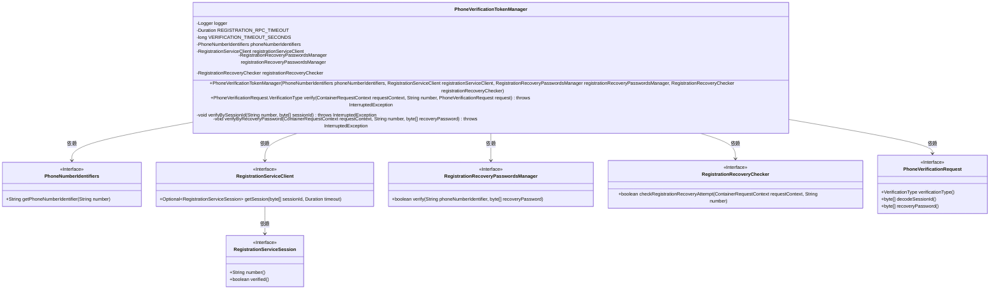
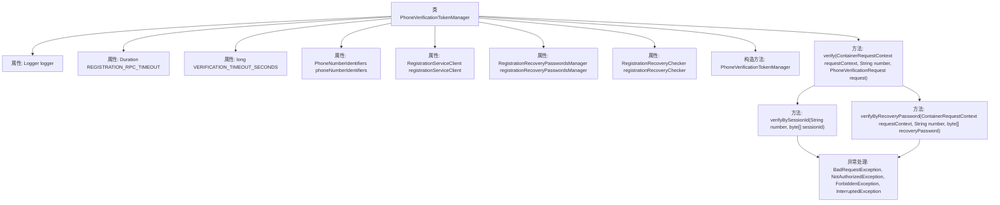

# 基础信息

|      |      |
|------|------|
| 名称 | PhoneVerificationTokenManager |
| 编码语言 | .java |
| 代码路径 | Signal-Server/service/src/main/java/org/whispersystems/textsecuregcm/auth/PhoneVerificationTokenManager.java |
| 包名 | org.whispersystems.textsecuregcm.auth |
| 依赖项 | ['io.grpc.Status', 'io.grpc.StatusRuntimeException', 'jakarta.ws.rs.BadRequestException', 'jakarta.ws.rs.ForbiddenException', 'jakarta.ws.rs.NotAuthorizedException', 'jakarta.ws.rs.ServerErrorException', 'jakarta.ws.rs.container.ContainerRequestContext', 'jakarta.ws.rs.core.Response', 'java.security.MessageDigest', 'java.time.Duration', 'java.util.concurrent.CancellationException', 'java.util.concurrent.ExecutionException', 'java.util.concurrent.TimeUnit', 'java.util.concurrent.TimeoutException', 'org.slf4j.Logger', 'org.slf4j.LoggerFactory', 'org.whispersystems.textsecuregcm.entities.PhoneVerificationRequest', 'org.whispersystems.textsecuregcm.entities.RegistrationServiceSession', 'org.whispersystems.textsecuregcm.registration.RegistrationServiceClient', 'org.whispersystems.textsecuregcm.spam.RegistrationRecoveryChecker', 'org.whispersystems.textsecuregcm.storage.PhoneNumberIdentifiers', 'org.whispersystems.textsecuregcm.storage.RegistrationRecoveryPasswordsManager'] |
| 概述说明 | PhoneVerificationTokenManager类验证手机号，支持会话ID和恢复密码，处理超时异常。 |

# 说明

PhoneVerificationTokenManager类主要用于手机号码的验证，支持通过会话ID和恢复密码两种方式进行验证。该类能够有效处理验证过程中的超时和异常情况，确保验证流程的稳定性和可靠性。通过该类的设计，用户可以在不同场景下安全、高效地完成手机号码的验证操作。

# 类列表 Class Summary

| 名称   | 类型  | 说明 |
|-------|------|-------------|
| PhoneVerificationTokenManager | class | PhoneVerificationTokenManager类用于验证手机号码，支持会话ID和恢复密码两种验证方式，处理超时和异常情况。 |

## 类 PhoneVerificationTokenManager

|      |      |
|------|------|
| 访问范围 | public |
| 类型 | class |
| 名称 | PhoneVerificationTokenManager |
| 说明 | PhoneVerificationTokenManager类用于验证手机号码，支持会话ID和恢复密码两种验证方式，处理超时和异常情况。 |

### UML类图

**描述：**  
`PhoneVerificationTokenManager` 类负责验证手机验证请求的令牌，通过会话ID或恢复密码进行验证。它依赖于多个接口类，如 `PhoneNumberIdentifiers`、`RegistrationServiceClient`、`RegistrationRecoveryPasswordsManager` 和 `RegistrationRecoveryChecker`，这些接口提供了获取电话号码标识符、获取会话、验证恢复密码和检查恢复尝试的功能。`PhoneVerificationRequest` 接口提供了验证类型、解码会话ID和获取恢复密码的方法，而 `RegistrationServiceSession` 接口则提供了会话号码和验证状态的信息。

### 内部方法调用关系图

这段代码描述了一个用于管理手机验证令牌的类 `PhoneVerificationTokenManager`。该类通过 `verify` 方法验证请求中的令牌，并根据令牌类型调用 `verifyBySessionId` 或 `verifyByRecoveryPassword` 方法进行具体验证。验证过程中可能会抛出多种异常，如 `BadRequestException`、`NotAuthorizedException` 等，以处理不同的错误情况。

### 字段列表 Field List

| 名称  | 类型  | 说明 |
|-------|-------|------|
| registrationRecoveryPasswordsManager | RegistrationRecoveryPasswordsManager | 私有注册密码恢复管理器实例。 |
| registrationServiceClient | RegistrationServiceClient | 私有注册服务客户端实例。 |
| logger = LoggerFactory.getLogger(PhoneVerificationTokenManager.class) | Logger | PhoneVerificationTokenManager类中定义了一个私有的静态日志记录器。 |
| REGISTRATION_RPC_TIMEOUT = Duration.ofSeconds(15) | Duration | 注册RPC超时设置为15秒。 |
| registrationRecoveryChecker | RegistrationRecoveryChecker | 私有注册恢复检查器实例。 |
| phoneNumberIdentifiers | PhoneNumberIdentifiers | 私有且不可变的电话号码标识符对象。 |
| VERIFICATION_TIMEOUT_SECONDS = REGISTRATION_RPC_TIMEOUT.plusSeconds(1).getSeconds() | long | 私有静态长整型变量VERIFICATION_TIMEOUT_SECONDS为REGISTRATION_RPC_TIMEOUT加1秒。 |

### 方法列表 Method List

| 名称  | 类型  | 说明 |
|-------|-------|------|
| verify | PhoneVerificationRequest.VerificationType | 根据验证类型执行手机号验证，返回验证类型。 |
| verifyByRecoveryPassword | void | 验证恢复密码失败抛出异常，超时或执行异常抛出服务不可用。 |
| verifyBySessionId | void | 通过会话ID验证号码，处理异常并记录错误。 |

