# 基础信息

|      |      |
|------|------|
| 名称 | RegistrationLockVerificationManager |
| 编码语言 | .java |
| 代码路径 | Signal-Server/service/src/main/java/org/whispersystems/textsecuregcm/auth/RegistrationLockVerificationManager.java |
| 包名 | org.whispersystems.textsecuregcm.auth |
| 依赖项 | ['org.whispersystems.textsecuregcm.metrics.MetricsUtil.name', 'com.google.common.annotations.VisibleForTesting', 'io.micrometer.core.instrument.DistributionSummary', 'io.micrometer.core.instrument.Metrics', 'io.micrometer.core.instrument.Tag', 'io.micrometer.core.instrument.Tags', 'jakarta.ws.rs.WebApplicationException', 'jakarta.ws.rs.core.Response', 'java.time.Duration', 'java.time.Instant', 'java.util.List', 'javax.annotation.Nullable', 'org.apache.commons.lang3.StringUtils', 'org.whispersystems.textsecuregcm.controllers.RateLimitExceededException', 'org.whispersystems.textsecuregcm.entities.PhoneVerificationRequest', 'org.whispersystems.textsecuregcm.entities.RegistrationLockFailure', 'org.whispersystems.textsecuregcm.identity.IdentityType', 'org.whispersystems.textsecuregcm.limits.RateLimiters', 'org.whispersystems.textsecuregcm.metrics.UserAgentTagUtil', 'org.whispersystems.textsecuregcm.push.NotPushRegisteredException', 'org.whispersystems.textsecuregcm.push.PushNotificationManager', 'org.whispersystems.textsecuregcm.storage.Account', 'org.whispersystems.textsecuregcm.storage.AccountsManager', 'org.whispersystems.textsecuregcm.storage.Device', 'org.whispersystems.textsecuregcm.storage.RegistrationRecoveryPasswordsManager'] |
| 概述说明 | 注册锁验证管理器负责验证账户注册锁状态，处理异常情况，记录指标并触发操作。 |

# 说明

注册锁验证管理器主要负责账户注册锁的验证工作，包括处理注册锁的过期、缺失或需要验证的情况。该管理器会记录相关指标，并在必要时触发相应的操作，以确保账户注册锁的有效性和安全性。

# 类列表 Class Summary

| 名称   | 类型  | 说明 |
|-------|------|-------------|
| RegistrationLockVerificationManager | class | 注册锁验证管理器，负责验证账户注册锁，处理过期、缺失或需验证情况，记录指标并触发相关操作。 |

## 类 RegistrationLockVerificationManager

|      |      |
|------|------|
| 访问范围 | public |
| 类型 | class |
| 名称 | RegistrationLockVerificationManager |
| 说明 | 注册锁验证管理器，负责验证账户注册锁，处理过期、缺失或需验证情况，记录指标并触发相关操作。 |

### UML类图

```mermaid
classDiagram
    class RegistrationLockVerificationManager {
        +enum Flow
        +int FAILURE_HTTP_STATUS
        -String EXPIRED_REGISTRATION_LOCK_COUNTER_NAME
        -String REQUIRED_REGISTRATION_LOCK_COUNTER_NAME
        -String CHALLENGED_DEVICE_NOT_PUSH_REGISTERED_COUNTER_NAME
        -String ALREADY_LOCKED_TAG_NAME
        -String REGISTRATION_LOCK_VERIFICATION_FLOW_TAG_NAME
        -String REGISTRATION_LOCK_MATCHES_TAG_NAME
        -String PHONE_VERIFICATION_TYPE_TAG_NAME
        -AccountsManager accounts
        -DisconnectionRequestManager disconnectionRequestManager
        -ExternalServiceCredentialsGenerator svr2CredentialGenerator
        -RateLimiters rateLimiters
        -RegistrationRecoveryPasswordsManager registrationRecoveryPasswordsManager
        -PushNotificationManager pushNotificationManager
        +RegistrationLockVerificationManager(AccountsManager, DisconnectionRequestManager, ExternalServiceCredentialsGenerator, RegistrationRecoveryPasswordsManager, PushNotificationManager, RateLimiters)
        +void verifyRegistrationLock(Account account, String clientRegistrationLock, String userAgent, Flow flow, PhoneVerificationRequest.VerificationType phoneVerificationType) throws RateLimitExceededException, WebApplicationException
        -ExternalServiceCredentials svr2FailureCredentials(StoredRegistrationLock existingRegistrationLock, Account account)
    }

    class AccountsManager {
        <<Interface>>
    }

    class DisconnectionRequestManager {
        <<Interface>>
    }

    class ExternalServiceCredentialsGenerator {
        <<Interface>>
    }

    class RateLimiters {
        <<Interface>>
    }

    class RegistrationRecoveryPasswordsManager {
        <<Interface>>
    }

    class PushNotificationManager {
        <<Interface>>
    }

    class StoredRegistrationLock {
        <<Interface>>
        +Status getStatus()
        +boolean verify(String clientRegistrationLock)
        +Duration getTimeRemaining()
        +boolean needsFailureCredentials()
    }

    class PhoneVerificationRequest {
        <<Interface>>
        +enum VerificationType
    }

    class WebApplicationException {
        <<Interface>>
    }

    class RateLimitExceededException {
        <<Interface>>
    }

    class ExternalServiceCredentials {
        <<Interface>>
    }

    class Metrics {
        <<Interface>>
        +static Counter counter(String name, Tags tags)
    }

    class Tags {
        <<Interface>>
        +static Tags of(Tag... tags)
        +Tags and(String key, String value)
    }

    class Tag {
        <<Interface>>
        +static Tag of(String key, String value)
    }

    class DistributionSummary {
        <<Interface>>
        +static Builder builder(String name)
    }

    class Builder {
        <<Interface>>
        +Builder tags(Tags tags)
        +Builder publishPercentiles(double... percentiles)
        +Builder distributionStatisticExpiry(Duration duration)
        +DistributionSummary register(MetricRegistry registry)
    }

    class MetricRegistry {
        <<Interface>>
    }

    class NotPushRegisteredException {
        <<Interface>>
    }

    class RegistrationLockFailure {
        <<Interface>>
    }

    class Account {
        <<Interface>>
        +StoredRegistrationLock getRegistrationLock()
        +String getNumber()
        +boolean hasLockedCredentials()
        +Account update(Account account, Function<Account, Account> function)
        +UUID getUuid()
        +List<Device> getDevices()
        +long getLastSeen()
        +Identifier getIdentifier(IdentityType identityType)
    }

    class Device {
        <<Interface>>
        +Byte getId()
    }

    class IdentityType {
        <<Interface>>
    }

    class Identifier {
        <<Interface>>
    }

    RegistrationLockVerificationManager --> AccountsManager : 依赖
    RegistrationLockVerificationManager --> DisconnectionRequestManager : 依赖
    RegistrationLockVerificationManager --> ExternalServiceCredentialsGenerator : 依赖
    RegistrationLockVerificationManager --> RateLimiters : 依赖
    RegistrationLockVerificationManager --> RegistrationRecoveryPasswordsManager : 依赖
    RegistrationLockVerificationManager --> PushNotificationManager : 依赖
    RegistrationLockVerificationManager --> StoredRegistrationLock : 依赖
    RegistrationLockVerificationManager --> PhoneVerificationRequest : 依赖
    RegistrationLockVerificationManager --> WebApplicationException : 依赖
    RegistrationLockVerificationManager --> RateLimitExceededException : 依赖
    RegistrationLockVerificationManager --> ExternalServiceCredentials : 依赖
    RegistrationLockVerificationManager --> Metrics : 依赖
    RegistrationLockVerificationManager --> Tags : 依赖
    RegistrationLockVerificationManager --> Tag : 依赖
    RegistrationLockVerificationManager --> DistributionSummary : 依赖
    RegistrationLockVerificationManager --> Builder : 依赖
    RegistrationLockVerificationManager --> MetricRegistry : 依赖
    RegistrationLockVerificationManager --> NotPushRegisteredException : 依赖
    RegistrationLockVerificationManager --> RegistrationLockFailure : 依赖
    RegistrationLockVerificationManager --> Account : 依赖
    RegistrationLockVerificationManager --> Device : 依赖
    RegistrationLockVerificationManager --> IdentityType : 依赖
    RegistrationLockVerificationManager --> Identifier : 依赖
```

这段代码定义了一个`RegistrationLockVerificationManager`类，用于验证用户的注册锁凭证。它依赖于多个接口类，如`AccountsManager`、`DisconnectionRequestManager`等，来处理账户管理、断开连接请求、外部服务凭证生成等功能。`verifyRegistrationLock`方法负责验证注册锁凭证，并根据验证结果执行相应的操作，如锁定账户、发送通知等。代码中还使用了多种工具类来处理标签、度量、异常等情况。

### 内部方法调用关系图

```mermaid
graph TD
    A["类RegistrationLockVerificationManager"]
    B["枚举Flow: REGISTRATION, CHANGE_NUMBER"]
    C["属性: int FAILURE_HTTP_STATUS"]
    D["属性: String EXPIRED_REGISTRATION_LOCK_COUNTER_NAME"]
    E["属性: String REQUIRED_REGISTRATION_LOCK_COUNTER_NAME"]
    F["属性: String CHALLENGED_DEVICE_NOT_PUSH_REGISTERED_COUNTER_NAME"]
    G["属性: String ALREADY_LOCKED_TAG_NAME"]
    H["属性: String REGISTRATION_LOCK_VERIFICATION_FLOW_TAG_NAME"]
    I["属性: String REGISTRATION_LOCK_MATCHES_TAG_NAME"]
    J["属性: String PHONE_VERIFICATION_TYPE_TAG_NAME"]
    K["属性: AccountsManager accounts"]
    L["属性: DisconnectionRequestManager disconnectionRequestManager"]
    M["属性: ExternalServiceCredentialsGenerator svr2CredentialGenerator"]
    N["属性: RateLimiters rateLimiters"]
    O["属性: RegistrationRecoveryPasswordsManager registrationRecoveryPasswordsManager"]
    P["属性: PushNotificationManager pushNotificationManager"]
    Q["构造方法: RegistrationLockVerificationManager"]
    R["方法: verifyRegistrationLock"]
    S["方法: svr2FailureCredentials"]

    A --> B
    A --> C
    A --> D
    A --> E
    A --> F
    A --> G
    A --> H
    A --> I
    A --> J
    A --> K
    A --> L
    A --> M
    A --> N
    A --> O
    A --> P
    A --> Q
    A --> R
    A --> S
```

该流程图展示了`RegistrationLockVerificationManager`类的结构和主要方法。类包含多个属性，如枚举类型`Flow`、常量`FAILURE_HTTP_STATUS`以及多个字符串类型的计数器名称和标签名称。构造方法`RegistrationLockVerificationManager`用于初始化类的属性，而`verifyRegistrationLock`方法用于验证注册锁凭证，并根据验证结果执行不同的逻辑。`svr2FailureCredentials`方法则用于生成失败时的外部服务凭证。整个类主要用于处理与注册锁相关的验证和管理逻辑。

### 字段列表 Field List

| 名称  | 类型  | 说明 |
|-------|-------|------|
| EXPIRED_REGISTRATION_LOCK_COUNTER_NAME =      name(RegistrationLockVerificationManager.class, "expiredRegistrationLock") | String | 定义过期注册锁计数器名称的静态常量。 |
| registrationRecoveryPasswordsManager | RegistrationRecoveryPasswordsManager | 私有注册恢复密码管理器实例。 |
| disconnectionRequestManager | DisconnectionRequestManager | 私有不可变的断开连接请求管理器实例。 |
| svr2CredentialGenerator | ExternalServiceCredentialsGenerator | 私有外部服务凭证生成器svr2CredentialGenerator。 |
| rateLimiters | RateLimiters | 私有常量RateLimiters类型变量rateLimiters。 |
| accounts | AccountsManager | 私有且不可变的账户管理器实例。 |
| FAILURE_HTTP_STATUS = 423 | int | 测试可见的常量，表示HTTP状态码423。 |
| REGISTRATION_LOCK_VERIFICATION_FLOW_TAG_NAME = "flow" | String | 定义常量字符串用于注册锁验证流程标签名。 |
| PHONE_VERIFICATION_TYPE_TAG_NAME = "phoneVerificationType" | String | 定义常量字符串变量PHONE_VERIFICATION_TYPE_TAG_NAME为"phoneVerificationType"。 |
| REGISTRATION_LOCK_MATCHES_TAG_NAME = "registrationLockMatches" | String | 定义了名为REGISTRATION_LOCK_MATCHES_TAG_NAME的私有静态常量字符串。 |
| pushNotificationManager | PushNotificationManager | 私有且不可变的推送通知管理器实例。 |
| REQUIRED_REGISTRATION_LOCK_COUNTER_NAME =      name(RegistrationLockVerificationManager.class, "requiredRegistrationLock") | String | 定义常量REQUIRED_REGISTRATION_LOCK_COUNTER_NAME，用于注册锁验证管理类。 |
| CHALLENGED_DEVICE_NOT_PUSH_REGISTERED_COUNTER_NAME =      name(RegistrationLockVerificationManager.class, "challengedDeviceNotPushRegistered") | String | CHALLENGED_DEVICE_NOT_PUSH_REGISTERED_COUNTER_NAME用于记录未注册推送的受挑战设备。 |
| ALREADY_LOCKED_TAG_NAME = "alreadyLocked" | String | 定义私有静态常量字符串变量，名为ALREADY_LOCKED_TAG_NAME，值为"alreadyLocked"。 |

### 方法列表 Method List

| 名称  | 类型  | 说明 |
|-------|-------|------|
| svr2FailureCredentials | ExternalServiceCredentials | 根据现有注册锁需求，生成外部服务凭证或返回空。 |
| verifyRegistrationLock | void | 验证账户注册锁状态，处理过期、缺失、需验证情况，记录指标并发送通知。 |

