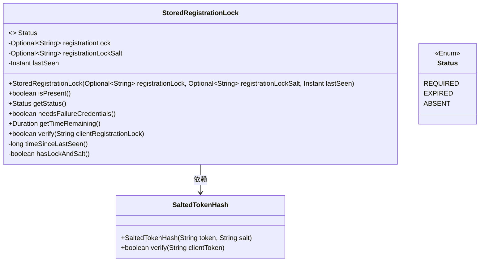
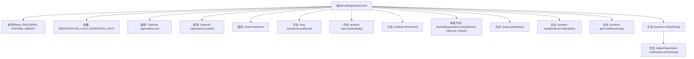

# 基础信息

|      |      |
|------|------|
| 名称 | StoredRegistrationLock |
| 编码语言 | .java |
| 代码路径 | Signal-Server/service/src/main/java/org/whispersystems/textsecuregcm/auth/StoredRegistrationLock.java |
| 包名 | org.whispersystems.textsecuregcm.auth |
| 依赖项 | ['com.google.common.annotations.VisibleForTesting', 'java.time.Duration', 'java.time.Instant', 'java.time.temporal.ChronoUnit', 'java.util.Optional', 'javax.annotation.Nullable', 'org.apache.commons.lang3.StringUtils'] |
| 概述说明 | 存储注册锁类，管理状态、验证及剩余时间计算。 |

# 说明

存储注册锁类负责管理注册锁的状态，包括验证注册锁的有效性以及计算剩余时间。该类的主要功能是确保注册锁的正确使用，通过验证机制确认锁的合法性，并实时更新锁的剩余时间，以便用户了解锁的有效期限。

# 类列表 Class Summary

| 名称   | 类型  | 说明 |
|-------|------|-------------|
| StoredRegistrationLock | class | 存储注册锁类，管理注册锁状态、验证及剩余时间计算。 |

## 类 StoredRegistrationLock

|      |      |
|------|------|
| 访问范围 | @SuppressWarnings("OptionalUsedAsFieldOrParameterType");public |
| 类型 | class |
| 名称 | StoredRegistrationLock |
| 说明 | 存储注册锁类，管理注册锁状态、验证及剩余时间计算。 |

### UML类图

这段代码定义了一个 `StoredRegistrationLock` 类，用于管理注册锁的状态和验证。该类包含一个枚举 `Status` 用于表示注册锁的状态（`REQUIRED`、`EXPIRED`、`ABSENT`）。`StoredRegistrationLock` 类通过 `registrationLock` 和 `registrationLockSalt` 来存储注册锁和盐值，并通过 `lastSeen` 记录最后一次看到的时间。类中的方法用于检查注册锁的存在、获取剩余时间、验证客户端提供的注册锁等。`SaltedTokenHash` 类用于验证注册锁的有效性。

### 内部方法调用关系图

这段代码定义了一个`StoredRegistrationLock`类，用于管理注册锁的状态和验证。类中包含一个枚举`Status`表示注册锁的不同状态，以及多个方法用于检查注册锁的存在、验证注册锁的有效性、计算剩余时间等。`getStatus`方法根据注册锁的存在和剩余时间返回相应的状态，`verify`方法用于验证客户端提供的注册锁是否有效。流程图展示了类的主要属性和方法之间的调用关系。

### 字段列表 Field List

| 名称  | 类型  | 说明 |
|-------|-------|------|
| REGISTRATION_LOCK_EXPIRATION_DAYS = Duration.ofDays(7) | Duration | 测试可见的注册锁定时长为7天。 |
| lastSeen | Instant | 私有不可变的最后访问时间戳。 |
| registrationLock | Optional<String> | 私有不可变可选字符串类型变量registrationLock。 |
| registrationLockSalt | Optional<String> | 私有不可变的可选字符串注册锁盐。 |

### 方法列表 Method List

| 名称  | 类型  | 说明 |
|-------|-------|------|
| hasLockAndSalt | boolean | 检查注册锁和盐值是否同时存在。 |
| getTimeRemaining | Duration | 获取剩余时间，返回注册锁定期减去最后出现时间后的差值。 |
| isPresent | boolean | 方法isPresent返回hasLockAndSalt()的布尔值。 |
| needsFailureCredentials | boolean | 检查是否需要失败凭证，返回是否包含锁和盐。 |
| timeSinceLastSeen | long | 计算自上次见到以来的时间差。 |
| getStatus | Status | 方法根据条件返回状态：不存在为ABSENT，剩余时间大于0为REQUIRED，否则为EXPIRED。 |
| verify | boolean | 验证客户端注册锁，若存在锁和盐且锁非空则返回验证结果，否则返回假。 |

