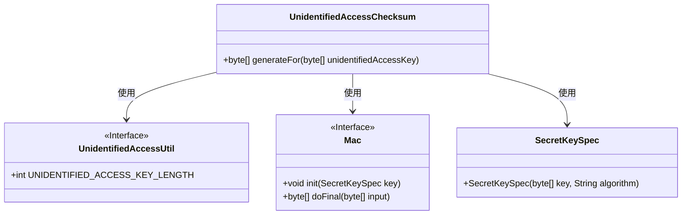
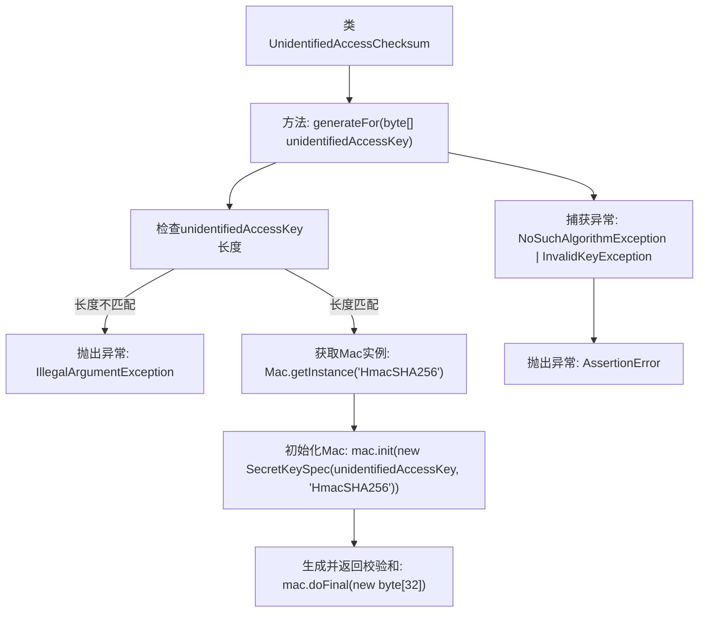

# 基础信息

|      |      |
|------|------|
| 名称 | UnidentifiedAccessChecksum |
| 编码语言 | .java |
| 代码路径 | Signal-Server/service/src/main/java/org/whispersystems/textsecuregcm/auth/UnidentifiedAccessChecksum.java |
| 包名 | org.whispersystems.textsecuregcm.auth |
| 依赖项 | ['javax.crypto.Mac', 'javax.crypto.spec.SecretKeySpec', 'java.security.InvalidKeyException', 'java.security.NoSuchAlgorithmException'] |
| 概述说明 | 生成HmacSHA256校验码以验证访问密钥长度是否有效。 |

# 说明

该内容描述了生成HmacSHA256校验码的过程，并强调了验证未识别访问密钥长度的重要性。HmacSHA256是一种基于SHA-256哈希算法的消息认证码，用于确保数据的完整性和真实性。在此过程中，关键步骤包括生成校验码并验证访问密钥的长度，以确保其符合预期标准，从而防止潜在的安全风险。

# 类列表 Class Summary

| 名称   | 类型  | 说明 |
|-------|------|-------------|
| UnidentifiedAccessChecksum | class | 生成HmacSHA256校验码，验证未识别访问密钥长度。 |

## 类 UnidentifiedAccessChecksum

|      |      |
|------|------|
| 访问范围 | public |
| 类型 | class |
| 名称 | UnidentifiedAccessChecksum |
| 说明 | 生成HmacSHA256校验码，验证未识别访问密钥长度。 |

### UML类图

这段代码定义了一个名为 `UnidentifiedAccessChecksum` 的类，其中包含一个静态方法 `generateFor`，用于生成基于未识别访问密钥的校验和。该方法首先检查密钥的长度是否符合要求，然后使用 `HmacSHA256` 算法生成校验和。代码依赖于 `UnidentifiedAccessUtil` 类来获取密钥长度常量，并使用了 `Mac` 和 `SecretKeySpec` 类来进行加密操作。整个过程涉及到异常处理，以确保在算法不支持或密钥无效时能够抛出断言错误。

### 内部方法调用关系图

这段代码定义了一个名为 `UnidentifiedAccessChecksum` 的类，其中包含一个静态方法 `generateFor`，用于生成基于 `unidentifiedAccessKey` 的校验和。方法首先检查输入密钥的长度是否合法，如果长度不匹配则抛出 `IllegalArgumentException` 异常。接着，方法使用 `HmacSHA256` 算法初始化 `Mac` 实例，并生成一个32字节的校验和。如果在过程中遇到 `NoSuchAlgorithmException` 或 `InvalidKeyException` 异常，方法会抛出 `AssertionError`。

### 字段列表 Field List

| 名称  | 类型  | 说明 |
|-------|-------|------|

### 方法列表 Method List

| 名称  | 类型  | 说明 |
|-------|-------|------|
| generateFor | byte[] | 生成HmacSHA256哈希，验证输入密钥长度，异常处理。 |

