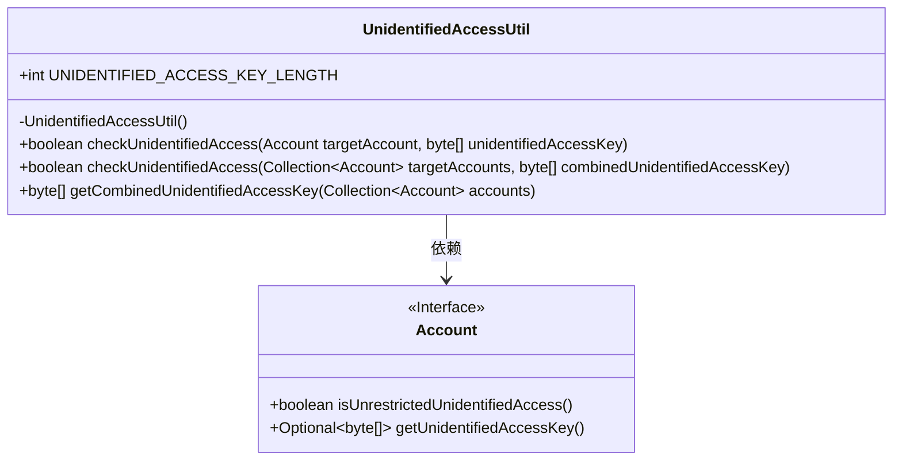
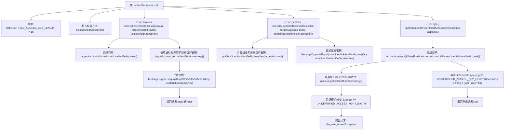

# 基础信息

|      |      |
|------|------|
| 名称 | UnidentifiedAccessUtil |
| 编码语言 | .java |
| 代码路径 | Signal-Server/service/src/main/java/org/whispersystems/textsecuregcm/auth/UnidentifiedAccessUtil.java |
| 包名 | org.whispersystems.textsecuregcm.auth |
| 依赖项 | ['org.whispersystems.textsecuregcm.storage.Account', 'java.security.MessageDigest', 'java.util.Collection', 'java.util.function.Predicate', 'java.util.stream.IntStream'] |
| 概述说明 | UnidentifiedAccessUtil类验证并计算未识别访问密钥的权限组合。 |

# 说明

UnidentifiedAccessUtil类的主要功能是验证和计算未识别访问密钥的权限及其组合。通过该工具类，系统能够有效地处理和管理未识别访问密钥的相关操作，确保权限的准确性和安全性。该类在权限验证和组合计算方面提供了必要的支持，帮助系统更好地控制和管理访问权限。

# 类列表 Class Summary

| 名称   | 类型  | 说明 |
|-------|------|-------------|
| UnidentifiedAccessUtil | class | UnidentifiedAccessUtil类用于验证和计算未识别访问密钥的权限和组合。 |

## 类 UnidentifiedAccessUtil

|      |      |
|------|------|
| 访问范围 | public |
| 类型 | class |
| 名称 | UnidentifiedAccessUtil |
| 说明 | UnidentifiedAccessUtil类用于验证和计算未识别访问密钥的权限和组合。 |

### UML类图

这段代码定义了一个名为 `UnidentifiedAccessUtil` 的工具类，用于处理与未识别访问密钥相关的操作。该类包含三个静态方法：`checkUnidentifiedAccess` 用于检查单个或多个账户的未识别访问权限，`getCombinedUnidentifiedAccessKey` 用于计算多个账户的联合未识别访问密钥。`Account` 是一个接口，提供了检查未识别访问权限和获取未识别访问密钥的方法。`UnidentifiedAccessUtil` 依赖于 `Account` 接口来实现其功能。

### 内部方法调用关系图

这段代码定义了一个名为 `UnidentifiedAccessUtil` 的工具类，用于处理未识别访问密钥的验证和计算。它包含三个主要方法：`checkUnidentifiedAccess` 用于检查单个或多个账户的未识别访问密钥是否有效，`getCombinedUnidentifiedAccessKey` 用于计算多个账户的组合未识别访问密钥。代码通过流操作和异或计算来实现这些功能，并在密钥长度不符合预期时抛出异常。

### 字段列表 Field List

| 名称  | 类型  | 说明 |
|-------|-------|------|
| UNIDENTIFIED_ACCESS_KEY_LENGTH = 16 | int | 未识别的访问密钥长度为16个字符。 |

### 方法列表 Method List

| 名称  | 类型  | 说明 |
|-------|-------|------|
| checkUnidentifiedAccess | boolean | 检查目标账户集合的未识别访问密钥是否匹配。 |
| checkUnidentifiedAccess | boolean | 检查账户是否允许未识别访问，或验证访问密钥匹配。 |
| getCombinedUnidentifiedAccessKey | byte[] | 合并未识别访问密钥，过滤并异或处理。 |

