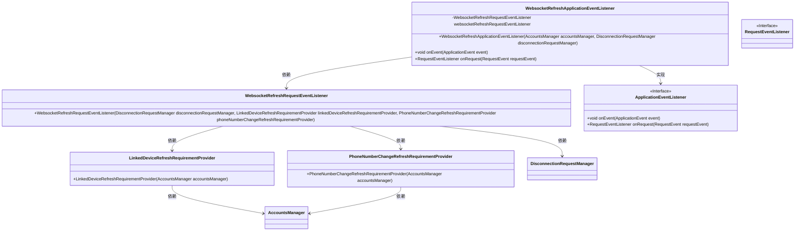
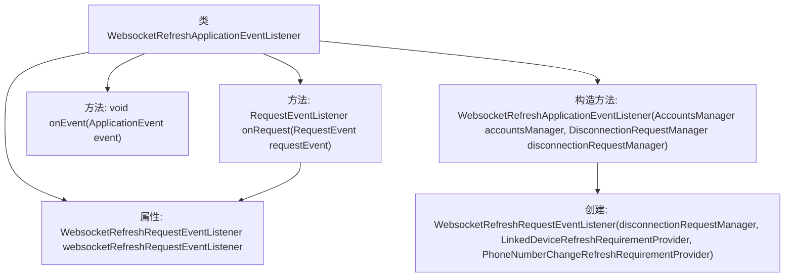

# 基础信息

|      |      |
|------|------|
| 名称 | WebsocketRefreshApplicationEventListener |
| 编码语言 | .java |
| 代码路径 | Signal-Server/service/src/main/java/org/whispersystems/textsecuregcm/auth/WebsocketRefreshApplicationEventListener.java |
| 包名 | org.whispersystems.textsecuregcm.auth |
| 依赖项 | ['org.glassfish.jersey.server.monitoring.ApplicationEvent', 'org.glassfish.jersey.server.monitoring.ApplicationEventListener', 'org.glassfish.jersey.server.monitoring.RequestEvent', 'org.glassfish.jersey.server.monitoring.RequestEventListener', 'org.whispersystems.textsecuregcm.storage.AccountsManager'] |
| 概述说明 | WebsocketRefreshApplicationEventListener类监听应用事件，依赖WebsocketRefreshRequestEventListener处理请求。 |

# 说明

WebsocketRefreshApplicationEventListener类负责实现应用事件监听功能，其核心作用是监听应用事件。该类依赖于WebsocketRefreshRequestEventListener来处理具体的请求事件。通过这种设计，实现了应用事件与请求事件的有效分离和处理，确保系统能够高效响应相关事件。

# 类列表 Class Summary

| 名称   | 类型  | 说明 |
|-------|------|-------------|
| WebsocketRefreshApplicationEventListener | class | WebsocketRefreshApplicationEventListener类实现应用事件监听，依赖WebsocketRefreshRequestEventListener处理请求。 |

## 类 WebsocketRefreshApplicationEventListener

|      |      |
|------|------|
| 访问范围 | public |
| 类型 | class |
| 名称 | WebsocketRefreshApplicationEventListener |
| 说明 | WebsocketRefreshApplicationEventListener类实现应用事件监听，依赖WebsocketRefreshRequestEventListener处理请求。 |

### UML类图

这段代码定义了一个 `WebsocketRefreshApplicationEventListener` 类，该类实现了 `ApplicationEventListener` 接口。该类通过构造函数初始化了一个 `WebsocketRefreshRequestEventListener` 实例，并在 `onRequest` 方法中返回该实例。`WebsocketRefreshRequestEventListener` 依赖于 `DisconnectionRequestManager`、`LinkedDeviceRefreshRequirementProvider` 和 `PhoneNumberChangeRefreshRequirementProvider`，而后两者又依赖于 `AccountsManager`。整体结构展示了类之间的依赖关系和接口的实现。

### 内部方法调用关系图

这段代码定义了一个名为`WebsocketRefreshApplicationEventListener`的类，实现了`ApplicationEventListener`接口。该类包含一个`WebsocketRefreshRequestEventListener`类型的属性，并在构造函数中初始化该属性。构造函数接收`AccountsManager`和`DisconnectionRequestManager`两个参数，并利用它们创建`WebsocketRefreshRequestEventListener`实例。类中还重写了`onEvent`和`onRequest`方法，其中`onRequest`方法返回`websocketRefreshRequestEventListener`实例。流程图清晰地展示了类的结构、属性、构造方法以及方法之间的关系。

### 字段列表 Field List

| 名称  | 类型  | 说明 |
|-------|-------|------|
| websocketRefreshRequestEventListener | WebsocketRefreshRequestEventListener | 私有Websocket刷新请求事件监听器实例。 |

### 方法列表 Method List

| 名称  | 类型  | 说明 |
|-------|-------|------|
| onEvent | void | 重写onEvent方法以处理应用事件。 |
| onRequest | RequestEventListener | 重写方法onRequest，返回websocketRefreshRequestEventListener。 |

