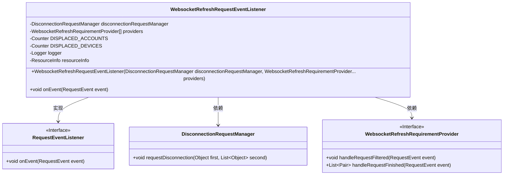
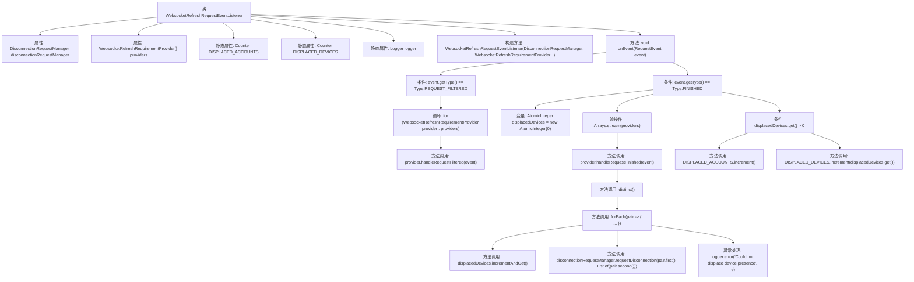

# 基础信息

|      |      |
|------|------|
| 名称 | WebsocketRefreshRequestEventListener |
| 编码语言 | .java |
| 代码路径 | Signal-Server/service/src/main/java/org/whispersystems/textsecuregcm/auth/WebsocketRefreshRequestEventListener.java |
| 包名 | org.whispersystems.textsecuregcm.auth |
| 依赖项 | ['org.whispersystems.textsecuregcm.metrics.MetricsUtil.name', 'io.micrometer.core.instrument.Counter', 'io.micrometer.core.instrument.Metrics', 'jakarta.ws.rs.container.ResourceInfo', 'jakarta.ws.rs.core.Context', 'java.util.Arrays', 'java.util.List', 'java.util.concurrent.atomic.AtomicInteger', 'org.glassfish.jersey.server.monitoring.RequestEvent', 'org.glassfish.jersey.server.monitoring.RequestEvent.Type', 'org.glassfish.jersey.server.monitoring.RequestEventListener', 'org.slf4j.Logger', 'org.slf4j.LoggerFactory'] |
| 概述说明 | 监听请求，处理Websocket刷新与断连，记录设备位移。 |

# 说明

该描述涉及监听请求事件，处理Websocket连接的刷新和断开，同时记录设备账户的位移信息。具体来说，系统需要实时监控请求事件，确保Websocket连接在刷新或断开时能够正确处理，并在此过程中记录设备账户的位置变化。这些操作旨在维护连接的稳定性，并确保设备账户的位移数据被准确记录，以便后续分析和处理。

# 类列表 Class Summary

| 名称   | 类型  | 说明 |
|-------|------|-------------|
| WebsocketRefreshRequestEventListener | class | 监听请求事件，处理Websocket刷新和断连，记录设备账户位移。 |

## 类 WebsocketRefreshRequestEventListener

|      |      |
|------|------|
| 访问范围 | public |
| 类型 | class |
| 名称 | WebsocketRefreshRequestEventListener |
| 说明 | 监听请求事件，处理Websocket刷新和断连，记录设备账户位移。 |

### UML类图

这段代码定义了一个 `WebsocketRefreshRequestEventListener` 类，该类实现了 `RequestEventListener` 接口。`WebsocketRefreshRequestEventListener` 类主要负责监听请求事件，并根据事件类型调用不同的处理逻辑。它依赖于 `DisconnectionRequestManager` 和 `WebsocketRefreshRequirementProvider` 接口，分别用于处理断开连接请求和提供刷新需求。类中还包含了一些用于监控和日志记录的静态成员变量。整体设计体现了事件驱动和依赖注入的思想，适用于处理复杂的请求事件流。

### 内部方法调用关系图

这段代码定义了一个`WebsocketRefreshRequestEventListener`类，用于处理Websocket刷新请求事件。类中包含两个主要属性：`disconnectionRequestManager`和`providers`，分别用于管理断开连接请求和提供刷新需求。`onEvent`方法根据事件类型执行不同的操作：如果是`REQUEST_FILTERED`事件，则调用所有提供者的`handleRequestFiltered`方法；如果是`FINISHED`事件，则处理请求完成后的逻辑，包括断开连接和记录设备位移。代码通过流操作和异常处理确保逻辑的完整性和健壮性。

### 字段列表 Field List

| 名称  | 类型  | 说明 |
|-------|-------|------|
| disconnectionRequestManager | DisconnectionRequestManager | 私有且不可变的断开连接请求管理器实例。 |
| providers | WebsocketRefreshRequirementProvider[] | 包含多个Websocket刷新需求提供者的私有数组。 |
| logger = LoggerFactory.getLogger(WebsocketRefreshRequestEventListener.class) | Logger | WebsocketRefreshRequestEventListener类中定义了一个静态的Logger实例。 |
| resourceInfo | ResourceInfo | 定义私有变量resourceInfo，类型为ResourceInfo。 |
| DISPLACED_DEVICES = Metrics.counter(      name(WebsocketRefreshRequestEventListener.class, "displacedDevices")) | Counter | 定义私有静态计数器DISPLACED_DEVICES，用于跟踪WebsocketRefreshRequestEventListener类中的displacedDevices指标。 |
| DISPLACED_ACCOUNTS = Metrics.counter(      name(WebsocketRefreshRequestEventListener.class, "displacedAccounts")) | Counter | 定义静态计数器DISPLACED_ACCOUNTS，用于统计WebsocketRefreshRequestEventListener中的displacedAccounts。 |

### 方法列表 Method List

| 名称  | 类型  | 说明 |
|-------|-------|------|
| onEvent | void | 方法处理请求事件，根据类型调用不同提供者处理，统计并记录设备断开情况。 |

