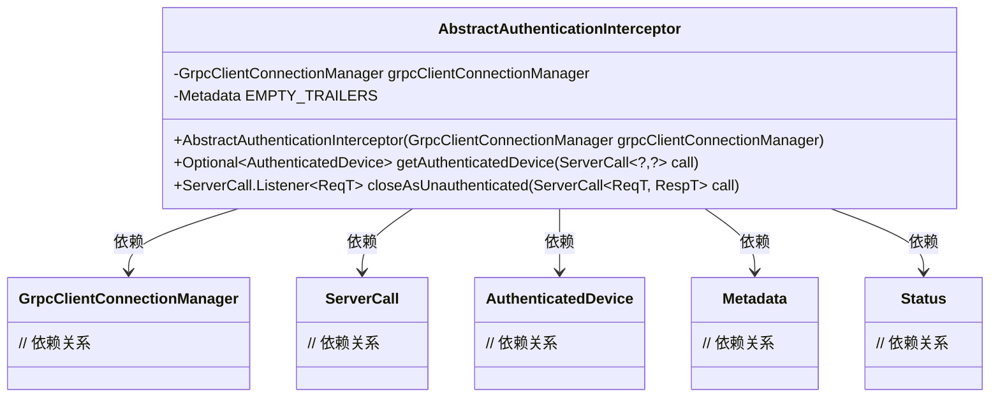
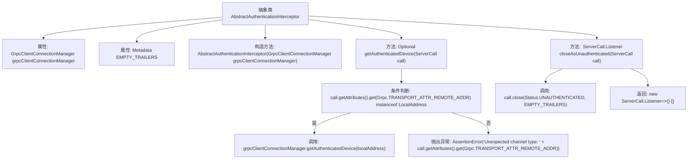

# 基础信息

|      |      |
|------|------|
| 名称 | AbstractAuthenticationInterceptor |
| 编码语言 | .java |
| 代码路径 | Signal-Server/service/src/main/java/org/whispersystems/textsecuregcm/auth/grpc/AbstractAuthenticationInterceptor.java |
| 包名 | org.whispersystems.textsecuregcm.auth.grpc |
| 依赖项 | ['io.grpc.Grpc', 'io.grpc.Metadata', 'io.grpc.ServerCall', 'io.grpc.ServerInterceptor', 'io.grpc.Status', 'io.netty.channel.local.LocalAddress', 'org.whispersystems.textsecuregcm.grpc.net.GrpcClientConnectionManager', 'java.util.Optional'] |
| 概述说明 | 抽象类实现gRPC认证拦截器，管理连接并处理未认证请求。 |

# 说明

该内容描述了一个抽象类，该类实现了gRPC认证拦截器的功能。其主要职责是管理客户端的连接，并处理未经认证的请求。通过这一实现，系统能够有效控制客户端的访问权限，确保只有经过认证的请求才能被处理，从而提升系统的安全性和可靠性。

# 类列表 Class Summary

| 名称   | 类型  | 说明 |
|-------|------|-------------|
| AbstractAuthenticationInterceptor | class | 抽象类实现gRPC认证拦截器，管理客户端连接并处理未认证请求。 |

## 类 AbstractAuthenticationInterceptor

|      |      |
|------|------|
| 访问范围 | abstract |
| 类型 | class |
| 名称 | AbstractAuthenticationInterceptor |
| 说明 | 抽象类实现gRPC认证拦截器，管理客户端连接并处理未认证请求。 |

### UML类图

这段代码定义了一个抽象类 `AbstractAuthenticationInterceptor`，它实现了 `ServerInterceptor` 接口。该类主要用于处理gRPC服务中的认证拦截逻辑。它依赖于 `GrpcClientConnectionManager` 来获取已认证的设备信息，并提供方法来处理未认证的请求。代码中使用了泛型和可选类型来处理不同类型的请求和响应。

### 内部方法调用关系图

这段代码定义了一个抽象类 `AbstractAuthenticationInterceptor`，用于处理gRPC服务器的认证拦截逻辑。类中包含两个主要方法：`getAuthenticatedDevice` 用于获取已认证的设备信息，`closeAsUnauthenticated` 用于在认证失败时关闭调用并返回未认证状态。流程图展示了类的结构、方法调用关系以及条件判断的逻辑流程。

### 字段列表 Field List

| 名称  | 类型  | 说明 |
|-------|-------|------|
| grpcClientConnectionManager | GrpcClientConnectionManager | 私有Grpc客户端连接管理器实例。 |
| EMPTY_TRAILERS = new Metadata() | Metadata | 声明一个不可变的空元数据对象EMPTY_TRAILERS。 |

### 方法列表 Method List

| 名称  | 类型  | 说明 |
|-------|-------|------|
| getAuthenticatedDevice | Optional<AuthenticatedDevice> | 获取已验证设备，若非本地地址则抛出异常。 |
| closeAsUnauthenticated | ServerCall.Listener<ReqT> | 方法关闭未认证的服务器调用并返回监听器。 |

