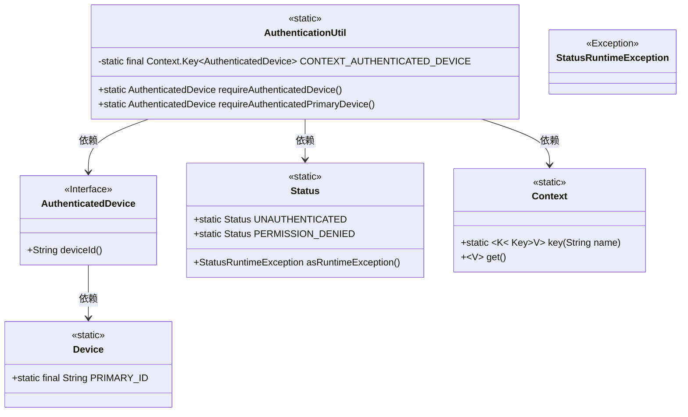
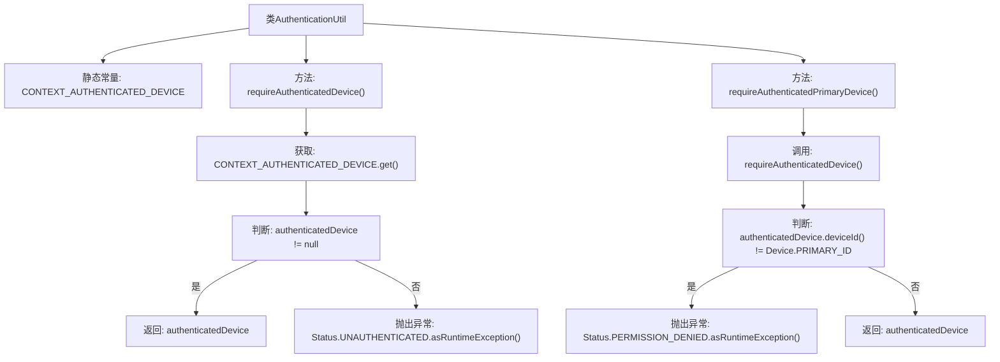

# 基础信息

|      |      |
|------|------|
| 名称 | AuthenticationUtil |
| 编码语言 | .java |
| 代码路径 | Signal-Server/service/src/main/java/org/whispersystems/textsecuregcm/auth/grpc/AuthenticationUtil.java |
| 包名 | org.whispersystems.textsecuregcm.auth.grpc |
| 依赖项 | ['io.grpc.Context', 'io.grpc.Status', 'javax.annotation.Nullable', 'org.whispersystems.textsecuregcm.storage.Device'] |
| 概述说明 | AuthenticationUtil类用于获取gRPC上下文中的认证设备，未认证或非主设备时抛出异常。 |

# 说明

类AuthenticationUtil提供了一种方法，用于从gRPC上下文中获取认证设备的信息。如果设备未通过认证或不是主设备，该方法将抛出异常。这一功能确保在处理gRPC请求时，只有经过认证的主设备才能继续执行相关操作，从而增强了系统的安全性和可靠性。

# 类列表 Class Summary

| 名称   | 类型  | 说明 |
|-------|------|-------------|
| AuthenticationUtil | class | 类AuthenticationUtil提供获取gRPC上下文中认证设备的方法，未认证或非主设备时抛出异常。 |

## 类 AuthenticationUtil

|      |      |
|------|------|
| 访问范围 | public |
| 类型 | class |
| 名称 | AuthenticationUtil |
| 说明 | 类AuthenticationUtil提供获取gRPC上下文中认证设备的方法，未认证或非主设备时抛出异常。 |

### UML类图

**描述**：`AuthenticationUtil` 类提供了两个静态方法，用于从当前的 gRPC 上下文中获取已认证的设备信息。`requireAuthenticatedDevice` 方法检查并返回已认证的设备，若未认证则抛出 `UNAUTHENTICATED` 异常。`requireAuthenticatedPrimaryDevice` 方法进一步检查设备是否为主设备，若非主设备则抛出 `PERMISSION_DENIED` 异常。该类依赖于 `Context`、`Status` 和 `AuthenticatedDevice` 等类来完成其功能。

### 内部方法调用关系图

这段代码定义了一个`AuthenticationUtil`类，包含两个静态方法：`requireAuthenticatedDevice()`和`requireAuthenticatedPrimaryDevice()`。`requireAuthenticatedDevice()`方法从当前gRPC上下文中获取已认证的设备信息，如果设备信息为空，则抛出`UNAUTHENTICATED`异常。`requireAuthenticatedPrimaryDevice()`方法在`requireAuthenticatedDevice()`的基础上，进一步检查设备是否是主设备，如果不是，则抛出`PERMISSION_DENIED`异常。流程图清晰地展示了这两个方法的执行流程和异常处理逻辑。

### 字段列表 Field List

| 名称  | 类型  | 说明 |
|-------|-------|------|
| CONTEXT_AUTHENTICATED_DEVICE = Context.key("authenticated-device") | Context.Key<AuthenticatedDevice> | 定义上下文键用于存储已验证设备信息。 |

### 方法列表 Method List

| 名称  | 类型  | 说明 |
|-------|-------|------|
| requireAuthenticatedPrimaryDevice | AuthenticatedDevice | 该方法要求认证设备为主设备，否则抛出权限异常。 |
| requireAuthenticatedDevice | AuthenticatedDevice | 获取已验证设备，若不存在则抛出未认证异常。 |

