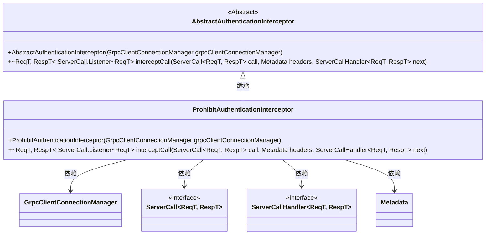
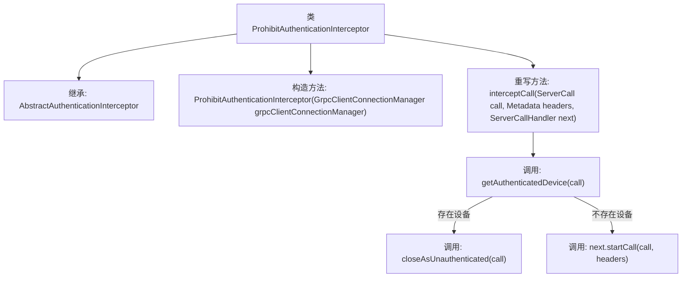

# 基础信息

|      |      |
|------|------|
| 名称 | ProhibitAuthenticationInterceptor |
| 编码语言 | .java |
| 代码路径 | Signal-Server/service/src/main/java/org/whispersystems/textsecuregcm/auth/grpc/ProhibitAuthenticationInterceptor.java |
| 包名 | org.whispersystems.textsecuregcm.auth.grpc |
| 依赖项 | ['io.grpc.Metadata', 'io.grpc.ServerCall', 'io.grpc.ServerCallHandler', 'org.whispersystems.textsecuregcm.grpc.net.GrpcClientConnectionManager'] |
| 概述说明 | 拦截器验证设备，拒绝未认证请求。 |

# 说明

ProhibitAuthenticationInterceptor拦截器的主要功能是验证设备的认证状态，并拒绝未经认证的请求。该拦截器通过检查请求的来源设备是否已通过认证，确保只有经过合法认证的设备才能访问系统资源。如果检测到未认证的请求，拦截器将立即阻止该请求，从而保护系统的安全性和数据的完整性。这一机制有效防止了未经授权的访问，增强了系统的整体安全性。

# 类列表 Class Summary

| 名称   | 类型  | 说明 |
|-------|------|-------------|
| ProhibitAuthenticationInterceptor | class | ProhibitAuthenticationInterceptor拦截器验证设备并拒绝未认证请求。 |

## 类 ProhibitAuthenticationInterceptor

|      |      |
|------|------|
| 访问范围 | public |
| 类型 | class |
| 名称 | ProhibitAuthenticationInterceptor |
| 说明 | ProhibitAuthenticationInterceptor拦截器验证设备并拒绝未认证请求。 |

### UML类图

### 描述
`ProhibitAuthenticationInterceptor` 是一个继承自 `AbstractAuthenticationInterceptor` 的类，用于拦截并处理 gRPC 调用中的认证逻辑。它通过 `GrpcClientConnectionManager` 管理客户端连接，并在 `interceptCall` 方法中根据设备认证状态决定是否关闭未认证的调用或继续处理。该类依赖于 `ServerCall`、`ServerCallHandler` 和 `Metadata` 等接口和类来实现其功能。

### 内部方法调用关系图

这段代码定义了一个名为`ProhibitAuthenticationInterceptor`的类，它继承自`AbstractAuthenticationInterceptor`。类的构造函数接收一个`GrpcClientConnectionManager`对象，并调用父类的构造函数。重写的`interceptCall`方法用于拦截gRPC调用，首先通过`getAuthenticatedDevice`方法检查是否有已认证的设备。如果存在设备，则调用`closeAsUnauthenticated`方法关闭调用并返回未认证状态；如果不存在设备，则调用`next.startCall`方法继续处理调用。

### 字段列表 Field List

| 名称  | 类型  | 说明 |
|-------|-------|------|

### 方法列表 Method List

| 名称  | 类型  | 说明 |
|-------|-------|------|
| interceptCall | ServerCall.Listener<ReqT> | 重写拦截方法，验证设备并处理未认证情况。 |

