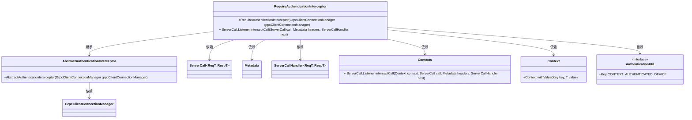
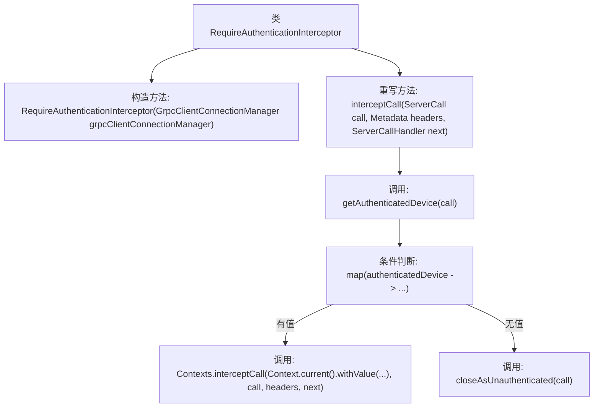

# 基础信息

|      |      |
|------|------|
| 名称 | RequireAuthenticationInterceptor |
| 编码语言 | .java |
| 代码路径 | Signal-Server/service/src/main/java/org/whispersystems/textsecuregcm/auth/grpc/RequireAuthenticationInterceptor.java |
| 包名 | org.whispersystems.textsecuregcm.auth.grpc |
| 依赖项 | ['io.grpc.Context', 'io.grpc.Contexts', 'io.grpc.Metadata', 'io.grpc.ServerCall', 'io.grpc.ServerCallHandler', 'org.whispersystems.textsecuregcm.grpc.net.GrpcClientConnectionManager'] |
| 概述说明 | RequireAuthenticationInterceptor类拦截并验证gRPC调用身份。 |

# 说明

RequireAuthenticationInterceptor类是一个用于拦截和验证gRPC调用身份认证的组件。其主要功能是确保在gRPC通信过程中，调用方已经通过身份验证，从而保证通信的安全性和合法性。该拦截器在请求处理前进行检查，未通过认证的请求将被拒绝，确保只有经过验证的请求能够继续执行。

# 类列表 Class Summary

| 名称   | 类型  | 说明 |
|-------|------|-------------|
| RequireAuthenticationInterceptor | class | RequireAuthenticationInterceptor类用于拦截并验证gRPC调用的身份认证。 |

## 类 RequireAuthenticationInterceptor

|      |      |
|------|------|
| 访问范围 | public |
| 类型 | class |
| 名称 | RequireAuthenticationInterceptor |
| 说明 | RequireAuthenticationInterceptor类用于拦截并验证gRPC调用的身份认证。 |

### UML类图

**描述：**
`RequireAuthenticationInterceptor` 类继承自 `AbstractAuthenticationInterceptor`，主要用于在 gRPC 调用中拦截并验证身份。它通过 `GrpcClientConnectionManager` 管理客户端连接，并在 `interceptCall` 方法中处理身份验证逻辑。如果验证成功，则继续调用；否则，关闭未认证的调用。该类依赖于多个 gRPC 相关的类，如 `ServerCall`、`Metadata`、`ServerCallHandler`，以及用于上下文管理的 `Contexts` 和 `Context` 类。

### 内部方法调用关系图

这段代码定义了一个名为`RequireAuthenticationInterceptor`的类，它继承自`AbstractAuthenticationInterceptor`。类的主要功能是通过`interceptCall`方法拦截gRPC调用，并进行身份验证。首先，调用`getAuthenticatedDevice`方法获取已认证的设备信息，如果存在，则通过`Contexts.interceptCall`方法将设备信息添加到上下文中并继续处理调用；如果不存在，则调用`closeAsUnauthenticated`方法关闭未认证的调用。

### 字段列表 Field List

| 名称  | 类型  | 说明 |
|-------|-------|------|

### 方法列表 Method List

| 名称  | 类型  | 说明 |
|-------|-------|------|
| interceptCall | ServerCall.Listener<ReqT> | 拦截调用并验证设备，成功则继续处理，否则关闭未认证连接。 |

