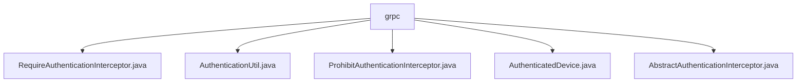

# 基础信息

|      |      |
|------|------|
| 名称 | grpc |
| 编码语言 | .java |
| 代码路径 | Signal-Server/service/src/main/java/org/whispersystems/textsecuregcm/auth/grpc |
| 包名 | Signal-Server.service.src.main.java.org.whispersystems.textsecuregcm.auth.grpc |
| 概述说明 | RequireAuthenticationInterceptor验证gRPC调用身份，确保通信安全。AuthenticationUtil获取认证设备信息，确保主设备执行。ProhibitAuthenticationInterceptor拒绝未认证请求，保护系统安全。AbstractAuthenticationInterceptor管理客户端连接，控制访问权限。 |

# 说明

## 概述
该代码模块主要围绕gRPC通信中的身份认证和安全性展开，包含多个拦截器和工具类，用于确保在gRPC请求处理过程中，只有经过合法认证的设备和请求能够被处理。通过这些组件的协作，系统能够有效防止未经授权的访问，增强通信的安全性和数据的完整性。

## 主要业务场景
1. **身份验证拦截**：
   - `RequireAuthenticationInterceptor`：在gRPC请求处理前进行身份验证，确保调用方已通过认证。未通过认证的请求将被拒绝，保证只有合法请求能够继续执行。
   - `ProhibitAuthenticationInterceptor`：验证设备的认证状态，拒绝未经认证的请求，确保只有合法认证的设备才能访问系统资源。

2. **认证信息获取**：
   - `AuthenticationUtil`：从gRPC上下文中获取认证设备的信息，确保只有经过认证的主设备才能执行相关操作，增强系统的安全性和可靠性。

3. **抽象拦截器实现**：
   - `AbstractAuthenticationInterceptor`：作为抽象类，实现了gRPC认证拦截器的核心功能，管理客户端连接并处理未经认证的请求，确保只有合法请求能够被处理。

通过这些组件的协作，该模块在gRPC通信中实现了严格的身份认证机制，有效提升了系统的安全性和可靠性。

### 包内部结构视图

该流程图展示了`grpc`文件夹下的文件层级关系，所有文件都直接位于`grpc`文件夹中，没有进一步的子文件夹嵌套。这些文件包括`RequireAuthenticationInterceptor.java`、`AuthenticationUtil.java`、`ProhibitAuthenticationInterceptor.java`、`AuthenticatedDevice.java`和`AbstractAuthenticationInterceptor.java`。每个文件都与`grpc`文件夹直接相连，清晰地展示了文件之间的层级结构。

# 文件列表 File List

| 名称   | 类型  | 说明 |
|-------|------|-------------|
| [AbstractAuthenticationInterceptor.java](AbstractAuthenticationInterceptor.md) | file | 抽象类实现gRPC认证拦截器，管理连接并处理未认证请求。 |
| [AuthenticatedDevice.java](AuthenticatedDevice.md) | file | 无内容，无法生成概要描述。 |
| [RequireAuthenticationInterceptor.java](RequireAuthenticationInterceptor.md) | file | RequireAuthenticationInterceptor类拦截并验证gRPC调用身份。 |
| [ProhibitAuthenticationInterceptor.java](ProhibitAuthenticationInterceptor.md) | file | 拦截器验证设备，拒绝未认证请求。 |
| [AuthenticationUtil.java](AuthenticationUtil.md) | file | AuthenticationUtil类用于获取gRPC上下文中的认证设备，未认证或非主设备时抛出异常。 |

