# 基础信息

|      |      |
|------|------|
| 名称 | BackupAuthManager |
| 编码语言 | .java |
| 代码路径 | Signal-Server/service/src/main/java/org/whispersystems/textsecuregcm/backup/BackupAuthManager.java |
| 包名 | org.whispersystems.textsecuregcm.backup |
| 依赖项 | ['io.grpc.Status', 'java.security.MessageDigest', 'java.time.Clock', 'java.time.Duration', 'java.time.Instant', 'java.time.temporal.ChronoUnit', 'java.util.List', 'java.util.Optional', 'java.util.concurrent.CompletableFuture', 'java.util.concurrent.CompletionStage', 'java.util.stream.Stream', 'javax.annotation.Nullable', 'org.signal.libsignal.zkgroup.GenericServerSecretParams', 'org.signal.libsignal.zkgroup.InvalidInputException', 'org.signal.libsignal.zkgroup.VerificationFailedException', 'org.signal.libsignal.zkgroup.backups.BackupAuthCredentialRequest', 'org.signal.libsignal.zkgroup.backups.BackupAuthCredentialResponse', 'org.signal.libsignal.zkgroup.backups.BackupCredentialType', 'org.signal.libsignal.zkgroup.backups.BackupLevel', 'org.signal.libsignal.zkgroup.receipts.ReceiptCredentialPresentation', 'org.signal.libsignal.zkgroup.receipts.ReceiptSerial', 'org.signal.libsignal.zkgroup.receipts.ServerZkReceiptOperations', 'org.slf4j.Logger', 'org.slf4j.LoggerFactory', 'org.whispersystems.textsecuregcm.controllers.RateLimitExceededException', 'org.whispersystems.textsecuregcm.experiment.ExperimentEnrollmentManager', 'org.whispersystems.textsecuregcm.limits.RateLimiters', 'org.whispersystems.textsecuregcm.storage.Account', 'org.whispersystems.textsecuregcm.storage.AccountsManager', 'org.whispersystems.textsecuregcm.storage.RedeemedReceiptsManager', 'org.whispersystems.textsecuregcm.util.Util'] |
| 概述说明 | BackupAuthManager类管理备份认证，处理凭证请求、生成、验证及有效期扩展。 |

# 说明

BackupAuthManager类负责管理备份认证功能，主要职责包括存储凭证请求、生成备份凭证、验证收据以及延长备份凭证的有效期。该类通过这些操作确保备份认证流程的完整性和安全性，提供灵活的凭证管理机制。

# 类列表 Class Summary

| 名称   | 类型  | 说明 |
|-------|------|-------------|
| BackupAuthManager | class | BackupAuthManager类管理备份认证，支持存储凭证请求、生成凭证、验证收据及扩展备份凭证有效期。 |

## 类 BackupAuthManager

|      |      |
|------|------|
| 访问范围 | public |
| 类型 | class |
| 名称 | BackupAuthManager |
| 说明 | BackupAuthManager类管理备份认证，支持存储凭证请求、生成凭证、验证收据及扩展备份凭证有效期。 |

### UML类图

```mermaid
classDiagram
    class BackupAuthManager {
        -Logger logger
        -Duration MAX_REDEMPTION_DURATION
        -String BACKUP_EXPERIMENT_NAME
        -String BACKUP_MEDIA_EXPERIMENT_NAME
        -ExperimentEnrollmentManager experimentEnrollmentManager
        -GenericServerSecretParams serverSecretParams
        -ServerZkReceiptOperations serverZkReceiptOperations
        -RedeemedReceiptsManager redeemedReceiptsManager
        -Clock clock
        -RateLimiters rateLimiters
        -AccountsManager accountsManager
        +BackupAuthManager(ExperimentEnrollmentManager, RateLimiters, AccountsManager, ServerZkReceiptOperations, RedeemedReceiptsManager, GenericServerSecretParams, Clock)
        +CompletableFuture~Void~ commitBackupId(Account, BackupAuthCredentialRequest, BackupAuthCredentialRequest)
        +CompletableFuture~List~Credential~~ getBackupAuthCredentials(Account, BackupCredentialType, Instant, Instant)
        +CompletableFuture~Void~ redeemReceipt(Account, ReceiptCredentialPresentation)
        +CompletableFuture~Void~ extendBackupVoucher(Account, Account.BackupVoucher)
        -boolean hasActiveVoucher(Account)
        -boolean hasExpiredVoucher(Account)
        -Optional~BackupLevel~ storedBackupLevel(Account, Instant)
        -Optional~BackupLevel~ configuredBackupLevel(Account)
        -boolean inExperiment(String, Account)
    }

    class Account {
        <<Interface>>
        +UUID getUuid()
        +Optional~byte[]~ getBackupCredentialRequest(BackupCredentialType)
        +void setBackupCredentialRequests(byte[], byte[])
        +Account.BackupVoucher getBackupVoucher()
        +void setBackupVoucher(Account.BackupVoucher)
    }

    class ExperimentEnrollmentManager {
        <<Interface>>
        +boolean isEnrolled(UUID, String)
    }

    class RateLimiters {
        <<Interface>>
        +RateLimiter forDescriptor(RateLimiters.For)
        +CompletableFuture~Void~ validateAsync(UUID)
    }

    class AccountsManager {
        <<Interface>>
        +CompletableFuture~Account~ updateAsync(Account, Consumer~Account~)
    }

    class ServerZkReceiptOperations {
        <<Interface>>
        +void verifyReceiptCredentialPresentation(ReceiptCredentialPresentation)
    }

    class RedeemedReceiptsManager {
        <<Interface>>
        +CompletableFuture~Boolean~ put(ReceiptSerial, long, long, UUID)
    }

    class GenericServerSecretParams {
        <<Interface>>
    }

    class Clock {
        <<Interface>>
        +Instant instant()
    }

    class BackupAuthCredentialRequest {
        <<Interface>>
        +byte[] serialize()
        +BackupAuthCredentialResponse issueCredential(Instant, BackupLevel, BackupCredentialType, GenericServerSecretParams)
    }

    class ReceiptCredentialPresentation {
        <<Interface>>
        +ReceiptSerial getReceiptSerial()
        +long getReceiptExpirationTime()
        +long getReceiptLevel()
    }

    class BackupAuthCredentialResponse {
        <<Interface>>
    }

    class BackupLevel {
        <<Enumeration>>
        +PAID
        +FREE
    }

    class BackupCredentialType {
        <<Enumeration>>
        +MESSAGES
        +MEDIA
    }

    class ReceiptSerial {
        <<Interface>>
    }

    class Account.BackupVoucher {
        +long receiptLevel()
        +Instant expiration()
    }

    BackupAuthManager --> ExperimentEnrollmentManager : 依赖
    BackupAuthManager --> RateLimiters : 依赖
    BackupAuthManager --> AccountsManager : 依赖
    BackupAuthManager --> ServerZkReceiptOperations : 依赖
    BackupAuthManager --> RedeemedReceiptsManager : 依赖
    BackupAuthManager --> GenericServerSecretParams : 依赖
    BackupAuthManager --> Clock : 依赖
    BackupAuthManager --> Account : 依赖
    BackupAuthManager --> BackupAuthCredentialRequest : 依赖
    BackupAuthManager --> ReceiptCredentialPresentation : 依赖
    BackupAuthManager --> BackupLevel : 依赖
    BackupAuthManager --> BackupCredentialType : 依赖
    BackupAuthManager --> ReceiptSerial : 依赖
    BackupAuthManager --> Account.BackupVoucher : 依赖
```

**描述：**  
`BackupAuthManager` 是一个用于管理备份认证的类，它依赖于多个接口和类来完成其功能。该类负责处理备份ID的提交、备份凭证的生成、收据的兑换以及备份凭证的扩展。它通过与其他管理器（如 `ExperimentEnrollmentManager`、`RateLimiters`、`AccountsManager` 等）的交互来实现这些功能。`BackupAuthManager` 还处理与备份相关的实验配置和收据验证，确保备份操作的合法性和安全性。

### 内部方法调用关系图

```mermaid
graph TD
    A["类BackupAuthManager"]
    B["属性: Logger logger"]
    C["属性: Duration MAX_REDEMPTION_DURATION"]
    D["属性: String BACKUP_EXPERIMENT_NAME"]
    E["属性: String BACKUP_MEDIA_EXPERIMENT_NAME"]
    F["属性: ExperimentEnrollmentManager experimentEnrollmentManager"]
    G["属性: GenericServerSecretParams serverSecretParams"]
    H["属性: ServerZkReceiptOperations serverZkReceiptOperations"]
    I["属性: RedeemedReceiptsManager redeemedReceiptsManager"]
    J["属性: Clock clock"]
    K["属性: RateLimiters rateLimiters"]
    L["属性: AccountsManager accountsManager"]
    M["构造方法: BackupAuthManager"]
    N["方法: CompletableFuture<Void> commitBackupId"]
    O["方法: CompletableFuture<List<Credential>> getBackupAuthCredentials"]
    P["方法: CompletableFuture<Void> redeemReceipt"]
    Q["方法: CompletableFuture<Void> extendBackupVoucher"]
    R["方法: boolean hasActiveVoucher"]
    S["方法: boolean hasExpiredVoucher"]
    T["方法: Optional<BackupLevel> storedBackupLevel"]
    U["方法: Optional<BackupLevel> configuredBackupLevel"]
    V["方法: boolean inExperiment"]

    A --> B
    A --> C
    A --> D
    A --> E
    A --> F
    A --> G
    A --> H
    A --> I
    A --> J
    A --> K
    A --> L
    A --> M
    A --> N
    A --> O
    A --> P
    A --> Q
    A --> R
    A --> S
    A --> T
    A --> U
    A --> V
```

**描述：**  
`BackupAuthManager` 类负责管理与备份认证相关的操作，包括提交备份ID、获取备份认证凭证、兑换收据以及扩展备份凭证的有效期。该类通过多个属性和方法来处理备份认证的各个步骤，确保备份操作的合法性和安全性。流程图中展示了类的属性、构造方法以及主要方法的调用关系，帮助理解类的整体结构和功能。

### 字段列表 Field List

| 名称  | 类型  | 说明 |
|-------|-------|------|
| logger = LoggerFactory.getLogger(BackupAuthManager.class) | Logger | BackupAuthManager类中定义了一个静态日志记录器。 |
| MAX_REDEMPTION_DURATION = Duration.ofDays(7) | Duration | 最大兑换时长为7天。 |
| clock | Clock | 类中包含一个私有的Clock类型变量clock。 |
| serverZkReceiptOperations | ServerZkReceiptOperations | 私有ServerZkReceiptOperations对象实例。 |
| serverSecretParams | GenericServerSecretParams | 服务器使用私有的通用秘密参数对象。 |
| experimentEnrollmentManager | ExperimentEnrollmentManager | 私有成员变量ExperimentEnrollmentManager用于实验管理。 |
| accountsManager | AccountsManager | 私有不可变的账户管理器实例。 |
| redeemedReceiptsManager | RedeemedReceiptsManager | 私有不可变的RedeemedReceiptsManager实例。 |
| rateLimiters | RateLimiters | 私有且不可变的速率限制器实例。 |
| BACKUP_MEDIA_EXPERIMENT_NAME = "backupMedia" | String | 定义了静态常量BACKUP_MEDIA_EXPERIMENT_NAME，值为"backupMedia"。 |
| BACKUP_EXPERIMENT_NAME = "backup" | String | 定义静态常量BACKUP_EXPERIMENT_NAME为"backup"。 |

### 方法列表 Method List

| 名称  | 类型  | 说明 |
|-------|-------|------|
| inExperiment | boolean | 方法检查账户是否参与指定实验。 |
| configuredBackupLevel | Optional<BackupLevel> | 根据实验状态返回账户备份级别。 |
| hasActiveVoucher | boolean | 检查账户是否有未过期的备用凭证。 |
| storedBackupLevel | Optional<BackupLevel> | 根据账户和赎回时间获取存储的备份级别。 |
| hasExpiredVoucher | boolean | 检查账户是否有过期未使用的优惠券。 |
| extendBackupVoucher | CompletableFuture<Void> | 异步更新账户备份凭证，确保凭证到期日对齐并合并新旧凭证。 |
| commitBackupId | CompletableFuture<Void> | 提交备份ID，验证凭证请求匹配，更新账户备份凭证请求，处理速率限制。 |
| merge | Account.BackupVoucher | 合并两个备份凭证，优先选择较晚过期或较新凭证。 |
| getBackupAuthCredentials | CompletableFuture<List<Credential>> | 获取账户备份认证凭证，检查过期支付，验证赎回窗口，生成每日凭证。 |
| redeemReceipt | CompletableFuture<Void> | 验证并处理收据凭证，检查过期和级别，管理已兑换收据。 |

